```mermaid
flowchart TD
    accTitle: Super Ultra Code Plan execution lifecycle
    accDescr: A request is classified as Spike, Bounded, or Architectural. All paths converge on brainstorming and a visual implementation plan gated by human approval, then route to TDD, systematic debugging, or subagent orchestration with chunk-fan-out-gather-audit loop, pass a verification gate and git hygiene, and close with a session-close debt sweep. A deep research path can inject evidence at any design phase. Compaction preserves state across context resets.

    Start(["🎯 User Request / Intent"]) --> Classify{"1️⃣ Task\nClassification"}

    Classify -->|Spike| PathSpike["🔬 Exploratory Spike\n& Hypothesis Testing"]
    Classify -->|Bounded < 2 files| PathBounded["⚡ Bounded Direct Fix"]
    Classify -->|Architectural| PathArch["🏗️ Architectural\nDesign & Brainstorming"]

    PathSpike --> DesignReport["📋 Spike Report\n& Recommendations"]
    PathArch --> Brainstorm["🧠 2️⃣ Brainstorming\nAlternatives · Trade-offs · Spec lock"]
    PathBounded --> WritePlan

    DesignReport --> Brainstorm
    Brainstorm --> Gate1{{"⏸️ Gate 1\nHuman Approval"}}
    Gate1 -->|Revisions| Brainstorm
    Gate1 -->|Approved| ResearchDecision{"Deep Research\nneeded?"}

    ResearchDecision -->|"External info required"| GraphPreflight["🕸️ Graphify Codebase\nPreflight (optional)"]
    GraphPreflight --> DeepResearch["🔭 Deep Research\nSearch → Fetch → Synthesize\n(TinyFish / web)"]
    DeepResearch --> WritePlan
    ResearchDecision -->|"Codebase sufficient"| WritePlan

    WritePlan["🗺️ 3️⃣ Visual Implementation Plan\nMermaid diagram · Todo checklist · skip_if"] --> HardGate{{"🛑 Gate 2\nHARD HUMAN APPROVAL GATE"}}

    HardGate -->|Revisions Requested| WritePlan
    HardGate -->|Approved| ExecRoute{"Execution\nStrategy"}

    ExecRoute -->|New Feature / Refactor| TDD["4️⃣ Test-Driven Development\nRED → GREEN → REFACTOR\nFailing test first"]
    ExecRoute -->|Bug Isolation| Debug["🐞 4.1 Systematic Debugging\nHypothesis → Probe → Observation\n4-Phase RCA Loop"]
    ExecRoute -->|Parallel Workstreams| ChunkPlan["📦 Chunk into smallest\nindependently verifiable units"]

    ChunkPlan --> FanOut["🚀 Fan-out: 10+ narrow\nsubagents dispatched"]
    FanOut --> SubWork["🤖 Subagents execute\nin isolated workspaces"]
    SubWork --> Gather["🔗 Gather & synthesize\nreports · dedup · re-verify"]
    Gather --> AuditChunk{"Chunk\naudit OK?"}
    AuditChunk -->|"❌ Red chunk"| ReChunk["Re-chunk &\nre-dispatch alone"]
    ReChunk --> SubWork
    AuditChunk -->|"✅ All green"| VerifyGate

    TDD --> VerifyGate
    Debug --> VerifyGate

    VerifyGate["5️⃣ Verification Before Completion\nFresh log · exit 0 · test pass · VCS diff"] --> Gate3{{"⏸️ Gate 3\nEvidence confirmed?"}}
    Gate3 -->|Evidence insufficient| TDD
    Gate3 -->|Evidence confirmed| GitHygiene

    GitHygiene["🧹 Finishing & Git Hygiene\nCommit · PR · no co-author trailers"] --> DebtSweep["6️⃣ Session-Close Debt Sweep\n3–5 ranked follow-ups harvested"]
    DebtSweep --> AskGate{{"🙋 Multi-Select\nFollow-Up Question"}}
    AskGate -->|"Items selected"| SweepFix["Execute as real work:\nchunk · subagents · TDD · verify · commit"]
    AskGate -->|"Nothing selected"| Done
    SweepFix --> Done(["✅ Zero-Debt Session\nor Documented Deferral"])

    Compact["♻️ Compaction / Context Reset\nPersist: state · decisions · evidence\nResume from last verified checkpoint"] -.->|"Continuity"| WritePlan
```

# Vivera: Ultimate All-in-One AI Coding Agent Pipeline

Comprehensive, production-grade, all-in-one skill pipeline for AI coding agents. Designed to guide agents through the entire software engineering lifecycle: **Idea -> Design -> Plan -> Human Approval Gate -> TDD -> Systematic Debugging -> Subagent Orchestration -> Verification -> Finishing -> Session-Close Debt Sweep**.

**Vivera** is the name of this farm. The vocabulary around the pipeline borrows from *Harvest Moon: Back to Nature*: skills are crops, pull requests are Blue Feather proposals, subagents are the seven Harvest Sprites (watering/menyiram is keep-alive, animal care/merawat is long-lived assets, harvesting/memanen is shipping), and the PR registry is the shipping bin. The flavor is cosmetic; every command, path, and behavior in this document is literal. See [The Vivera Farm Glossary](docs/vivera-glossary.md).

Verification is the last gate, not the last step. Once the plan is `Done 100%` and the evidence is green, the agent harvests every noticed-but-unclosed item from the session, ranks 3-5 follow-ups that can be finished right now, and asks them through the harness's own prompt widget as multi-select groups in a single call. The user taps checkboxes instead of retyping, selected items run as real work, and the session ends with zero unexamined coding debt.

Maintains a **Single Source of Truth** (`Super Ultra Code Plan Implementation.md`) so the agent never loses contextual invariants, safety constraints, or human-approval gates during execution.

The skill is four components in sequence — **Brainstorming → Writing Plans → TDD → Verification** — with a human approval gate between each one, plus a **Deep Research** path that runs only when a decision depends on information the codebase does not contain. The sub-agent pipeline that carries out the work is mandatory, not a recommendation.

---

## Execution Lifecycle

<picture>
  <source media="(prefers-color-scheme: dark)" srcset="diagrams/lifecycle-dark.svg">
  
</picture>

<sub>Rendered from the Mermaid source below. Light and dark variants are generated by `scripts/render-diagrams.sh`; the committed files are kept in sync by a CI drift gate.</sub>

<details>
<summary>View raw Mermaid source</summary>



</details>

---

## Execution Model: Subagent-First, High Fan-Out

Execution runs through subagents by default. The parent agent is the orchestrator: it chunks the work, dispatches a batch, then gathers and synthesizes the reports.

- **Task chunking before dispatch:** the work is split into the smallest independently verifiable units (one behavior, one file, one command chain, one hypothesis), and each unit gets its own subagent.
- **High fan-out floor:** aim for 10 or more narrow subagents when the task supports it. Ten small chunks finish faster and isolate failure better than five oversized ones. Dropping below the floor requires a written reason (atomic task, no subagent tool available, or inseparable shared state).
- **Gather and synthesize:** subagent reports are inputs, not conclusions. The parent dedupes, resolves conflicts from the evidence, re-verifies each claim via diff/log/exit status, and merges one result before continuing.
- **Audit gate:** every integrated chunk passes the parent diff audit before it counts as done. A red chunk is re-chunked and re-dispatched alone.

Inline execution exists only as a documented exception, not a default.

---

## Confirmations Without Typing

Every point where the pipeline pauses for a human decision, from the Step 1 intent lock to the Step 6 debt sweep, is a call to the harness's own question tool with ready-made options, so the answer is a tap or an Enter. No gate asks "proceed?" as plain chat text, and typing stays possible wherever the tool offers free-form input (Claude Code and OpenCode do). This changes how a gate is asked, never whether it exists.

| Harness | Tool | Limits | Free-form answer |
|---|---|---|---|
| Claude Code | `AskUserQuestion` | 1 to 4 questions, 2 to 4 options each, header up to 12 characters, `multiSelect` | the tool adds "Other" |
| OpenCode v2 | `question` | header, prompt, choices, `multiple`; dismissing cancels | always available |
| Gemini CLI | `ask_user` | 1 to 4 questions, 2 to 4 options each, header up to 16 characters, `multiSelect` | types `text` and `yesno` exist; not stated for `choice` |

Verified 2026-10-11: Claude Code against the tool schema, OpenCode v2 against <https://opencode.ai/v2/docs/tools/>, Gemini CLI against <https://geminicli.com/docs/tools/ask-user/>. Any other harness (Antigravity included) is not verified: the agent looks for a question tool by name, reads its schema, and uses the closest equivalent. With no tool, a tool error, or no interactive client, it renders a numbered list in the final message, says the prompt widget is missing, and keeps the gate closed.

What a question looks like:

- The artifact (draft intent, design, plan summary, diff stat, exact comment text) is shown in chat first, then asked about.
- 2 to 4 options. The recommended one comes first, labelled `(Recommended)`, so Enter accepts it. Labels are five words or fewer, each with a one-line description.
- At most 4 questions per call and at most 4 options per question. The debt sweep groups its follow-ups into multi-select questions of at most 4 options.
- Destructive, hard-to-reverse, externally visible, or shared-system actions (force push, delete, merge, publish, deploy) put the safe option first, `Cancel, do nothing`, and the go-ahead second, naming the exact action. Enter never runs the action, so no option carries `(Recommended)`, and such a question is asked alone, never batched.
- A dismissed question is not an approval. The gate stays closed, one line says what is pending, and the same question is not asked again in that session unless the user asks. A clarifying question that is not a gate takes its recommended default and records it as an assumption.
- Unattended runs ask nothing mid-run. The overnight entry gate is collected while the user is present, and a mid-run decision follows the Unattended Continuation Rule: a reversible one continues on the most reasonable reading, an irreversible one that could go either way is parked in the handoff. The debt-sweep question is the one exception, as the last act of the run, and only when the harness has an interactive client.
- Question text follows the user's language preference, never a hardcoded language. Subagents never ask: a question goes into their report and the parent asks.

The full rule is the `### ⏸️ Confirmation Protocol` section of [`skills/sucp-rules/SKILL.md`](skills/sucp-rules/SKILL.md). Its last table is the gate catalog: the header and the ordered options for each gate, from the intent lock to the merge and the debt sweep.

---

## Repository Structure

```
vivera/
├── README.md                                    # Documentation & architecture flow
├── LICENSE                                      # MIT License
├── package.json                                 # npm scripts & devDependencies (@mermaid-js/mermaid-cli)
├── Super Ultra Code Plan Implementation.md      # Orchestrator skill: gates, classification, phase router
├── MEMORY.md                                    # Distilled in-repo rules from Step 6 learning harvest
├── install.sh                                   # 1-command installer for all harnesses
├── mermaid.config.json                          # Light theme: palette + embedded-font stack
├── mermaid.dark.config.json                     # Dark variant, same layout and font
├── puppeteer-config.json                        # Headless flags for mermaid-cli rendering
├── .claude/
│   ├── agents/                                  # Seven Harvest Sprite subagents, generated from agents/roles
│   └── hooks/
│       └── block-git-writes.mjs                 # PreToolUse guard: subagents never write git state
├── agents/
│   ├── roles/                                   # Four role templates: researcher, implementer, debugger, reviewer
│   └── crew.json                                # Assigns each Harvest Sprite a role and a color
├── .githooks/
│   └── pre-commit                               # Non-blocking: refresh graphify graph when a commit includes Markdown
├── .github/
│   └── workflows/
│       └── ci.yml                               # CI: bun install, render, drift gate, validate, test
├── diagrams/                                    # Generated SVGs (only the hero pair is committed)
│   ├── lifecycle.svg                            # README hero, light
│   └── lifecycle-dark.svg                       # README hero, dark
├── docs/
│   ├── graphify-integration.md                  # graphify setup, memory bounds, and runbook
│   └── code-plan/
│       ├── <date>-<slug>.manifest.md            # Batch manifests written before dispatch
│       ├── plans/
│       │   └── <date>-<slug>.md                 # ultra-plan/v1 plans this repo executed
│       └── spikes/                              # Spike reports & hypothesis evaluation
├── examples/
│   ├── worked-example.md                        # Full pipeline walkthrough (filled-in reference)
│   └── deep-research-worked-example.md          # Citation-grounded report at target density
├── scripts/
│   ├── sync.sh                                  # Bidirectional sync (~/.config/ai <-> repo)
│   ├── render-diagrams.sh                       # Render all mermaid blocks to SVG
│   ├── validate-skill.mjs                       # Frontmatter, link, token, mermaid & a11y lint
│   ├── check-runner-contract.mjs                # Fast structural check for runner frontmatter keys
│   ├── validate-agents.mjs                      # Lint .claude/agents frontmatter (Claude Code ignores bad fields silently)
│   ├── validate-agents.test.mjs                 # Field, name, skills, and CLI exit-code tests
│   ├── gen-sprite-agents.mjs                    # Render the sprite crew for Claude Code and OpenCode
│   ├── gen-sprite-agents.test.mjs               # Both formats, hook pinning, drift, and hand-written-file guards
│   ├── block-git-writes.test.mjs                # Blocked and allowed command tables for the git guard hook
│   ├── skipif-registry-audit.mjs                # Tally and classify skip_if predicates across all plans
│   ├── ultra-plan-runner.mjs                    # ultra-plan/v1 DAG runner + visual map contract
│   ├── ultra-plan-runner.test.mjs               # Contract tests for the runner
│   ├── sync-snippets.mjs                        # Drift guard: snippets/ <-> Snipset database
│   ├── sync-snippets.test.mjs                   # Normalization + drift-detection tests
│   ├── export-opencode-history.mjs              # OpenCode SQLite session history -> Obsidian notes mirror
│   ├── lib/                                     # Exporter & chunk utilities (db, redact, note-name, sync-writer, etc.)
│   ├── plan-publish.mjs                         # Publish plans into the Obsidian vault (one-way mirror)
│   ├── plan-publish.test.mjs                    # Publish, idempotency, drift, and refusal tests
│   ├── plan-publish-registry.mjs                # Vault + project registry and destination paths
│   ├── plan-publish-registry.test.mjs           # Config, project resolution, enumeration tests
│   ├── plan-publish-frontmatter.mjs             # Pure ultra-plan/v1 -> PARA frontmatter transform
│   ├── plan-publish-frontmatter.test.mjs        # Merge rules, related-link, title fallback tests
│   ├── pr-registry.mjs                          # PR session slots: derived branch/worktree, state machine, merge order
│   ├── pr-registry.test.mjs                     # Collision, terminal-state, and merge-order guards
│   ├── plan-issue-sync.mjs                      # Plan -> GitHub issue mirror (one-way, hash-keyed)
│   ├── plan-issue-sync.test.mjs                 # Action-matrix and real-argv/stdin guards
│   ├── graphify-sync.mjs                        # Union repo Markdown chunk nodes into graphify-out/graph.json
│   ├── graphify-sync.test.mjs                   # Remap, idempotency, retention, and gate tests
│   ├── vault-index.mjs                          # Vault index scanner & worklist generator
│   ├── vault-index-verify.mjs                   # Verify coverage, privacy boundaries, and graphify read paths
│   ├── vault-index-rebuild.mjs                  # Rebuild merged knowledge graph from structural + semantic chunks
│   ├── vault-index-cluster.mjs                  # Leiden clustering pass for knowledge graph
│   └── plan-mirror-check.sh                     # Local drift watchdog (systemd --user timer, check only)
├── snippets.manifest.json                      # Maps trigger prompts to Snipset database slots
├── plans.publish.json                          # Vault path, destination template, and project roots for the plan mirror
├── plan.issues.json                            # Project -> owner/repo for the plan-issue mirror (committed config)
├── pr.registry.json                            # Live PR session slots (gitignored; per-machine coordination state)
├── snippets/                                    # Copy-paste trigger prompts
│   ├── orkestrasi-brainstorm.md                # Brainstorm intent lock (keyword: brn)
│   ├── orkestrasi-ngoding-plan.md               # Plan + TDD + mandatory subagent fan-out (keyword: ;')
│   ├── orkestrasi-debugging.md                  # RCA + mandatory hypothesis-parallel subagents (keyword: ';)
│   ├── orkestrasi-pr.md                         # PR delivery, review, and topological batch merge (keyword: ;;')
│   ├── orkestrasi-pr-review.md                  # Standalone PR review & verification gate (keyword: prr)
│   ├── orkestrasi-overnight.md                  # Approved plan to verified PR while away, never merges (keyword: ovn)
│   └── cmd-*.md                                 # Ten short command snippets (mrg err apv dnn sts rsm cln aud prm fbk)
├── templates/                                   # Companion templates (blank scaffolds)
│   ├── brainstorm-intent-template.md           # Brainstorm intent lock, task list A/B/C/D, & approval gate
│   ├── implementation-plan-template.md          # Visual work breakdown & task mapping
│   ├── spike-report-template.md                 # Timeboxed exploratory spike & hypotheses
│   ├── systematic-debugging-log-template.md     # 4-phase RCA & bug reproduction log
│   ├── verification-checklist-template.md       # Multi-layer proof & sign-off checklist
│   ├── handoff-template.md                      # Session handoff - resume from exact state
│   ├── progress-log-template.md                 # Persistent task state across sessions
│   ├── adr-template.md                          # Architecture Decision Record with decision tree
│   ├── subagent-contract-template.md            # Subagent task contract & parent audit gate
│   ├── vault-index-subagent-contract.md         # Subagent contract for note reading & semantic extraction
│   ├── code-review-template.md                  # Reviewer output contract & verdict
│   ├── deep-research-report-template.md         # Citation-grounded long-form research report
│   ├── follow-up-injection-template.md          # Session-close debt sweep & follow-up question
│   ├── pull-request-template.md                 # PR body, local evidence table, delivery metadata
│   ├── pr-review-template.md                    # Remote PR review, coverage table, binary verdict
│   └── session-learning-ledger-template.md      # Self-learning ledger for operational mistakes
├── vault-index/                                 # Subagent-extracted semantic vault knowledge graph
│   ├── manifest.json                            # Vault files, sha256 hashes, byte sizes, and node counts
│   └── semantic/                                # Subagent chunk outputs (chunk-*.json)
└── skills/
    ├── super-ultra-code-plan/                   # Full skill package with bundled templates & examples
    │   ├── SKILL.md -> ../../Super Ultra Code Plan Implementation.md
    │   ├── templates -> ../../templates
    │   ├── examples -> ../../examples
    │   ├── mermaid.config.json -> ../../mermaid.config.json
    │   └── mermaid.dark.config.json -> ../../mermaid.dark.config.json
    ├── sucp-rules/SKILL.md                      # Phase skill: shared operating rules (loaded every run)
    ├── sucp-brainstorm/SKILL.md                 # Phase skill: Step 2 path process and deep research
    ├── sucp-plan/SKILL.md                       # Phase skill: Step 3 writing plans and GitHub issue sync
    ├── sucp-tdd-debug/SKILL.md                  # Phase skill: Step 4 TDD and systematic debugging
    ├── sucp-verify-deliver/SKILL.md             # Phase skill: Step 5 verification and PR delivery
    ├── sucp-debt-sweep/SKILL.md                 # Phase skill: Step 6 debt sweep and learning harvest
    └── sucp-overnight/SKILL.md                  # Phase skill: unattended run from approved plan to verified PR
```

TinyFish is documented inside the master skill itself, in the
`🌐 Web Evidence & Retrieval — TinyFish` section: the four-rung escalation ladder
(`search` → `fetch_content` → `run_web_automation` → `create_browser_session`),
the parameter sets that matter, the run-management and cost rules, and the
gotchas. It used to ship as a separate vendored skill (`skills/use-tinyfish/`,
deployed by a now-removed `install.sh` §6b); that split is retired because two
sources of truth had drifted, and the CLI-only copy never described the MCP
tools an agent actually calls. One master skill, one set of rules.

The skill installs through `skills/super-ultra-code-plan/`, which is a set of symlinks into
the repo root rather than a copy. The master file stays single-sourced, and
`render-diagrams.sh` skips symlinked files so the same diagram is never rendered twice.

---

## Quick Start & Installation

Install and configure symlinks across all installed agent harnesses with one command:

```bash
git clone https://github.com/belajarcarabelajar/vivera.git
cd vivera
./install.sh
```

### Prerequisites

- **`git`**: hard prerequisite (version control, repo self-check, `core.hooksPath` setup).
- **Bun >= 1.1.0** ([bun.sh](https://bun.sh)): **mandatory runtime.** All dependency installation uses `bun install` / `bun add`, and all JS/TS execution uses `bun test` / `bun run`. `npm install`, `npm test`, `yarn`, and `pnpm` are strictly prohibited. `curl -fsSL https://bun.sh/install | bash`
- **Node.js is not required.** Every script in this repository runs under Bun, and the only lockfile is `bun.lock`.
- **`ripgrep` (`rg`) & `tgrep`**: Primary code search uses `rg` (v15.2+ direct binary with smart-case). `tgrep` ([microsoft/tgrep](https://github.com/microsoft/tgrep)) is used for trigram-indexed search in indexed repositories and shell pipe filtering. Raw GNU `grep` is strictly prohibited. `tgrep` is optional: install.sh prints one warning when it is missing and the skill falls back to plain `rg`.

### Supported Harnesses & Target Paths

| Harness / Ecosystem | Config / Skill Location | Auto-Discovery Support |
|---|---|---|
| **OpenCode** | `~/.config/opencode/skills/super-ultra-code-plan/` | Supported |
| **Google Antigravity CLI** (`agy`) | `~/.gemini/config/skills/super-ultra-code-plan/` | Supported |
| **Universal Agents** | `~/.agents/skills/super-ultra-code-plan/` | Supported |
| **Claude Code** | `~/.claude/skills/super-ultra-code-plan/` | Conditional |
| **Personal Config Mirror** | `~/.config/ai/Super Ultra Code Plan Implementation.md` | Supported |

**Conditional** means the target is linked only when that harness is already installed. The
installer checks for the parent directory first (`~/.claude`, `~/.gemini/antigravity-cli/builtin/skills`)
and skips the target rather than fabricating an empty config tree. So a target that is absent after a
successful `./install.sh` means the harness is not installed — it is not a failed install. Run
`./install.sh --dry-run` to see exactly which targets your machine qualifies for.

### Claude Code agents

The subagents are the seven Harvest Sprites. Claude Code labels a running subagent with its agent
name, so a wave of parallel chunks sent to one shared role agent shows one name over and over. Each
sprite is a named, colored copy of one of four role templates in `agents/roles/`, and
`agents/crew.json` assigns the sprites to roles. Each role preloads the phase skill it works under,
so a delegated chunk starts with the rules of its phase instead of discovering them.

| Role template | Sprites | Tools | Preloaded skill | Use for |
|---|---|---|---|---|
| `researcher` | `timid` (green), `aqua` (blue) | Read, Grep, Glob, Bash, TinyFish MCP | `sucp-brainstorm` | One narrow question about the code, the history, or the web |
| `implementer` | `chef` (red), `nappy` (orange), `hoggy` (yellow) | inherited | `sucp-tdd-debug` | One chunk of an approved plan, test first, inside the permitted files |
| `debugger` | `bold` (purple) | inherited | `sucp-tdd-debug` | One failing test or reproducible bug, isolated by hypothesis and probe |
| `reviewer` | `staid` (cyan) | Read, Grep, Glob, Bash | `sucp-verify-deliver` | Independent audit of a diff or a completion claim |

`bun run agents:gen` renders the sprites into `.claude/agents/`; edit a template or the roster, never
the generated files, which carry a `# Generated by` line in their frontmatter. `bun run agents:check`
fails when they drift. `./install.sh` renders the same crew into `~/.claude/agents/` (and into
OpenCode, see below), so the sprites
exist in every project, with the hook path pinned to this repository because `$CLAUDE_PROJECT_DIR` in
another project has no guard script. It writes and removes only files that carry the marker. Staid's
color varies between sources (see `docs/vivera-glossary.md`), and Claude Code has no indigo, so cyan
is a stand-in.

Every role carries a frontmatter `PreToolUse` hook, `.claude/hooks/block-git-writes.mjs`, that exits 2 on
the git subcommands that write state (`commit`, `add`, `push`, `checkout`, `switch`, `merge`, `rebase`,
`reset`, and more), on the writing forms of mixed commands such as `stash`, `branch`, `tag`, `remote` and
`config`, and on any `gh` call, including inside `a && b` chains. Read forms such as `git stash list` and
`git branch --show-current` pass. It enforces the parent-only git rule from the subagent contract.
The hook looks at the command word of each segment, matches `git` and `gh` by basename, and reads one level
into `sh -c` strings, so `/usr/bin/git commit` and `sh -c "git commit"` are blocked. An alias, a command
substitution, a nested `-c`, `eval`, or script text piped into a shell still get past it: it is a second
line behind the contract text, not the only one. It also does not stop a `Bash` call from writing ordinary files, so the "does not edit files"
rule of the researcher and the reviewer is a contract, not an enforced limit.

Things that are easy to get wrong:

- **There is no `CLAUDE.md` on purpose.** Claude Code reads `AGENTS.md` itself only when no `CLAUDE.md`
  exists in the working directory or any directory above it. Adding one here would stop `AGENTS.md`
  from loading unless the new file imports it.
- **The `skills:` names resolve from the skills Claude Code has installed**, not from this repository's
  `skills/` folder. Run `./install.sh` first, or the preload is skipped with only a debug-log warning.
- **Frontmatter hooks of project agents run only after the workspace trust dialog is accepted** for this
  folder. Before that the agent still runs, without the guard.
- **Claude Code ignores an unknown frontmatter field without any message**, so `maxTurn:` instead of
  `maxTurns:` does nothing. `bun run agents:check` (also part of `bun run ci`) rejects it, and rejects a
hook whose script path under `$CLAUDE_PROJECT_DIR` does not exist, since a typo there turns the guard off
without any message. The allowed
  field list is pinned to the Claude Code documentation of 2026-10-10.

### OpenCode agents

`./install.sh` also renders the crew into `~/.config/opencode/agents/` with
`gen-sprite-agents.mjs --target opencode`, so OpenCode launches the same seven names instead of its
built-in `general`. The format differs, and the differences were measured on OpenCode v2.0.24:

- **OpenCode skips a Claude Code agent file without any message.** A color name (`color: red`) or the
  legacy `tools:` field drops the whole agent, so the Claude Code files cannot be linked across. The
  OpenCode files use a hex color, `mode: subagent`, and `steps` in place of `maxTurns`.
- **OpenCode ignores `skills:` and `hooks:`.** The body starts with a line telling the agent to load
  its phase skill, and the git guard becomes shell `permissions`: every `git` and `gh` command is
  denied, then common read forms (`git status`, `git diff`, `git log`, `git show`, and more) are
  allowed again. The last matching rule wins and each command of an `a && b` chain is matched on its
  own. `git -C` is blocked, so the agent runs `cd <dir> && git ...` instead.
- **The rtk plugin rewrites `git x` to `rtk git x` before the match**, so every rule has an `rtk` form.
  Without it, a `git commit*` rule blocked nothing on this machine.
- Like the hook, the rules miss `sh -c` strings and aliases. The researcher and reviewer get
  `edit: deny`, so in OpenCode they cannot use the edit tools, but the shell can still write files.

Nothing of OpenCode's is committed: the files are rendered from the same templates at install time.

---

## Mermaid Rendering

Diagrams are rendered to SVG with the pinned [mermaid-cli](https://github.com/mermaid-js/mermaid-cli) v12 (which bundles mermaid 12, Node >= 22.13).

| Concern | How it is handled |
|---|---|
| Theming | `mermaid.config.json` (light) and `mermaid.dark.config.json` (dark) are the single source of truth. The render script never passes `-t`. |
| Font | `Recursive Variable` is pinned so mermaid embeds it in every SVG. Label geometry is then identical on GitHub, docs sites, and PDF export, instead of depending on whichever of Verdana/Arial/Trebuchet the viewer happens to have. |
| Accessibility | Every diagram carries `accTitle` and `accDescr`, which mermaid emits as `<title>`/`<desc>` wired to `aria-labelledby`. The validator fails the build if one is missing. |
| Duplicates | Symlinked files (`skills/*/SKILL.md`) are skipped, so the master file's diagrams are not rendered twice. |
| Orphans | SVGs from deleted diagrams are pruned on every run. A stale artifact is worse than none. |
| Empty runs | Finding zero mermaid blocks is a hard failure, not a silent success. |
| Missing toolchain | A missing `mmdc` fails validation instead of skipping the gate. A skipped gate that reports success is worse than no gate. |
| Dark mode | The README hero ships light and dark, served through `<picture>` and `prefers-color-scheme`. |
| Drift | CI re-renders and fails if the committed hero no longer matches its Mermaid source. |
| Version | Pinned in `bun.lock`, upgraded deliberately. mermaid-cli 12 bundles mermaid 12 and requires Node >= 22.13. |

```bash
bun install                              # pinned toolchain
bun run render-diagrams                  # all blocks -> diagrams/
bun run validate                         # syntax + a11y + config + hero presence
bun test scripts/                        # plan-runner contract tests
bun run ci                               # everything above, in order
```

These run **locally, by you, before the commit** — not on a hosted runner. Two reasons,
and the second is the one that matters:

1. GitHub Actions minutes on the free tier are the scarce resource here, so the workflow
   at `.github/workflows/ci.yml` is `workflow_dispatch`-only by explicit user policy. It
   has no `push` or `pull_request` trigger, and it should not grow one. The file's header
   carries the reasoning and the exact revert.
2. A hosted runner cannot see your vault, your Snipset database, or your working tree. It
   can only check the portable subset, so a green remote result is weaker evidence than
   the same command run locally, not stronger.

> Only `diagrams/lifecycle.svg` and `diagrams/lifecycle-dark.svg` are committed. Every
> other SVG under `diagrams/` is a build artifact that the render step regenerates and the
> gate prunes: GitHub renders Mermaid code blocks natively, so committing them would add
> megabytes of duplicated output for no reader. The exact count moves as templates are
> added, which is why it is not written down here.

### Why the font is embedded

mermaid-cli 12 inlines the diagram font as base64 `@font-face` blocks, which is why each
rendered SVG is roughly 200 KB rather than 12 KB. That is the deliberate trade. Without
embedding, mermaid measures label widths against whatever font the renderer happens to
have, and a viewer with wider metrics than the build machine silently re-flows or clips
labels. Embedding makes the geometry identical on GitHub, in a docs site, and in PDF
export.

`Recursive Variable` is preferred over `Open Sans` for the same reason mermaid itself
recommends it: it is a variable font, so 4 faces cover every weight, where Open Sans
embeds 20 and doubles the file size. Pass `--no-font-embed` only if you accept per-viewer
label drift.

---

## Companion Templates

Agents can instantly scaffold structured artifacts using the ready-to-use templates in `templates/`. Every planning artifact mandatorily includes at least one embedded Mermaid diagram (a plan without Mermaid is incomplete and blocks the approval gate):

- **[`brainstorm-intent-template.md`](templates/brainstorm-intent-template.md)**: Intent Lock Report before any plan is written — records verbatim user intent, maps tasks A/B/C/D into interpreted scope, embeds a scope map Mermaid flowchart, documents non-goals and trade-offs (distinguishing Human-locked from Agent-default choices), and enforces the human approval gate before planning.
- **[`implementation-plan-template.md`](templates/implementation-plan-template.md)**: MANDATORY Mermaid visual map (tasks, dependencies, gates, verification), task breakdown, failing tests (RED), implementation (GREEN), and verification matrix.
- **[`spike-report-template.md`](templates/spike-report-template.md)**: Hypothesis testing flow, epistemic unknowns exploration, and architectural trade-off evaluations.
- **[`systematic-debugging-log-template.md`](templates/systematic-debugging-log-template.md)**: 4-phase RCA state machine (REPRODUCE -> DIAGNOSE -> FIX -> VERIFY) and bug reproduction log.
- **[`verification-checklist-template.md`](templates/verification-checklist-template.md)**: Evidence gate flowchart, pre-completion checks (test logs, zero warnings, build pass, git hygiene).
- **[`pull-request-template.md`](templates/pull-request-template.md)**: delivery metadata, acceptance-criteria-to-evidence table, local verification evidence, independent review, risk and rollback, deferred debt.
- **[`pr-review-template.md`](templates/pr-review-template.md)**: remote PR target, fetched-state record, coverage table, findings anchored to changed lines, merge readiness, binary verdict, and what gets posted.
- **[`handoff-template.md`](templates/handoff-template.md)**: Session handoff document - fill at the end of every session so the next session can resume exactly where you left off (last verified state, next action, open decisions, blockers).
- **[`progress-log-template.md`](templates/progress-log-template.md)**: Persistent task state log - the single source of truth for a task across multiple sessions (checklist, decisions, evidence trail, session log).
- **[`adr-template.md`](templates/adr-template.md)**: Architecture Decision Record (ADR) - structured decision tree, alternative trade-off comparison, and consequences.
- **[`subagent-contract-template.md`](templates/subagent-contract-template.md)**: Subagent task contract - task chunking and fan-out plan, strict scope isolation, permitted target files, gather & synthesize checkpoint, and parent diff audit gate sequence.
- **[`vault-index-subagent-contract.md`](templates/vault-index-subagent-contract.md)**: Vault Index Extraction Contract (Semantic Layer) — Subagent task contract for reading notes and emitting `concept` / attribute nodes into isolated chunk files with strict `source_file` provenance and chunk-schema validation.
- **[`code-review-template.md`](templates/code-review-template.md)**: Reviewer output contract - rule attribution precedence, 8-point bug qualification filter, P0–P3 priority with confidence, exhaustiveness and dedupe rules, suggestion block format, and the binary `correct` / `not correct` verdict.
- **[`deep-research-report-template.md`](templates/deep-research-report-template.md)**: Citation-grounded long-form research report - executive summary, `##` themes with `###` subsections, inline `[n]` citations, LaTeX notation, and a closing synthesis.
- **[`follow-up-injection-template.md`](templates/follow-up-injection-template.md)**: Session-close debt sweep - harvested debt candidates, `NOW`/`LATER` classification, the ranked 3-5 follow-up set, the batched multi-select question, the execution record, and the deferred backlog.
- **[`session-learning-ledger-template.md`](templates/session-learning-ledger-template.md)**: Self-learning ledger filled during the Step 6 Learning Harvest - records the agent's own operational mistakes (wrong tool calls, misread rules, blind retries, premature guesses, scope creep), distills them into `WHEN → DO → NOT` rules through the Minimum-Signal and 30-Day Horizon gates, writes kept rules in-repo automatically into [`MEMORY.md`](MEMORY.md), and promotes recurring rules to `~/AGENTS.md` only with per-item user approval. The next session reads these before starting work.

---

## Examples

See the [`examples/`](examples/) folder for a complete filled-in walkthrough:

- **[`worked-example.md`](examples/worked-example.md)**: Full pipeline from Classify through the session-close debt sweep on a real-sized task (adding zod input validation to a REST endpoint). Use this as a reference for what correct output looks like at each phase.
- **[`deep-research-worked-example.md`](examples/deep-research-worked-example.md)**: Citation-grounded research report at target length and density.

---

## Deep Research Workflow

Some implementation choices cannot be settled from the codebase: the decision depends on a
library surface the agent has not observed, on comparing more than two alternatives along
several axes, or on being defensible to a reviewer who never saw the reasoning. The
`🔬 Deep Research Workflow` in the master skill exists for exactly that case, and it runs
between the spike and the implementation plan rather than replacing either.

| Concern | Rule |
|---|---|
| Invocation | Only when the decision depends on information absent from the codebase, the project overlay, and the agent's verified configuration. A question that fits in a spike report or an ADR does not need it. |
| Output | A long-form, citation-grounded report built from [`templates/deep-research-report-template.md`](templates/deep-research-report-template.md). Length follows the scope of the question, never a padded minimum. |
| Shape | Executive summary, 3-7 `##` themes with `###` subsections, closing synthesis. Inline `[n]` citations, LaTeX delimiters for notation, prose over lists, tables for multi-axis comparisons. |
| Provenance | The report lands as a dated artifact under `research/` in the active project. The plan cites its section anchors instead of restating findings; an ADR references the report rather than duplicating its citations. |
| Anti-patterns | Citing unconsulted sources, claiming authorship by a specific external system, padding to an artificial length, or hiding directives in markup are all failures. These are skill rules the agent is held to at review time, not a machine gate: `validate-skill.mjs` currently only asserts that the template and the worked example exist. |

[`examples/deep-research-worked-example.md`](examples/deep-research-worked-example.md) is
the calibration reference: read it before writing the first report to match its length,
citation density, and prose rhythm.

---

## Executing an `ultra-plan/v1` Plan

`scripts/ultra-plan-runner.mjs` is the machine half of the plan contract. It parses the
`ultra-plan/v1` frontmatter, validates the task DAG, enforces idempotent skips, executes
each task's `run[]` steps, and aggregates failures into an error ledger. Zero dependencies,
Bun only.

```bash
bun run plan:check docs/code-plan/plans/<plan>.md   # validate the DAG and the visual map
bun run plan:run   docs/code-plan/plans/<plan>.md   # same, then execute the tasks
bun run contract:check                              # fast structural check for all 18 runner keys (~1s)
bun run audit:skipif                                # tally & audit skip_if predicates across registry
```

### Regex performance: two scans that were quadratic

Two regex-based scanners were quadratic on this repository's own input, and both
have been rewritten to a single pass. Both fixes keep the quadratic original in
the test file as a **control**, so the claim stays falsifiable — a performance
claim with nothing to compare against is a comment, not a test.

| Site | Old shape | Measured old | New |
|---|---|---|---|
| `check-anchors.mjs` `parseAnchors` | forward walk from every `[` | 250 KB → **3.0 s** | 1.4 ms |
| `vault-index-structural.mjs` `stripFrontmatter` | `/^([\s\S]*?)^---[ \t]*(?:\r?\n\|$)/m` | 781 KB → **3.8 s**; 3 MB → 30 s | ~2 ms |

Both had the same underlying cause: **an unbounded lazy prefix with no literal for
the engine to jump to**. `[\s\S]*?` matches the empty string at every position, so
the engine retries from each one, roughly 4x per doubling of input size. The
`--all` corpus is OpenCode session notes, which routinely run to hundreds of KB, so
this was minutes of wall clock per audit rather than a theoretical concern.

The property that predicts the problem is **not** "contains a lazy quantifier".
Two sibling regexes with the same shape were measured and deliberately left alone:
`redact.mjs`'s PEM pattern and `ultra-plan-runner.mjs`'s mermaid-fence matcher both
open with a **literal** (`-----BEGIN `, ` ```mermaid `), so the engine's prefix
search jumps straight to the candidate — 0.1 ms on an 800 KB input. Re-measure
before touching either.

Replacements, both linear and both verified against the original over a corpus that
includes the nasty cases (`----` is not a fence, `k: ---` is not a fence, a fence at
EOF with no newline, a BOM, CRLF, and an unterminated block):

- `parseAnchors` → a bracket stack. Equivalent by construction: the `]` that brings
  depth to 0 from position `i` is exactly the bracket matching `i` under standard
  matching, since everything between them is balanced.
- `stripFrontmatter` → a **sticky** regex (`y`) walked over line starts found with
  `indexOf('\n')`. The sticky flag is what makes "must match exactly here"
  expressible, which is what lets the caller walk line starts by hand.

One timing lesson is recorded in both test files, because it cost two wrong
assertions: a wall-clock ratio between two separately-timed runs measures the
scheduler as much as the algorithm. One assertion read 3.28x per doubling on a
provably linear function, and a best-of-N retry still went flaky once the suite ran
55 files concurrently. The assertions that hold are **comparative and interleaved** —
both implementations timed back to back on the same input, alternating order, so a
GC pause lands on both and cancels in the quotient.

`bun run contract:check` (`scripts/check-runner-contract.mjs`) verifies that `templates/implementation-plan-template.md` and the master skill plan header declare all 23 keys the runner reads (`tasks[].run[].cmd`, `tasks[].run[].loop_until`, `tasks[].skip_if`, `tasks[].impacts`, etc.) using pure AST/frontmatter comparison in ~1 second, bypassing the expensive headless Mermaid browser rendering.

The visual map check is the part that catches a lying plan. Every task heading must have a
matching node in the Mermaid block, and every `depends_on` edge must match a Mermaid edge
**in both directions** — a task in the diagram with no `depends_on`, or a `depends_on` with
no arrow, is a contradiction between the two representations of the same plan, and the
runner fails rather than guessing which one is right.

### `run[]` is what makes a plan executable

A plan is only machine-runnable to the degree its steps live in `tasks[].run[]`. Each entry
is one command with `cmd`, `expect_exit`, and `retry`; the runner runs them in order,
compares the exit code, retries a transient mismatch, and reports `PASSED`,
`FAILED-BLOCKING`, `FAILED-ISOLATED`, `HALTED-UPSTREAM`, or `SKIPPED-IDEMPOTENT`. A RED
step is expected to fail, so it passes with `expect_exit: 1`.

| Task declares | Runner does |
|---|---|
| `run[]` | Executes the steps. `PASSED` or a classified failure. |
| `skip_if` only | `NEEDS-AGENT` plus a warning. Correct for prose, layouts, design calls. |
| Neither | **Validation error.** Invisible to the runner and exempt from every gate. |

### How a failure is reported

Three things make a failure actionable instead of merely recorded, and all three
were defects before 2026-10-04.

**1. The row carries its own evidence.** `run()` always captured stderr and stdout;
no caller read either, so a `FAILED-ISOLATED` row said `exit 1` and stopped. Diagnosing
it meant re-running the command by hand — and for a stateful step a re-run is not the
same command twice. The ledger now records the stderr tail (stdout when stderr is
empty), bounded to the last few lines, plus the expectation the step actually carried
(`exited 1, expected 0` is a fact; `exited 1` is half of one). `_no output captured_` is
itself the finding: the failing command produced nothing to diagnose with.

**2. Classification comes from the exit code, and only from the exit code.**

| Exit | Class | Transient | Why |
|---|---|---|---|
| 124 / ETIMEDOUT | `timeout` | `true` | the step outlived `step_timeout_s` |
| 127 | `environment` | `false` | the command is not on this machine; a re-run cannot change it |
| 126 | `environment` | `false` | found, but not executable |
| 130 | `interrupted` | `false` | SIGINT reached the step |
| 143 | `terminated` | `false` | SIGTERM reached the step |
| anything else | `code` | `unknown` | the command ran and disagreed with `expect_exit` |

`transient` is a second axis, not a synonym for the class: it answers "is re-running
worth anything". A flaky test and a deterministic failure both exit 1, so `unknown` is
reported rather than guessed — the same rule `classifySkipIf` already follows. A
`transient: false` row **skips its retry and says so in the run log**, which is why a
typo'd command now fails once instead of `retry: 3` times.

**3. A timed-out step dies with its children.** Measured: `spawnSync(..., { shell: true,
timeout })` signals only the shell, so on `sh -c "sleep N & wait"` the backgrounded
process was still running after the runner had already reported ETIMEDOUT. Steps now run
in their own process group (`detached: true`) and the group is signalled on timeout, so a
step that overruns leaves no build or test worker holding a lock. This is the machine
form of the Stalled Subagent & Stale-Writer Guardrail the agent follows by hand.

The ledger's column order is a contract, not a preference: `plan-mark-done.mjs` reads a
row back by **shape** (id-shaped first cell, backticked status last), which is what makes
widening the table safe, and the trace escapes `|` so a compiler's output can never
manufacture a phantom row. A test asserts the widened ledger still parses through
`plan-mark-done`'s own parser.

### State files are written atomically

`pr.registry.json`, `plan.issues.json`, and the plan `.md` that `plan-mark-done.mjs`
rewrites are all written through `scripts/lib/atomic-write.mjs`: temp file in the
target's own directory (same filesystem, so `rename(2)` is atomic), `fsync` before the
rename, then rename, with one generation of `.bak`.

The reason is recovery cost, not theory. All three are gitignored *because* they are
machine-local, so `git checkout` has nothing to restore and a truncated write has no
recovery path outside that machine. A bare `writeFileSync` opens with `O_TRUNC` first, so
a crash mid-write has already destroyed the old bytes by the time it fails.

Atomicity is not a lock, and the module does not pretend otherwise: two concurrent writers
can still interleave, because making that impossible needs a lock file and a stale-lock
policy with its own failure modes. `pr-registry.mjs` guards that case separately with
`assertNoCollisions`, which refuses a duplicate branch or worktree on both load and save.

A `skip_if` that only proves a string is present (`grep -q 'Marker' src/x.md`) is a
false-pass channel: it survives the behaviour being reverted, and `plan-mark-done.mjs`
ticks the task on that claim alone. The runner **rejects it as a validation error**. Use
a command that fails on behaviour — a test invocation, a build, a `git diff` query, a
state check. A `grep` filtering a tool's output (`bun test x 2>&1 | grep -q '...'`) is
fine, because the tool has to succeed first.

The classifier behind that check returns one of five classes: `empty` (nothing claimed),
`sentinel` (the literal `skip_if: "false"`, the documented "this task has no command"),
`behavioural` (runs a tool that has to succeed first), `loose` (reads a file and asserts
a string is in it — rejected), and `unknown` (matches neither rule). `unknown` **warns**
rather than errors, naming the task and the command, because 14 such tasks live in plans
belonging to repositories this one does not own and an error here would be one commit
changing someone else's repository. Run `bun scripts/skipif-registry-audit.mjs` for the
current per-plan tally, or `--compare-to-frozen` to see what the live rule changed since
the 2026-09-30 freeze.

### `impacts` — what the task can break, which `files` never asked

`files: { create, modify, test }` names the paths a task **touches**. Nothing in the
contract asked what it **breaks**, so a task could change a shared interface, a public
export shape, a CLI flag, or a documented rule, declare only its own file, and pass every
gate while its consumers stayed broken. `depends_on` cannot close that gap: it orders
tasks *inside one plan*, so a consumer in another module, another plan, or another
repository is not a node and cannot be an edge.

`tasks[].impacts` closes it. Each entry is a surface plus the command or graph query that
shows the impact, so the claim carries its own evidence:

```yaml
- id: T1
  impacts: ["scripts/check-runner-contract.mjs - structural key compare: bun scripts/check-runner-contract.mjs",
            "README.md §Runner contract — bun scripts/check-runner-contract.mjs"]
```

| Plan declares | Runner does |
|---|---|
| `require_impacts: true` + a task with no `impacts` | **Validation error**, naming the task. |
| `impacts: []` | **Validation error.** An empty list claims nothing and proves nothing. |
| `impacts: ["none: <command>"]` | Passes. "Checked, nothing downstream" is a real answer, and it names the check — the same discipline as `skip_if: "false"`. |
| `require_impacts` absent | One aggregated **warning** naming every undeclared task, never an error. |
| `allow_no_impacts: [T3]` | Exempts one task. Naming a task that *does* declare impacts is itself an error, so the list cannot become a permanent blanket. |
| `loop_until: "<command>"` on an iterative step | The runner executes it after that step's own `cmd` succeeds. Exit 0 is converged and the step passes; non-zero re-runs the step inside the `retry` budget it already declares, and exhausting that budget is a failure naming `loop_until`. It is a command, never a string match: `grep -q 'Done' src/x.ts` survives the behaviour being reverted, so it reports convergence for work that is not converged. |
| `loop_until` absent | Legal, and the default. A step that does not iterate never runs a convergence check, so every plan that predates the key behaves exactly as before. |
| `loop_until` present but blank or not a string | **Validation error**, naming the task and the step. A condition the runner cannot execute is worse than no condition, because it reads as a claim and enforces nothing. |

Flow-style only (`impacts: ["a", "b"]`). The block form `- "text"` parses as an object
rather than a scalar, so a block-style list reaches the validator as objects where
strings were written — and the validator reports that, naming the form that works,
instead of counting it as a claim.

The prose mirror is §2b of the plan template, an **Affected Surfaces** table with an
evidence column, and the audit is re-run before Step 1 and again at Step 4 of every task.
Where the subagent contract forbids a child from editing outside its chunk, an
`IMPACT: <surface> - <what breaks> - <evidence>` line in the report is the handoff, and the
parent's gather checkpoint requires every such line to have an owner: a task or a `defer:`
backlog line, never a name that reaches no queue.

`validate-skill.mjs` asserts that the plan template and the master skill's plan header both
declare every key the runner reads, comparing the **parsed frontmatter structure** rather
than searching the text. The key list is imported from the runner, so adding an input
without documenting it fails CI. This check exists because the two halves did drift once
with CI green: `files`, `idempotency_key`, `verify_exit`, and `on_precondition_fail` were
all documented and none were read, while `run[]` was read by nothing and documented
nowhere.

This repository's own plans live in [`docs/code-plan/plans/`](docs/code-plan/plans/), with
the pre-dispatch batch manifest beside them in [`docs/code-plan/`](docs/code-plan/). The
manifests are kept because they record the deviations that were approved during execution,
which is the part a finished plan can no longer explain.

---

## Plan Mirroring: Obsidian and GitHub Issues

A plan gets two derived copies, and both are one-way. The project repository is
the source of truth; every other copy is derived state that is regenerated, never
edited.

| Copy | What it buys | Idempotency key |
|---|---|---|
| Obsidian note | Searchable, readable, rendered Mermaid, graph-linked | `source_hash` recorded in the note's own frontmatter |
| GitHub issue | **History**: who opened it, when it was approved, what closed and when, every comment in one timeline GitHub already indexes and links from the commit | Issue number recorded in `plan.issues.json` |

The issue body **is** the plan text, byte for byte, plus a machine-readable
trailer carrying the plan id, key, source path, status, and hash. A summary body
is banned: a summary is a second source of truth that goes quietly stale the
moment the plan changes, and then the issue is wrong in a way nothing reports.
The trailer is what makes "is this issue current?" answerable from the issue alone.

### Three things that will bite you, and why they are built this way

**The issue number is never written into the plan's frontmatter.** The vault mirror
hashes the entire plan text, so injecting a number would change `source_hash` and
instantly make every vault mirror stale, which blocks `--execute` with exit 3. The
number lives in a sidecar, `plan.issues.json`, which is why the plan file stays
byte-stable.

**The body goes on stdin, never on argv.** A 10 KB plan body on the command line
hits `ARG_MAX` and goes through the shell's quoting rules, so the bytes stop being
identical to the plan, which is the entire premise of the mirror. Every write uses
`--body-file -`.

**The issue state is derived from the plan's `status`, never chosen.**

| Plan `status` | Issue state | Why |
|---|---|---|
| `Draft`, `Approved`, `InProgress`, `Verification` | open | |
| `Blocked` | open | Blocked work is not done. Closing it would report finished work. |
| `Complete` | closed | |

A hand-closed issue does not win, because the issue is derived state. An
in-progress plan whose issue somebody closed by hand reopens it on the next sync,
so tidying a board never permanently detaches a plan from its mirror.

### The decision is pure, which is why it is tested without a network

`syncOne` resolves to exactly one of five actions, from `(recorded entry, plan
text, plan status)`:

| Action | Trigger | Effect |
|---|---|---|
| `create` | nothing recorded | one `gh issue create`, body on stdin |
| `update-body` | hash differs | one `gh issue edit` with title and body |
| `update-state` | open/closed differs | one `gh issue edit --state` |
| `update-and-state` | both differ | **one** edit call, not three |
| `current` | nothing differs | **zero** `gh` calls |

`current` is the real no-op and is reported as its own kind, so `--check` and
`--status` can tell "already current" from "dry run wrote nothing". Running the
sync twice performs no second write, which is what stops a duplicate issue from
appearing in a real repository.

```bash
bun run issue:sync <plan.md>...     # create or sync
bun run issue:check <plan.md>...     # drift report, never writes, exit 1 on drift
bun run issue:status                 # table of every recorded link, always exit 0
```

A project with no entry in `plan.issues.json` is **refused, not guessed**: a plan
filed under the wrong repository is worse than one that is not filed. A plan with
no `status:` in its frontmatter is refused too, because there is no state to
derive. A sync failure does not invalidate the plan; report the exit code, and do
not hand-create the issue as a workaround, because a hand-made issue carries no
trailer and so reads as permanent drift.

> `plan.issues.json` holds the `project -> owner/repo` mapping and **is** committed,
> because it is configuration. The recorded issue links it accumulates are live
> coordination state; point `PLAN_ISSUES_CONFIG` at a gitignored copy
> (`plan.issues.local.json`) on a machine that syncs plans, so twenty sessions
> writing one file cannot collide in version control.

---

## Plan Checklist (the to-do list)

The to-do list lives in the plan file, as a `- [ ]` checklist. Every completed item
cites its evidence (command, exit code, result) in the same update that checks it
off. Agents do not use the harness's own todo tool for this.

Why not the harness tool: it is a second copy of the list. It is lost on compaction
or a harness switch, it can drift from the plan file, and its name and permission
differ per harness (`todowrite`, `TodoWrite`, `update_plan`). A checklist in the
plan file survives all of those, and a resumed session reads it directly.

### Ownership

- **The parent owns the checklist.** A subagent gets a chunk and returns a report.
  Asking it to maintain a list produces a fabricated one in its report.
- **The checklist is per session, not per subagent.** Ten subagents updating ten
  lists is ten lists nobody reconciles. This mirrors the one-PR-per-session rule.

### Rules that keep the checklist honest

- One item per independently verifiable unit, at chunking granularity. An item that
  cannot fail on its own cannot be checked on its own.
- Every item names a **finish line**, not a topic. "Add `session.test.ts` covering
  token refresh and make it pass" is an item. "Fix the auth module" is not.
- **Exactly one item is in progress at a time.** Two in progress is two threads.
- Completion is recorded **with its evidence in the same update**: command, exit
  code, result. Marking complete and citing later is the false pass the runner's
  `skip_if` rules exist to prevent.
- A newly discovered item is **added**, never substituted for the current one.

If the plan file cannot be written, that is a blocker to report. It is not a reason
to move the list into a harness tool.

---

## Pull Request Delivery & Batch Merge

A session ends in a pull request on its own branch, never in a commit on the working
branch. That is what makes running twenty or more sessions at once survivable, and the
reason is mechanical: when more than one session touches one repository, three failures
appear, and **none of them raises an error at the git level**, because each individual
command is valid on its own.

| Failure | What actually happens | Prevented by |
|---|---|---|
| Two sessions on one branch | The second push fast-forwards or is rejected, the agent reaches for `--force`, and the first session's PR now carries the second session's commits | Branch names **derived** by `pr-registry claim`, duplicate refused at claim, load, and save time |
| Two sessions in one worktree | `git worktree add` fails, or the second session works inside the first session's checkout and both diffs become garbage | Worktree paths derived the same way, and the worktree sits *beside* the repository, never inside it |
| Merging in finish order | A session that depends on another lands first, then conflicts with the rest of the batch | Topological order computed from a recorded `depends_on` graph, ties broken on name so the order is reproducible |

### Two ownership rules that make concurrency safe

**Git writes are parent-only.** A subagent edits files and runs tests. It never runs
`git commit`, `git add`, `git checkout`, `git switch`, `git merge`, `git rebase`,
`git stash`, `git reset`, `git push`, or `gh`. The git index is shared mutable state
with no per-writer lock, so two subagents staging at once produce a commit containing a
half-applied change from the other, and that commit was never tested in that shape. The
parent integrates per chunk by reading `git diff -- <permitted paths>` and staging by
explicit path, never `git add .`.

**One session, one PR.** Twenty subagents inside one session are one PR. Twenty sessions
are twenty PRs. One PR per subagent turns a twenty-session run into a two-hundred-PR
merge queue.

### The session state machine

`pr-registry.mjs` holds the state, and the states exist to make two specific mistakes
impossible:

```
isolated → active → verified → open → merged
                                    ↘ closed
```

| Constraint | Why it is a hard error |
|---|---|
| A PR number cannot be recorded before `verified` | Recording one implies the work is finished and checked, so `isolated → open` would skip the gate that makes a merge safe |
| Only an `open` session with a PR can merge | A green local run alone is not a mergeable session |
| `merged` needs a `Complete` plan and a closed issue | The plan flips to `Complete` after the debt sweep, so a merge recorded with an open plan or issue means a closing step was skipped. `state <s> merged` exits 1 and prints the fix commands; `--allow-open-plan` overrides with a warning, and `--repo <path>` points it at another repository's plan |
| `merged` and `closed` are terminal | Reverting or redoing a session is a new session with a new branch. A file that can "un-merge" hides the revert from the merge order |
| A closed session did not move the base | `merged` is a rebase reason because it advanced `origin/main`; `closed` is not, so `surface` never lists it as landed, while `order` still treats it as a satisfied dependency |
| A duplicate branch or worktree is refused | A registry that reports success for a layout that will lose work is worse than no registry |

```bash
bun scripts/pr-registry.mjs claim --plan <plan-id> --session <slug> [--depends-on <slug>,<slug>]
bun scripts/pr-registry.mjs state <session> <isolated|active|verified|open|merged|closed>
bun scripts/pr-registry.mjs state <session> merged [--repo <path>] [--allow-open-plan]
bun scripts/pr-registry.mjs pr <session> --number 42
bun scripts/pr-registry.mjs order       # topological merge order
bun scripts/pr-registry.mjs surface w3  # what must rebase first, what blocks it
bun scripts/pr-registry.mjs status
```

`claim` prints the exact `git worktree add` command to run, and is idempotent: a retried
claim after a crashed session returns the same slot rather than allocating a second one.

The derived branch is `<plan-id>/<session-slug>`, with no tool or workflow prefix. There
used to be an `ai/` prefix, and it was removed on the same reasoning as the
attribution-footer rule below: a branch name is permanent, publicly readable
history, so a prefix asserts an authorship in the one artifact nobody can redact
afterwards. The plan id already dates and describes the work. A slot claimed
before the change keeps the branch it claimed, so there is no migration and no
rename to undo.
`pr.registry.json` is **gitignored** on purpose. It is per-machine live state recording
which branch each running session holds right now; committing it would merge twenty
machines' in-flight sessions into one file and guarantee a conflict on the next claim.

### Merging twenty PRs

One at a time, in the order `order` prints, and each merge carries its own evidence:

1. Rebase that session's branch onto `origin/main` **immediately before its own merge**.
   The base moves with every merge, so a branch rebased at position 3 is already behind
   by position 7. `surface <s>` reports which sessions landed since the branch was cut.
2. Resolve any conflict **in the session's branch**, never on the base branch, then
   re-run that session's verification. Editing the base to "fix" a conflict produces a
   change no session can attribute or review.
3. Merge this one PR.
4. Re-run the local check on the new base. That run is the evidence for *that* merge.

Batching twenty merges and testing at the end leaves nineteen of them unverified. A
session that cannot be made mergeable is reported and skipped while the batch proceeds;
it is a status, not a reason to freeze nineteen others. Already-merged sessions drop out
of the order and stop blocking their dependents, and a dependency cycle is refused with
the cycle named, because no valid order exists for one.

### Two boundaries this stage does not cross

**Remote CI is reported, never adopted.** This repository's checks run locally by policy,
so a green GitHub Actions run is the author's evidence about a commit, not this session's
evidence about the working tree. Reading it as verification is the same error as pushing
to trigger someone else's runner.

**Generating a review and posting it are two acts.** The posted comment is a shorter
artifact than the internal report: verdict, blocking findings, nothing else. A human
reads the exact text first. See [`templates/pr-review-template.md`](templates/pr-review-template.md)
for the coverage table, the line-anchoring rule, and the binary verdict.

---

## Trigger Snippets

Copy-paste prompts for the six workflow entry points. They live in
[`snippets/`](snippets/) and are the fastest way to activate the skill correctly.

- **[`orkestrasi-brainstorm.md`](snippets/orkestrasi-brainstorm.md)** (keyword: `brn`): grill-until-locked brainstorm interview BEFORE any plan: grounds in the repository, surfaces trade-offs via the harness question tool, and locks tasks A/B/C/D into an approved intent artifact.
- **[`orkestrasi-ngoding-plan.md`](snippets/orkestrasi-ngoding-plan.md)** (keyword: `;`): plan generation, TDD execution, and the mandatory subagent pipeline.
- **[`orkestrasi-debugging.md`](snippets/orkestrasi-debugging.md)** (keyword: `;,`): root cause analysis with hypothesis-parallel investigation, and the mandatory subagent pipeline.
- **[`orkestrasi-pr.md`](snippets/orkestrasi-pr.md)** (keyword: `;;,`): PR delivery from a finished session, PR review, and the ordered batch merge.
- **[`orkestrasi-overnight.md`](snippets/orkestrasi-overnight.md)** (keyword: `ovn`): carry an approved plan to a verified PR while you are away. Its target comes from `#{clipboard}`: copy the approved plan's path. Entry gate, retry budget, never-merge, and a morning handoff file.
- **[`orkestrasi-pr-review.md`](snippets/orkestrasi-pr-review.md)** (keyword: `prr`): standalone remote PR review, line-anchored findings, coverage table, and binary verdict; merges to main only when pre-authorized and all gates pass. Its target comes from `#{clipboard}`: copy one PR URL for a single review, or several (one per line) for a batch of any size.

### Command snippets

Short prompts for the moments between the six entry points: authorizing a merge,
continuing past a failure, answering a check-in, resuming, cleaning up. Each is one
paragraph, carries no subagent contract (they run inside a session that already
has one), and is tracked in the manifest like the large ones.

| Keyword | File | Use it to |
|---|---|---|
| `mrg` | [`cmd-merge.md`](snippets/cmd-merge.md) | authorize merging this session's PR(s) into main; gates re-measured, never `--admin` or `--force` |
| `err` | [`cmd-error-continue.md`](snippets/cmd-error-continue.md) | keep going after a failure: 2 attempts per chunk, then park as `blocked` |
| `apv` | [`cmd-approved.md`](snippets/cmd-approved.md) | answer a "shall I continue?" check-in inside the approved scope |
| `dnn` | [`cmd-done-verify.md`](snippets/cmd-done-verify.md) | report a manual step done; the agent measures instead of trusting |
| `sts` | [`cmd-status.md`](snippets/cmd-status.md) | read-only status table: plan, PRs, running job |
| `rsm` | [`cmd-resume.md`](snippets/cmd-resume.md) | resume from the plan file after compaction, `/clear`, or an interrupted turn |
| `cln` | [`cmd-cleanup.md`](snippets/cmd-cleanup.md) | remove this session's merged worktree and local branch, by PID, never `rm -rf` |
| `aud` | [`cmd-audit.md`](snippets/cmd-audit.md) | read-only audit with ranked proposals and revert paths |
| `prm` | [`cmd-review-merge.md`](snippets/cmd-review-merge.md) | type after `prr`: the pre-authorization that lets it merge safe PRs |
| `fbk` | [`cmd-fallback.md`](snippets/cmd-fallback.md) | fallback ladder when a tool fails; never swap a remote run for a local one |

`mrg` authorizes the merge and nothing else: no deploy, no cleanup. Cleanup is `cln`,
a separate act. Undo any slot with `snipset snippet delete <uuid>` (the uuid is in
`snippets.manifest.json`) and remove its manifest entry and source file.

### Clipboard-driven review targets

`orkestrasi-pr-review.md` takes its target from `#{clipboard}`, substituted by Snipset at
expansion time. One URL reviews one PR; several (one per line) review a batch:

```bash
snipset snippet expand --by-keyword prr \
  --clipboard "https://github.com/owner/repo/pull/42"

# a batch
snipset snippet expand --by-keyword prr --clipboard "$(gh pr list --json url --jq '.[].url' | tr '\n' ' ')"
```

Accepted shapes: a full PR URL, `#123`, or `owner/repo#123`. A value with no
recognizable target is a **stop**, never a guess at a nearby number and never a
fallback to whatever `gh pr list` shows first.

Batch behaviour is defined rather than left to the agent reading a bigger number. One
verdict per PR, never one for the batch. Fan-out chunks per `(PR, coverage category)`
so no two subagents share a cell. Merges stay strictly sequential even though the
reviews ran in parallel, with a fetch and a local check after every individual merge.
Pre-authorization covers each PR in the list individually, so merging the first does
not authorize the second. One unreachable PR is recorded as `not reviewed` and the
batch continues.

### Copy rules: no em dash, no attribution footer

Two rules about the copy this repository ships, enforced by
`bun run copy:check` and asserted on every `bun run ci`:

```bash
bun run copy:check <file>...        # check an artifact (a PR body, a doc)
bun run copy:check --commits [N]    # check the last N commit messages
```

| Rule | Pattern |
|---|---|
| No em dash | U+2014 in user-visible prose |
| No attribution footer | `Generated with <tool>`, a `🤖` credit badge, `Co-Authored-By:`, `Signed-off-by:` |
| No tool prefix on a branch name (the same attribution rule, on generated text) | `pr-registry.mjs claim` derives `<plan-id>/<session-slug>` |

The second rule exists because of PR #15 on 2026-10-04, where a
`Generated with [Claude Code]` footer was appended to a PR body that no
template, no instruction, and none of the seven other PRs in this repository
supported, in a session that was not Claude Code. It published a false claim
about authorship in a permanently public artifact. Both rules already existed as
prose; the em-dash rule was in the master skill and in the PR template checklist,
and 69 em dashes still rode out in one diff. A rule that only exists in prose
cannot stop anything.

Two scope decisions, both forced by running the checker rather than reading it:

**The patterns match attribution SHAPES, not tool names.** A first version also
matched bare vendor names and immediately flagged README's harness table, which
legitimately lists Claude Code and Copilot, plus a mermaid node reading
`🤖 Subagents execute`. Those are not attributions. A gate that fires on those
gets learned to be noise, and a noisy gate reports success while checking
nothing. `Generated with X` is an attribution whatever X is; a bare tool name is
not.

**Git history is not scanned by CI.** An earlier version checked the last 20
commit messages and failed on two commits from a previous session, which is not
CI's to fix and would leave the gate red forever on history nobody will rewrite.
Run `bun run copy:check --commits` on your own commits before pushing, where a
hit is a hit on work you just produced.

**The branch-name rule needs a different gate, because the name is generated.**
The pattern list above can only catch text someone typed, and a branch name is
printed by `pr-registry.mjs claim` rather than written by hand. So the gate is
`bun run validate`: it calls `branchFor` and compares the result against the
shape the master skill documents, which fails the moment a prefix is put back.
`pr-registry.mjs` once derived `ai/<plan-id>/<session-slug>`. A branch name is
permanent, publicly readable repository history, so that prefix was an
authorship claim in the one artifact nobody can redact afterwards, and it was
removed on that basis. Slots claimed before the change keep the branch they
claimed, so there is no migration and no rename to undo.

A line that states the rule is exempt from it, with a two-line lookback so a
wrapped markdown checklist item can quote the trigger phrase it forbids. The
window is bounded: a violation four lines below a rule statement is still caught.

### Strict retries: `retry_if`

```yaml
defaults:
  retry_if: any        # any (default) | transient
```

| Value | A retry is spent on |
|---|---|
| `any` | Anything except a failure the exit code proves cannot change: 127, 126, 130, 143 |
| `transient` | Only `transient: true`, which in practice means a timeout |

**The strict policy is opt-in because `transient: 'unknown'` is the ordinary exit
1**, where a deterministic assertion failure and a flaky test are indistinguishable
from an exit code. Defaulting to the strict policy would stop retrying flaky tests
in every existing plan, including plans belonging to repositories this one does
not own. An unrecognised value throws rather than defaulting, the same as
`on_precondition_fail`.

### Mutual exclusion for the PR registry

`pr.registry.json` decides which session owns which branch and worktree, and it is
gitignored, so a lost write cannot be recovered. Atomic writes make each write
indivisible; they do not stop two writers from interleaving, where the second
rename silently discards the first.

`saveRegistry` therefore takes `expectedRaw`: the exact bytes the caller read. If
the file changed since, it refuses. There is **no lock file**, deliberately: a lock
needs a stale-lock policy, and a stale lock needs a decision about what a crashed
holder does to the next one. Compare and swap needs neither, because the state it
reads *is* the state.

```js
mutateRegistry((registry) => claimSlot(registry, { ... }).registry, { registryPath })
```

`mutate` must be pure, because it is re-applied on a fresh read when a conflict
happens. After four conflicts it fails loudly rather than spinning.

The residual window is stated, not hidden: between the re-read and the rename,
another process could still write. That window is one call wide instead of a whole
session, and `mutateRegistry` closes it by re-reading and re-applying.

### Backfilling `impacts` into plans that predate it

```bash
bun scripts/backfill-plan-impacts.mjs --dry-run   # report only
bun scripts/backfill-plan-impacts.mjs             # rewrite in place
```

Twelve plans held 108 tasks written before the key existed, each emitting a
validation warning. Hand-writing 108 impact claims would be writing 108 analyses,
and an analysis nobody performed is a fabrication wearing the costume of a record.
Every entry is instead **derived** from what each task already declared in its own
`files`, plus the consumers of those files in the current tree, plus the command
that shows them.

The first version of this script reported a file as having no consumer because its
regex stripped `.mjs` off the stem and then required the closing quote immediately,
so `from './plan-publish-frontmatter.mjs'` never matched. **83 of 127 tasks came
back as the "checked, nothing found" sentinel**, and every plan still validated,
because a sentinel is a legal entry. That is the failure the key exists to
prevent, reproduced inside the tool that fills it in. After the fix: 88 derived
entries, 39 sentinels, and a test that re-scans every claimed consumer count.

### All five share the subagent and evidence rules

All five carry the same subagent and evidence rules, because the most common failure is an agent
that reads a trigger prompt, never sees a subagent requirement in it, and quietly
implements everything inline. Each one states the eight-step pipeline explicitly:
task-chunking, batch manifest, high fan-out floor, non-overlapping scopes, nested
fan-out, gather and synthesize, parent diff audit, and batched dispatch. Inline work is
allowed only as a written exception.

The brainstorming variant locks user intent through structured interview rounds before any plan
or code exists. The debugging variant chunks by **hypothesis** rather than by file, so competing
explanations are tested in parallel and a disproven cause is discarded without
contaminating the others. The PR delivery variant adds derived isolation, parent-only git ownership,
the PR body contract (`--body-file`), and topological batch merge. The PR review variant enforces
line-anchored review contracts and gates merging behind green local checks and a `correct` verdict.

All 16 snippets (six entry points and ten command snippets) carry one identical `CONFIRMATIONS:` paragraph right after the `PROGRESS METER:` paragraph, because a session started from a snippet never loads `sucp-rules`, and a test in [`scripts/sync-snippets.test.mjs`](scripts/sync-snippets.test.mjs) fails if one is missing, duplicated, or drifts. The Snipset database copy only catches up when the user runs `bun run snippets:push`.

### Keeping the database in sync

The markdown files are the source of truth. The Snipset database holds a copy, because
that copy is what an agent actually receives when the snippet is triggered.
[`snippets.manifest.json`](snippets.manifest.json) maps each file to its database slot
(uuid, keyword, name, description).

```bash
bun run snippets:status   # table of local vs database hashes
bun run snippets:check    # exit 1 on drift (also runs in CI)
bun run snippets:push     # write local content to the database
```

### Adding a new snippet is a create, not an update

`sync-snippets.mjs` only ever calls `snippet update`, which requires a uuid that
**already exists**. So a new trigger prompt needs its database slot provisioned once,
by hand, before `snippets:push` can do anything with it:

```bash
# 1. the CLI must agree with the database schema, or every write is refused
snipset doctor            # schema_match must be true

# 2. create the slot, taking the body from the file (never retyping it)
snipset snippet add \
  --name "<name>" --keyword "<keyword>" --group "Agentic Coding AI" \
  --description "<description>" \
  --content "$(bun -e "import {readFileSync} from 'fs'; import {extractPromptBody} from './scripts/sync-snippets.mjs'; process.stdout.write(extractPromptBody(readFileSync('snippets/<file>.md','utf8')))")"

# 3. paste the uuid the database returns into snippets.manifest.json, then
bun run snippets:push
```

The uuid is **chosen by the database**, so it cannot be pre-generated and written into
the manifest ahead of time. A manifest entry whose uuid does not exist yet reports
`snippet not found` from `snippets:check`, which is the correct verdict: the database
genuinely has no copy, and the agent would receive nothing when the snippet is triggered.

Both sides are normalized before comparison (em dash, curly quotes, rightwards arrow,
CRLF, trailing whitespace), so a typographic character in the Markdown source is not
reported as drift. A missing Snipset install is reported as a skipped comparison rather
than a failure, because a CI runner has no local database and that is an environment
boundary, not evidence of a problem. Real drift still fails.

`validate-skill.mjs` enforces the invariants that hold everywhere, including CI: the
manifest is valid JSON, every entry has all required fields, no duplicate uuid or
keyword, every referenced file exists, every tracked file carries the subagent contract,
and every required trigger snippet is tracked so it can never be silently left out of the
database.

### Mirroring plans into the Obsidian vault

A plan under `docs/code-plan/plans/` is a markdown file in a project repository, so the
vault cannot search it, render its Mermaid, or show it in the graph. `scripts/plan-publish.mjs`
copies each plan into `01 - Projects/<Project>/plans/` with the vault's PARA frontmatter
merged in. The copy is a **one-way, read-only mirror**: the project repository is the source
of truth, the vault copy is derived state, and the vault copy is never hand-edited. The
publisher never reads a mirror back as an input, so a stale mirror can rot visibly
(`--check` exists to catch that) but can never corrupt a plan.

```bash
bun run mirror:publish <plan.md>...   # mirror the named plans (or pass the flags below directly)
bun run mirror:check                  # exit 1 on drift or a missing mirror
bun run mirror:status                 # table of every plan and its mirror state, always exit 0
bun run issue:sync <plan.md>...       # the same plan, mirrored to a GitHub issue
bun run issue:check <plan.md>...      # issue drift report, never writes
bun run issue:status                  # table of recorded plan-issue links, always exit 0
```

A plan has **two** derived copies, both one-way: this Obsidian note, and a GitHub
issue carrying the same text. Run the issue sync immediately after each
`mirror:publish` for the same trigger, so the two never drift apart. See
[Plan Mirroring](#plan-mirroring-obsidian-and-github-issues) for the state mapping
and the three traps that shape the implementation.

- **`mirror:publish`** writes one file per plan and stages it in the vault with `git add` when
  `stageInVault` is on, so obsidian-git (configured with `autoCommitOnlyStaged: true`) commits
  it. It stages the single file and never commits or pushes. A re-publish of an unchanged plan
  prints `SKIPPED-IDEMPOTENT`, exits 0, and writes nothing.
- **`mirror:check`** is the CI-style gate: it never writes, and it exits 1 when a mirror's
  recorded `source_hash` no longer matches its source plan or the mirror is missing. Exit 0
  means every enumerated plan is mirrored and current.
- **`mirror:status`** is a report, not a verdict. It always exits 0, including when a mirror is
  missing, so it is safe inside a `&&` chain and in a shell pipeline.

Flags the CLI itself understands, for when you call `bun scripts/plan-publish.mjs` directly:

| Flag | Why it exists |
|---|---|
| `--check [--all]` | Verify only. `--all` enumerates every plan under every `mirror: true` project instead of requiring explicit paths. |
| `--status` | Report mirror state for every plan; never fails. |
| `--dry-run` | Print the destination and whether it would write, then write and stage nothing. |
| `--today YYYY-MM-DD` | Overrides the `updated` frontmatter value. It exists to make that property deterministic in tests; without it the value is today's local date. |
| `PLAN_PUBLISH_CONFIG` | Environment variable holding the path to `plans.publish.json`. It is the only way to point the tool at a different vault or a different set of project roots. |

Two more environment variables are host seams, so scripts that need a
machine-specific path can run on a machine that is not this one:

| Variable | Read by | Default |
|---|---|---|
| `OBSIDIAN_VAULT` | `spike-skipif-corpus.mjs` | `$HOME/Dokumen/Obsidian Vault` |
| `GRAPHIFY_SITE_PACKAGES` | `vault-index.mjs`, `vault-index-cluster.mjs` / `.py` | unset: the `graphifySitePackages` key in gitignored `local.config.json` (see `local.config.example.json`), else an actionable error |
| `GRAPHIFY_PYTHON` | `vault-index.mjs`, `vault-index-cluster.mjs` | unset: the `graphifyPython` key in `local.config.json`, else an actionable error |

`bun test scripts/` **skips, rather than fails,** the tests whose premise the
current host cannot satisfy: a checkout elsewhere, a machine without the
graphify detector installed, or a machine without the vault. The skip carries
its reason, so an absent prerequisite is never reported as a defect — and,
equally, never counted as a pass. Set the relevant variable to run those tests
here.

Exit codes: `0` success or idempotent skip, `1` drift / missing mirror / refused destination /
transform failure, `2` usage error.

### A worktree is not a project

`projects` is a routing table keyed on **path prefix**, and a plan file carries no
project name, so a plan is routed purely by where it sits on disk. That makes a git
worktree of an already-registered project unpublishable: its path is owned by nobody,
and `mirror:publish` refuses rather than guessing.

The tempting fix, registering the worktree as a project in its own right, is wrong,
and the damage is proportional to the repository's history. `mirror: true` does two
things: it permits explicit publishing *and* it enrolls the root in `--check --all`
enumeration, which walks **every** `.md` under `<root>/docs/code-plan/plans/`. A
worktree checkout contains the entire tracked history, so enumerating one republishes
every plan the repository has ever had. Registering the Snipset SEO worktree as a
project mirrored all 274 existing Snipset plans a second time, under a second project
folder, 286 files in one commit.

So a project may declare **`worktrees`**: extra directories that hold the same
project's plans on another branch.

```json
{ "name": "Snipset", "root": "/home/.../Proyek/Snipset", "mirror": true,
  "worktrees": ["/home/.../Proyek/Snipset-seo"] }
```

| Concern | How it is handled |
| --- | --- |
| Routing | `resolveProject()` treats a worktree as a candidate location for its project, so a plan written in a worktree mirrors into `01 - Projects/<Project>/plans/` beside its siblings. It creates no second project and no second index. |
| Enumeration | `enumeratePlans()` reads the **root only**, never the worktrees. This asymmetry is the whole point of the field: routing must accept a worktree, enumeration must not, because the worktree's plans are the root's plans. `enumeratePlans` is asserted against it directly. |
| Precedence | Roots and worktrees compete on the same longest-prefix scale, so a real project nested inside a worktree still wins over the worktree that contains it. |
| Refusal | A `worktrees` value that is not an array, an entry that is empty or not a string, an entry that is already a registered root, and an entry two projects both claim are all load errors. One directory is never routable as two projects. |
| Detection | There is no git-identity check, so nothing infers that two roots are one repository. A worktree has to be declared. `loadRegistry` rejects the collision instead of letting the longer-prefix rule pick a winner by accident. |

A worktree that has been removed from disk should be dropped from `worktrees`. The
field costs nothing while stale, since enumeration never reads it, but a stale entry
silently keeps routing paths that no longer exist to a project that will never mirror
them.

`mirror:check` is deliberately **not** part of `bun run ci`. It reads `plans.publish.json`, which
names one vault by absolute path on one machine, and the plan set it enumerates currently has
mirrors for none of it, so the check is a local gate to run on the machine that owns the vault
rather than something a portable CI runner can ever pass.

### Indexing generated Markdown into the graph

`graphify update .` cannot do this. Its help reads "re-extract code files and update the
graph (no LLM needed)" and it parses code, so every plan, batch manifest, spike report,
handoff, progress log and learning ledger a session writes stays invisible to `graphify
query`, `path` and `explain`. `scripts/graphify-sync.mjs` closes that gap with the
deterministic half of the vault-index pipeline: one `document` node per eligible Markdown
file, its ATX `heading` nodes, and its resolvable `[[wikilinks]]` as `references` edges,
unioned into `graphify-out/graph.json`.

```bash
bun run graphify:sync     # structural extraction + merge, writes graph.json
bun run graphify:check    # exit 1 when the graph is stale; never writes
bun scripts/graphify-sync.mjs --dry-run
bun scripts/graphify-sync.mjs docs/code-plan/plans/<plan>.md   # narrow to files
```

| Concern | How it is handled |
|---|---|
| Cloud boundary | It is a local line scan: no `extract`, no API key, no packet. The eligible set is decided by graphify's own detector through `scan()`, so the `.gitignore`/`.graphifyignore` boundary is the same one a future extraction would honour rather than a second matcher. |
| Ordering | Run it **after** `graphify update .`. `update` rewrites the code graph and is not known to preserve foreign nodes, so running it after the sync can discard the document nodes the sync just added. The pre-commit hook below enforces this order automatically. |
| Duplicate ids | The graph already carries graphify-era `document` ids. Before the union, previous `document` ids are remapped onto this layer's ids for the same `source_file`, so a known file is not indexed twice and its edges follow the remap. `node_kind: heading` nodes are never remapped — they are children of a file, not its identity. |
| Loss | `merge()` seeds the union from the previous graph, so code, concept and rationale nodes are retained and can only be added to. A gate refuses to write when the node count would fall. |
| Idempotency | `structural()` is deterministic and the merge is a union keyed on node id, so a second run over unchanged files writes byte-identical output. `graphify:check` is the gate. |
| Missing graph | It refuses and says so. It merges into an existing graph; it never fabricates one. |

This runs at the end of a session as Step 6.6 of the skill, and it also runs automatically
through a committed git hook.

### The pre-commit hook

`.githooks/pre-commit` keeps the graph consistent with what a commit actually contains,
without the agent having to remember: when code changed it runs `graphify update .` (local
AST), then `bun run graphify:sync` adds the Markdown's structural nodes last. `install.sh`
enables it with `git config core.hooksPath .githooks`.

| Concern | How it is handled |
|---|---|
| Not blocking | Every path exits 0. The graph is derived, local and regenerable, so a failed step prints a bounded warning and the commit proceeds — a red graph must never block history. |
| Ordering | `graphify update` runs **before** the sync, never after. `update` rebuilds `graph.json` and its writer is not guaranteed to preserve foreign nodes, so the structural layer must be the last writer or the document nodes can vanish. Measured 2026-10-03: `update` took 5.3 s, grew the graph 2342 → 2832 nodes, preserved the semantic layers (concept 284 → 274, rationale 156 → 158), and the following sync restored the document layer to 2984 nodes with `graphify:check` CURRENT. |
| Gating / cost | Nothing runs when the staged diff is empty or there is no graph to update. A **Markdown-only** commit runs the sync alone and skips the 5.3 s code rebuild; a commit with **any non-Markdown** file runs `update` then the sync. Both steps are local: no LLM, no network. |
| Why a git hook and not an OpenCode plugin hook | OpenCode v2's only session-lifecycle event is `session.idle`, which fires after **every** assistant turn rather than at a session end, so a plugin hook there would re-scan constantly. A git hook is harness-agnostic (OpenCode, Claude Code, a terminal all end in `git commit`) and is a committed file rather than machine-local plugin state. |
| Enable / disable | `git config core.hooksPath .githooks` enables it; `GRAPHIFY_SYNC_SKIP=1 git commit ...` disables it for one commit; `git config --unset core.hooksPath` reverts to the default `.git/hooks`. Neither touches `graphify-out/`. |

This is deliberately **not** part of `bun run ci`: it writes a gitignored, machine-local
artifact whose correctness depends on the vault and the installed graphify, neither of
which a portable CI runner can see.

### The drift watchdog

`scripts/plan-mirror-check.sh` wraps `mirror:check` for unattended daily runs. It only ever
passes `--check`, so there is deliberately no publish path in that file.

| Concern | How it is handled |
|---|---|
| Scheduling | A `systemd --user` timer, not a GitHub Actions workflow. A workflow on a runner can see neither the vault nor the sibling repositories, so it would either fail forever on a missing path or pass vacuously by enumerating zero plans. |
| Vacuous pass | Reported as a distinct verdict rather than hidden. A gate that passes because it found nothing is worse than no gate, because it manufactures confidence. |
| Exit status | Propagated on purpose, so a failed run shows up in `systemctl --user --failed`. Swallowing it would make the script a log-dumper instead of a watchdog. |
| Missing runtime | `exit 127` when `bun` is absent from both `PATH` and `$HOME/.bun/bin/bun`, because systemd starts services with a minimal environment. |
| Log | `~/.local/state/plan-mirror/mirror-check.log`, append-only, capped at 500 records and 20 detail lines per run. The trim goes through a temp file, so an interrupted run cannot leave a truncated log. |

Disable it with:

```bash
systemctl --user disable --now plan-mirror-check.timer
systemctl --user reset-failed plan-mirror-check.service
```

---

## Exporting OpenCode History to Obsidian

`scripts/export-opencode-history.mjs` provides a deterministic, one-way mirror from the local OpenCode SQLite session database (`~/.local/share/opencode/opencode.db`) into Obsidian markdown notes under `05 - Conversations/<Project>/`.

```bash
bun run export:history [options]
bun scripts/export-opencode-history.mjs --dry-run --limit 5
bun scripts/export-opencode-history.mjs --project-dir ~/vivera
```

### Safety and Content Guarantees

| Concern | How it is handled |
|---|---|
| Read-Only SQLite Access | The database is opened with `readonly: true` (`openReadonly()`). No query touches the `credential` table; there is no code path capable of writing to the database. |
| Inlined Attachments | Inline session images and binary attachments are hashed with sha256 and unpacked into `.attachments/`. Timestamps are preserved across runs (`restoreUnchangedAttachmentTimes`) so `obsidian-git` avoids false-positive commits on unchanged images. |
| Spill Containment | Large tool execution outputs spilled to disk are read safely within an allowed root. Path traversal (`..` and symlinks pointing outside the root) is strictly refused, and output exceeding `maxBytes` is truncated with a clear visible marker. |
| Secret Redaction | 8 distinct secret signatures are redacted from messages before writing: AWS access keys, GitHub classic & fine-grained PATs, PEM private keys, JWTs, Bearer tokens, TOTP codes, and generic API key assignments. |
| Change Detection | `sync-writer.mjs` checks note contents before writing. A re-run against an unchanged database performs zero disk writes. |
| Failure Containment | Writes are buffered: individual broken sessions are logged and skipped, but if more than half of the batch fails, the run exits non-zero having written nothing. |

### CLI Options

| Flag | Purpose |
|---|---|
| `--dry-run` | Render and resolve sessions without writing notes or attachments to disk. |
| `--limit N` | Process at most N sessions, oldest first (0 processes none). |
| `--vault PATH` | Destination Obsidian vault root (defaults to `$OPENCODE_EXPORT_VAULT`, else the `vaultRoot` key in `local.config.json`; see `local.config.example.json`). |
| `--db PATH` | Path to the OpenCode SQLite database (defaults to `~/.local/share/opencode/opencode.db`). |
| `--project-dir PATH` | Filter to export only sessions associated with PATH or its subdirectories. |

---

## Vault Indexing & Knowledge Graph Verification

This repository maintains the extraction contracts, scripts, and verification gates for building a comprehensive knowledge graph of the local Obsidian vault and archived conversations without cloud extraction costs:

- **Structural Layer (`vault-index-structural.mjs`)**: Local deterministic extraction of document nodes, ATX headings (`contains` edges), and `[[wikilinks]]` (`references` edges).
- **Semantic Layer (`vault-index/semantic/`)**: Subagents extract high-signal `concept` nodes and decision attributes into isolated chunk files using [`templates/vault-index-subagent-contract.md`](templates/vault-index-subagent-contract.md), strictly adhering to `scripts/lib/chunk-schema.mjs`.
- **Manifest (`vault-index/manifest.json`)**: Records tracked roots, sha256 content hashes, byte sizes, and node counts across 9,600+ lines.
- **Community Clustering (`vault-index-cluster.mjs` / `.py`)**: Runs graphify's native Leiden community detection algorithm locally on the assembled graph.

### Verification Gate (`scripts/vault-index-verify.mjs`)

Task T12 verification proves that the hand-authored graph satisfies all structural, privacy, and query contracts:

```bash
bun scripts/vault-index-verify.mjs                 # full gate: coverage + privacy + live graphify read paths
bun scripts/vault-index-verify.mjs --no-graphify   # fast gate: coverage and privacy rules only (~2s, CI-safe)
```

| Assertion | Contract |
|---|---|
| Coverage | Every path in the worklist is verified as a `source_file` in the graph or recorded in the manifest skip list. |
| Privacy Boundary | Verifies that no node `source_file` falls under excluded sensitive directories (e.g. `Satset/`). Boundary violations fail loudly. |
| Read Path Integrity | Verifies that `graphify query`, `graphify explain`, and `graphify path` execute with exit 0 and non-empty output against the assembled graph. |

---

## Mathematical Utilities

Three pure-function modules provide mathematical foundations for workflow decisions. They are deterministic, dependency-free, and fully tested with hand-computed fixtures.

### Bayesian Confidence Aggregation (`scripts/bayesian-confidence.mjs`)

Combines independent findings from multiple subagents into a single posterior probability using the odds form of Bayes' theorem:

```
posterior_odds = prior_odds × ∏(p_i / (1 - p_i))
```

| Export | Purpose |
|---|---|
| `combineConfidence(findings, prior)` | Combine independent findings into a posterior |
| `classifyVerdict(posterior)` | Map posterior to `auto-merge`, `human-review`, or `reject` |
| `weightOfEvidence(confidence)` | Log-likelihood ratio (nats) for a single finding |
| `aggregateFindings(findings, prior)` | Full verdict object with counts |

**Thresholds:** `>= 0.95` auto-merge, `>= 0.70` human review, `< 0.70` reject.

```bash
bun run math:bayes
```

### Formal Logic Invariants (`scripts/formal-invariants.mjs`)

Structural predicates that must hold for a plan to be well-formed. Each returns `true` or a violation string.

| Export | Invariant |
|---|---|
| `isAcyclic(graph)` | Dependency graph is a DAG (no cycles) |
| `hasReferentialIntegrity(graph, taskIds)` | All dependencies reference existing tasks |
| `hasMutuallyExclusiveScopes(scopes)` | No two tasks claim the same file |
| `hasValidGateOrdering(tasks)` | Verification comes after implementation |
| `hasUniqueIdempotencyKeys(tasks)` | No duplicate idempotency keys |
| `validateInvariants(plan)` | Run all checks, return violation list |

```bash
bun run math:invariants
```

### Queueing Theory Batch Sizing (`scripts/queueing-batch.mjs`)

M/M/c queue model for optimal subagent dispatch. Computes wait probabilities, queue lengths, and cost-minimizing batch sizes.

| Export | Formula |
|---|---|
| `erlangC(λ, μ, c)` | Probability an arriving task must wait |
| `averageQueueLength(λ, μ, c)` | Mean queue length `L_q` |
| `averageWaitTime(λ, μ, c)` | Mean wait time `W_q = L_q / λ` |
| `optimalBatchSize(λ, μ, costs)` | Cost-minimizing batch size |
| `completionProbability(λ, μ, c, t)` | `P(T <= t)` |

```bash
bun run math:batch
```


---

## Plan Lifecycle Audit & Task Completion

Two scripts manage the lifecycle state of `ultra-plan/v1` plans after execution.

### Plan Lifecycle Audit (`scripts/plan-lifecycle-audit.mjs`)

Audits the `status:` field across all tracked plans and splits the count into three honest buckets:

| Bucket | Meaning |
|---|---|
| `untracked` | No YAML frontmatter at all. The mirror's `Draft` is a publisher fallback, not a real claim. |
| `tracked` | Has frontmatter with `status: Draft` — a real lifecycle claim that may be stale. Only these are candidates for backfill. |
| `frontmatter-no-status` | Has a `---` fence but no `status:` key. Malformed plan. |

```bash
bun scripts/plan-lifecycle-audit.mjs         # human-readable tally
bun scripts/plan-lifecycle-audit.mjs --json  # same data as JSON
```

Always exits 0 — a report, not a gate. A threshold would fail the moment a new plan is added.

### Task Completion (`scripts/plan-mark-done.mjs`)

Reads a runner execution log and applies `[x]` ticks to plan `[ ]` step lines for every task that reached a terminal success (`PASSED` or `SKIPPED-IDEMPOTENT`). Three non-success statuses (`NEEDS-AGENT`, `READY (dry-run)`, `HALTED-UPSTREAM`) are explicitly refused — a task is marked done only when evidence says so.

```bash
bun scripts/plan-mark-done.mjs --from runner.log docs/code-plan/plans/<plan>.md
bun scripts/plan-mark-done.mjs --task T3 docs/code-plan/plans/<plan>.md  # assert, no evidence
```

---

## Vault Chunk Quality Gates

Scripts for maintaining correctness of the `vault-index/semantic/` chunk corpus produced by the vault-indexing subagent pipeline.

### Anchor Audit (`scripts/check-anchors.mjs`)

Verifies that every `[path:LN]` anchor in a semantic chunk points to a real line containing the quoted words verbatim. Four silent failure modes it prevents: vacuous zero-count (bracket imbalance swallows pattern), fabricated quotes (keyword overlap ≠ verbatim), synthetic harness padding (quotes sourced from `session-event: synthetic` blocks), and wrong anchor side (commentary before `[path:LN]` instead of after).

```bash
bun scripts/check-anchors.mjs rem-154          # one chunk, exit 1 on any failure
bun scripts/check-anchors.mjs --all            # full corpus, report only
bun scripts/check-anchors.mjs --all --quiet    # only chunks with failures
```

The anchor scan tracks `[` `]` depth, because a path's own trailing `[ses_…]`
group has to close before the anchor does. That tracking used to walk forward from
every `[` to find its closer, which is correct and **quadratic**: an unbalanced
`[` sends the walk to the end of the string and the next `[` repeats the trip.
Measured on `text [more words here and there\n` repeated — ordinary prose with a
bracket and no closer, which is what a session note full of markdown links looks
like when the closing bracket is outside the quoted span:

| Input | Old | New |
|---|---|---|
| 63 KB | 123 ms | 2.3 ms |
| 125 KB | 759 ms | 8.1 ms |
| 250 KB | **3032 ms** | 1.4 ms |
| 200 KB, fully unbalanced | **96 s** | — |

A bracket stack answers the same question in one pass, and is equivalent by
construction: the `]` that brings depth to 0 from position `i` is exactly the
bracket matching `i` under standard matching. `scripts/check-anchors-perf.test.mjs`
asserts the equivalence over a 22-case corpus **and** re-measures the quadratic
control, so the claim stays falsifiable instead of becoming a comment.

### Anchor Repair (`scripts/repair-anchors.mjs`)

Automatically repairs pre-§4a anchors that fail the verbatim test using a tiered strategy:

| Tier | Strategy |
|---|---|
| T1 | Quote IS verbatim somewhere in the file — rewrite anchor to the correct line number. |
| T2 | Quote wraps two consecutive lines — split into two anchors per §4a. |
| T3 | Quote absent, but `source_location` names a supporting line — replace with a verbatim slice. |
| T4 | Nothing verifiable — **left alone and reported, never guessed.** |

```bash
bun scripts/repair-anchors.mjs --survey            # tier counts, no writes
bun scripts/repair-anchors.mjs --tier 1 --apply    # rewrite correct line numbers
bun scripts/repair-anchors.mjs --chunk 037 --apply # one chunk, any tier
```

### Chunk Validation & Acceptance (`scripts/verify-chunk.sh`, `scripts/accept-chunks.sh`)

Parent-side gather-and-synthesize helpers:

```bash
./scripts/verify-chunk.sh rem-090              # validate one chunk with cross-chunk link resolution
./scripts/accept-chunks.sh rem-127 075         # dry run: gate + structural diff
./scripts/accept-chunks.sh --commit -m 'msg' rem-127
./scripts/accept-chunks.sh --commit            # all dirty chunks
```

`accept-chunks.sh` enforces that node ids, order, and links array match HEAD unless the chunk declared a case-3 deletion — the one change allowed to alter structure.

---

## graphify Integration Integrity

### AGENTS.md Section Drift (`scripts/agents-md-current.mjs`)

Detects when a repo's `## graphify` block in `AGENTS.md` is stale relative to the installed `graphify` binary. A **missing** block is self-correcting (agent falls back to grep). A **stale** block is worse — it asserts the graph is absent when it exists, causing the agent to silently skip `graphify query` for the entire session.

```bash
bun scripts/agents-md-current.mjs
```

### Plugin Drift Guard (`scripts/graphify-plugin-drift.mjs`)

Guards `.opencode/plugins/graphify.js` against silent overwrites by `graphify install --project`. The installer has been measured to change the plugin's exported shape to an unverified signature and delete hand-written module resolution notes. This script **reports only** — it has no write path, and a test asserts the local file's bytes are unchanged after any call.

```bash
bun scripts/graphify-plugin-drift.mjs
```

Full measured runbook: [`docs/graphify-integration.md`](docs/graphify-integration.md).

---

## Validation & Quality Checks

Run the automated validation suite locally:

```bash
# Install the pinned toolchain (once)
bun install

# Fast runner frontmatter contract check (~1s, pure AST comparison)
bun run contract:check

# Render all diagrams to diagrams/
bun run render-diagrams

# Validate frontmatter, symlinks, templates, scripts, mermaid syntax & a11y
bun run validate

# Contract tests for the plan runner and the snippet sync guard
bun test scripts/

# Trigger prompts vs the Snipset database (skips cleanly where no database exists)
bun run snippets:check

# Fast knowledge graph verification (coverage and boundary rules, ~2s)
bun scripts/vault-index-verify.mjs --no-graphify

# OpenCode history exporter dry run
bun run export:history --dry-run --limit 1
```

Or run the whole gate in order with `bun run ci`.

Verifies:
- YAML frontmatter syntax (`name`, `description`, `triggers`).
- Master file integrity, the debt-sweep contract, and the estimated token budget (~34k tokens, measured at ~4 chars/token).
- Symlink validity in `skills/super-ultra-code-plan/SKILL.md`.
- Presence of all required templates and executable scripts.
- Mermaid syntax validity for every ` ```mermaid` block in the repo (exits 1 on any error).
- `accTitle` and `accDescr` present on every diagram.
- Both mermaid config files parse and pin `theme` + `fontFamily`.
- The committed README hero exists in light and dark.
- `ultra-plan-runner` enforces the visual map: task headings, task nodes, and `depends_on` matching the Mermaid edges in both directions.
- Trigger snippets carry the mandatory subagent contract and use Bun rather than the prohibited runtimes.
- The Confirmation Protocol is pinned (block 3l of `scripts/validate-skill.mjs`): `sucp-rules` holds the section and its key rules, the orchestrator and every phase skill point at it by name, the debt sweep and its follow-up template state the 4-option cap, and the old typed-approval phrases (`wait for explicit yes`, `nod sufficient`, `wait for explicit approval before plan`) are gone. The `CONFIRMATIONS:` paragraph in every trigger snippet is pinned by `bun test scripts/`.
- `snippets.manifest.json` is consistent: valid, complete, no duplicate uuid or keyword, and every trigger snippet is tracked.
- The plan-publishing contract is documented: publisher CLI reference, idempotency marker, and a valid `plans.publish.json`.

Not covered by `bun run ci`, on purpose: `mirror:check`, which needs a vault this runner
cannot see. Run it locally when you own the vault.

---

## Third-Party Notices and Disclaimer

The graphify skill copy under `.opencode/skills/graphify/` and `.opencode/plugins/graphify.js` originate from the graphify project by Safi Shamsi, MIT licensed; full notices are in `THIRD-PARTY-NOTICES.md`.

This project is an independent personal pipeline and is not affiliated with, endorsed by, or sponsored by any vendor whose tools it references, including Claude, OpenCode, Gemini, TinyFish, and graphify.

---

## License

[MIT License](LICENSE). Copyright (c) 2026 Iwan Kurniawan.

## The Vivera Farm Glossary

Vivera is the name this repository goes by. The pipeline underneath is
unchanged; the vocabulary around it borrows from *Harvest Moon: Back to
Nature* (Sony PlayStation, published in English in 2000), a farming game
about slow, patient work that pays off. The terms below are cosmetic labels
for real pipeline concepts. When a document says "ship it", "dispatch the
sprites", or "offer the Blue Feather", this is what it means.

| Farm term | In Back to Nature | In Vivera |
|---|---|---|
| The farm | The player's land in Mineral Village | This repository |
| Crops and seeds | What you plant, tend, and ship | Skills and their source files; `install.sh` plants them into every harness |
| Power Berry | A hidden berry that permanently raises max stamina by 10; ten of them exist | A permanent capability upgrade: each merged skill or tooling change raises what the pipeline can do in a day |
| Mystic Berry (Kappa's Berry) | Halves the fatigue rate; earned from Kappa after leaving three cucumbers in Mother Lake, one per spring day | Work that halves context fatigue: token frugality, graphify queries over raw dumps, `ctx_execute` over full output |
| The seven Harvest Sprites | Chef, Nappy, Hoggy, Aqua, Bold, Timid, and Staid, each in a different color | Subagents. Fan-out sends sprites to separate fields, and each sprite owns one small chunk |
| The Tea Party | A spring gathering held only when all seven sprites are home | The gather-and-synthesize checkpoint: reports are collected only when every dispatched sprite has reported |
| Affection (heart levels) | Seven colors from black to red, tracked in points (blue is 20,000 to 29,999; green is 30,000 to 39,999) | Trust, measured: review findings, fresh evidence, and merged work accumulate points; nothing is approved on vibes |
| Blue Feather | Sold at the Supermarket for 1,000G once a bachelorette reaches an orange heart; the marriage proposal item | A pull request. Opening one is the proposal, the owner's approval is the yes, and the merge is the wedding |
| Ores and Saibara's Forge | Mythril, Orichalcum, and Adamantite dug from the mine; Saibara forges Orichalcum into an accessory for 1,000G and a three-day wait | Raw contributions are ore. The REFACTOR pass and the review forge them into tools, and forging has a cooldown on purpose |
| The Shipping Bin and Zack | Produce goes in the bin and is collected and paid for each evening | The PR registry (`scripts/pr-registry.mjs`). Sessions toss verified work in, `order` computes the pickup route, and `merged` means shipped and paid |
| Won | The traveling peddler who shows up with rare goods | The optional-tools bazaar: tgrep, rtk, context-mode, snipset, graphify. Powerful, oddly priced, and strictly opt-in |
| House extensions and the Greenhouse | The farmhouse grows through extensions, and the greenhouse grows crops in any season | Repo maturity: each capability (templates, deep research, vault indexing, the graph) is a new wing. `graphify-out/` is the greenhouse: it grows in any codebase, in any season |
| Seasons | Spring, Summer, Fall, and Winter, thirty days each | The delivery lifecycle: Spring plants the idea (brainstorm), Summer tends the plan (design and approval), Fall brings the harvest (TDD, verification, PR), and Winter is for the hearth (debt sweep, ledger, memory) |
| Stamina and fatigue | Stamina drains as you work; at zero you pass out and lose the morning | The agent's context budget. Power Berries raise the ceiling, the Mystic Berry halves the burn, and compaction is passing out |
| Festivals | The town calendar: Goddess Festival, Harvest Festival, Fireworks Display, Starry Night | Release milestones; a new version may take a festival name |

### Naming

Vivera is a name the repository owner coined for this farm. It does not
appear in Harvest Moon: Back to Nature; it is the umbrella the
game-inspired vocabulary hangs under.

### Sources

Game facts above were checked against fan guides on 2026-10-03; rows backed
by a listed source are covered by it, and the rest (such as the thirty-day
seasons and the town names) are general game lore.

- Skyrender, The Hitchhiker's Guide to HM:BTN (https://www.skyrender.net/hmbtn_pb.html), fetched 2026-10-03: all ten Power Berry locations (+10 max stamina each) and the Mystic Berry ritual (three cucumbers into Mother Lake in spring, after noon).
- Harvest Moon Wiki (Fandom), search snippets for "Power Berry (BTN)", "Mystic Berry (BTN)", "Blue Feather (BTN)", and "Harvest Sprites (BTN)", accessed 2026-10-03: +10 stamina per berry; the Mystic Berry halves the fatigue rate; the Blue Feather is sold at the Supermarket for 1,000G at an orange heart; the seven sprites are Chef, Nappy, Hoggy, Aqua, Bold, Timid, and Staid.
- Ranch Story wiki, Items List (Harvest Moon: Back to Nature) (https://ranchstory.miraheze.org/wiki/Items_List_(Harvest_Moon:_Back_to_Nature)), accessed 2026-10-03: Mythril ore 40G, Orichalcum 50G, Adamantite 50G.
- GameFAQs, Harvest Moon: Back to Nature Guide and Walkthrough (faqs/10669, 2001-02-16), snippet: Saibara forges an Orichalcum accessory for 1,000G, ready after three days.
- Harvest Moon: Back to Nature Guide (https://www.harvestmoonbacktonatureguide.com/girls.html), accessed 2026-10-03: heart level affection point ranges (blue 20,000 to 29,999; green 30,000 to 39,999).
- Ushi No Tane forum, "Harvest Sprite Tea Party" (https://fogu.com/hmforum/viewtopic.php?t=174351), accessed 2026-10-03: the tea party requires all seven sprites at home.
