# Super Ultra Code Plan Implementation
## Purpose
Unified pipeline for AI coding agents: idea → design → plan → implementation → verification. Merges brainstorming, writing-plans, TDD, verification-before-completion.
## HARD GATE
No implementation, no scaffolding, no code — until human partner approves stated intent. Applies to every path, every task. Ceremony scales with task size. Approval gate never scales down.
Every approval gate is asked through the Confirmation Protocol in `sucp-rules`: a call to the harness's own question tool with ready-made options, never a plain-text question that makes the user type the answer.

## ⚖️ Instruction Precedence
When instructions appear to conflict, resolve them in this order:

| Priority | Source | Rule |
|---|---|---|
| 1 | 🛡️ Non-negotiable constraints | Safety, authorization, platform, and repository protection rules always win. |
| 2 | 🗣️ Latest explicit request | Follow the user's latest clear request within those constraints. |
| 3 | ✅ Approved intent/spec/plan | Preserve the approved scope, decisions, contracts, and acceptance criteria. |
| 4 | 🧬 Active project overlay | Follow the active repository's verified configuration, conventions, interfaces, tests, and documentation style. |
| 5 | ⚙️ Generic defaults | Use these only when higher-priority sources do not decide the matter. |

Never use a lower-priority default to silently override a higher-priority constraint. If two interpretations at the same priority would materially change the result, state the ambiguity and ask at the appropriate approval gate.
- Skill-Conflict Transparency: If an active skill or overlay file (e.g. a `SKILL.md`) causes the agent to request permission or confirmation, pause, leave requested work unfinished, or diverge from the user's expressed intent, the agent must name and link the exact skill file read, quote the relevant instruction, and briefly explain how it applies, distinguishing explicit skill requirements from the agent's own interpretation of guidelines. Never silently invoke a skill rule to override the user's latest explicit request.

## 🧬 Active Project Overlay
The universal rules must adapt at runtime to the repository, package, application, or service currently in scope. The overlay is a task-scoped profile derived from verified project configuration, not a model-specific default and not a permanent assumption.

### 🔎 Discover the Active Project
- Resolve the active repository root and target package, application, service, or workspace from the user's request and current working directory before planning.
- Dynamically detect active agent harness and available skill directories (e.g. `.gemini/skills`, `.claude/skills`, `.agents/skills`, `.agent/skills`, `.skills/`, `skills/`). If a dedicated skill tool (`activate_skill`) exists, invoke it; otherwise read matching `SKILL.md` directly into context. If none exist, proceed seamlessly.
- Root Guardrail for Exploration: Strictly confine directory tree generation (`printdirtree`, `tree`) and deep filesystem scans to active project repositories. Automatically block/skip tree commands if located at system root (`/`) or home directory (`$HOME`) to prevent context flooding.
- Inspect the nearest applicable agent instructions, project documentation, manifests, lockfiles, scripts, workspace configuration, CI definitions, test configuration, build configuration, and deployment configuration.
- Determine the actual language/runtime, package manager, test runner, lint/type-check tools, build/package commands, deployment path, generated files, protected boundaries, and repository-specific Definition of Done.
- Treat discoverable repository configuration as authoritative context. Do not ask the user to restate the tech stack, test command, build command, folder structure, or project convention when the active project can establish it.
- Prefer commands and workflows declared by the active project. Never guess a test, build, deploy, migration, or package command when the repository configuration can establish it.
- Ask for manual input only when multiple active targets are plausible, configuration sources have a material unresolved conflict, or a required fact cannot be discovered safely. State what was inspected before asking.

### 🧾 Record the Active Profile
- Before implementation planning, summarize the active profile: repository root, target scope, stack/toolchain, configuration sources, exact relevant commands, test scope, protected paths, generated artifacts, and unresolved configuration gaps.
- Record the profile source paths and the repository revision or configuration state used to derive it. Treat the profile as a snapshot for the current task.
- Distinguish verified facts, strong inferences, and unknowns in the profile. Use the highest-confidence discovered configuration without requiring the user to supply information already available in the repository.
- If configuration sources disagree, identify the conflict, determine whether one source is authoritative from repository convention, and stop for clarification when the difference would materially change the work.

### 🔁 Refresh Before Execution
- Revalidate the active profile, target scope, commands, and protected boundaries immediately before implementation and again before final verification when configuration may have changed.
- If the repository changes package manager, runtime, test command, workspace scope, or deployment contract during the task, update the plan and evidence instead of continuing with stale commands.
- If a required command or configuration is unavailable, report the exact environment boundary and use only a safe, explicitly documented fallback.

### 🚫 Project Isolation
- Read credentials, configuration, APIs, database settings, and deployment metadata only from the active project or explicitly authorized shared configuration.
- Never infer or copy secrets, identifiers, commands, or conventions from neighboring repositories or unrelated projects.
- Do not turn a task-scoped profile into a global default unless the user explicitly requests a documented project-overlay change.

## 🧩 Four Skill Components
`🧠 Brainstorming` → `🗺️ Writing Plans` → `🧪 TDD` → `✅ Verification`

| # | Component | Core question | Primary output | Gate |
|---|---|---|---|---|
| 1 | 🧠 **Brainstorming** | What are we solving, and which approach is approved? | Validated design/spec | Human approval before planning |
| 2 | 🗺️ **Writing Plans** | What exactly will change, where, and how will it be tested? | Executable implementation plan | Spec/requirements exist |
| 3 | 🧪 **Test-Driven Development** | Does the test prove the behavior before production code exists? | RED → GREEN → REFACTOR cycle | Failing test before implementation |
| 4 | ✅ **Verification** | What fresh evidence proves the completion claim? | Commands, output, exit status, diff | Evidence before completion claim |

Verification is the last gate, never the last step. A mandatory **🧹 Session-Close Debt Sweep** (Step 6) runs after the evidence gate, converts every observation made during planning and execution into a selectable follow-up, and drives it to completion inside the same session so no coding debt survives the handoff.

```mermaid
flowchart LR
    accTitle: Four skill components and their approval gates
    accDescr: Brainstorming, writing plans, test-driven development, and verification, joined by numbered human approval gates, with a session-close debt sweep after verification.
    B["🧠 Brainstorming\nValidated design/spec"]
    B -->|"Human approval"| G1{{"⏸️ Gate 1"}}
    G1 --> P["🗺️ Writing Plans\nExecutable implementation plan"]
    P -->|"Spec exists"| G2{{"⏸️ Gate 2"}}
    G2 --> T["🧪 TDD\nRED → GREEN → REFACTOR"]
    T -->|"Failing test first"| G3{{"⏸️ Gate 3"}}
    G3 --> V["✅ Verification\nFresh evidence & diff"]
    V -->|"Evidence confirmed"| S["🧹 Debt Sweep\nSession-close follow-up injection"]
    S -->|"Items selected"| Sweep(["🧹 Zero-debt session\nor documented deferral"])
```

> 📊 **Progress symbols:** 🔎 Explore · 🧬 Profile · 💬 Clarify · 🧠 Design · 🗺️ Plan · 🧪 Test · 🛠️ Implement · ✅ Verify · 🧹 Debt sweep · ⏸️ Await approval · 🛑 Stop

> 📏 **Progress meter:** checkpoint messages in the chat (never written to a file) open with a bar from the plan checklist (`▰▰▰▱▱▱▱▱▱▱ 30% · 3/10 · Test`), or one star per debt found during the debt sweep (`★★★☆☆`). Rules: `sucp-rules`, Output.

## Step 1 — Classify
Before first question: classify task, state classification aloud.
| Path | Definition | Trigger |
|---|---|---|
| Spike | Feasibility question. Output = answer, not kept code. | "Can we...", "is it possible...", "quick and dirty" |
| Bounded | Well-scoped change to existing flow in repo. | Flag, small endpoint, one-file fix |
| Architectural | New project/subsystem, restructures components, alters shared interfaces. | No existing flow to change |
Rule: doubt → heavier path. Ratchet is one-way — hidden complexity mid-task upgrades path. Nothing downgrades.

## Phase Router — Steps 2 to 6

This file is the orchestrator. The phase rules live in separate skills, and each is loaded by name before its phase starts. Load `sucp-rules` at the start of every run; it stays active for the whole run.

| Phase | Load skill | Enter when |
|---|---|---|
| Always | `sucp-rules` | Before Step 1, and kept active for the whole run |
| Step 2 — Path process (Spike, Bounded, Architectural brainstorm), reasoning lenses, deep research | `sucp-brainstorm` | After Step 1 classification |
| Step 3 — 🗺️ Writing plans (architectural path) and visual implementation map | `sucp-plan` | After the human approves the design |
| Step 4 — 🧪 TDD and 🐞 systematic debugging | `sucp-tdd-debug` | Before the first RED test or bug reproduction |
| Step 5 — ✅ Verification, professional engineering gates, 📤 PR delivery | `sucp-verify-deliver` | Before any completion claim or PR |
| Step 6 — 🧹 Session-close debt sweep and learning harvest | `sucp-debt-sweep` | After the plan is Done 100% and the evidence gate is green |
| Overnight run (user leaves, plan to verified PR) | `sucp-overnight` | After the plan is Approved and the user says they are leaving. Loaded in addition to the phase skills, never instead of them |

- Load the phase skill before entering its phase. Do not reconstruct its rules from memory.
- If a phase skill cannot be loaded, say so and stop before that phase. Do not continue from memory.
- The HARD GATE, Instruction Precedence, Active Project Overlay, Step 1 classification, and every human approval gate stay in this file. A phase skill never overrides them.
