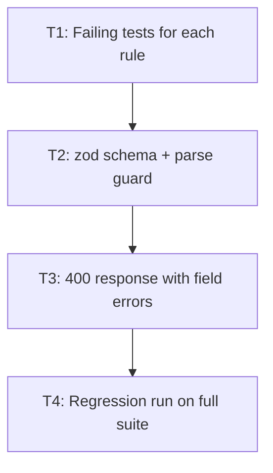

# Worked Example: Adding zod Input Validation to a REST Endpoint

> A complete filled-in walkthrough of the pipeline on a real-sized task. Read this
> to calibrate what correct output looks like at each phase, not to copy the plan verbatim.

---

## 0. The Request

> "Add input validation to `POST /api/orders`. Body comes from mobile clients, so field
> shapes drift. Use zod. Reject bad input with 400 and a field-level error list."

**Classification:** Bounded. One endpoint, one dependency, no shared interface change.
Stated aloud before the first question, per Step 1.

## 1. Active Project Profile

| Field | Value |
|---|---|
| Repository root | `~/projects/orders-api` |
| Target scope | `src/routes/orders.ts`, `src/routes/orders.test.ts` |
| Runtime | Bun 1.4.0 |
| Test command | `bun test src/routes/orders.test.ts` |
| Lint / type | `bun run lint`, `bun run typecheck` |
| Config sources | `package.json` scripts, `tsconfig.json`, `biome.json` |
| Protected paths | `src/middleware/auth.ts` (untouched) |

Read from the repository, not asked from the user. Nothing in this section came from a question.

## 2. Short Design (Bounded path, presented in chat)

> **🗺️ Plan**
>
> **Approach:** Parse the body with a zod schema at the route boundary, before the handler
> runs. Return 400 with a flat `[{ field, message }]` list so mobile clients can map errors
> to form fields without parsing prose.
>
> **Files touched:** `src/routes/orders.ts` (add schema + guard), `src/routes/orders.test.ts`.
>
> **Testing plan:** failing test first for each rule, then the schema, then a regression run
> over the existing suite.



> **Pre-execution checklist**
> - [ ] T1: failing tests for each rule
> - [ ] T2: zod schema + parse guard
> - [ ] T3: 400 response with field errors
> - [ ] T4: regression run on full suite

Approval received, then execution started.

## 3. Task T1: RED

```bash
bun test src/routes/orders.test.ts
# exit 1, 4 failing: missing field 'sku', bad 'quantity' type, unknown key, negative qty
```

Structured evidence: `[bun test] → [exit 1] → [4 failing, all asserting 400 + field errors] → [VERIFIED RED]`

The test fails for the right reason: the route currently returns 500 on a malformed body,
because nothing validates it.

## 4. Task T2: GREEN

Added the schema and the guard. One focused edit in `src/routes/orders.ts`:

- `OrderSchema` describing the accepted body
- `parseOrderBody` returning a discriminated result rather than throwing
- the guard placed before the handler, after auth

Re-ran the focused suite: `[bun test src/routes/orders.test.ts] → [exit 0] → [4 passed]`

## 5. Task T3 and T4: response shape and regression

- T3: response is `{ error: [{ field, message }] }`, matched against a snapshot test
- T4: `bun test` on the whole suite → `[exit 0] → [38 passed, 0 failed]`, no regressions

`bun run typecheck` → exit 0. `bun run lint` → exit 0, 0 warnings.

## 6. Finishing

- `git status` confirmed only the two intended files changed
- commit: `feat: validate order request body with zod schema`
- No temporary files left behind

## 7. Session-Close Debt Sweep

Harvested during the session, ranked, and offered as one question-tool call of multi-select groups:

| # | Candidate | Class | Disposition |
|---|---|---|---|
| F1 | `GET /api/orders` has the same body-less drift risk; no query validation | `LATER` | `defer: 2 sprints, <mobile client reports a bad query>` |
| F2 | No test for the 401 path, which auth middleware owns, not this change | `LATER` | `defer: next auth change` |
| F3 | `orderSchema` is local; the same three fields repeat in the refund route | `NOW` | Extract to `src/schemas/order.ts` and cover it directly |

F1 and F2 are pre-existing and outside the approved request, so they were written to the
backlog rather than silently fixed. F3 was selected, executed through the same TDD loop,
verified, and committed as `refactor: extract shared order schema`.

## 8. What This Example Teaches

1. The profile came from the repository, not from questions.
2. Every task carried a command, an expected exit code, and extracted evidence.
3. Completion was claimed only after a fresh full-suite run with 0 failures.
4. The session ended with a question, not a report, and the declined items were recorded
   with `defer:` markers instead of evaporating.
