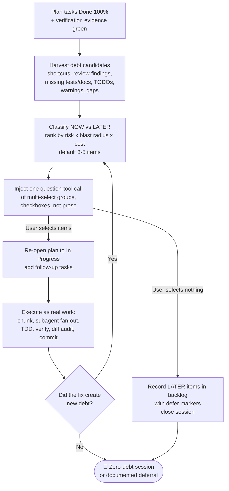

# Session-Close Debt Sweep

> Part of `super-ultra-code-plan`. Read `sucp-rules` too.

## 6️⃣ 🧹 Session-Close Debt Sweep & Follow-Up Injection (Mandatory)
> 🧹 **Closing stage — zero-debt session:** once the plan is `Done 100%` and the evidence gate is green, the agent mines everything it learned during planning and execution, turns it into a short list of concrete follow-ups that can be finished right now, and asks the user to pick them with a single tap. Reporting alone is a failed close: the deliverable of this stage is a question the user answers with a checkbox, not a paragraph they must retype.

```
A SESSION ENDS WITH ZERO UNEXAMINED CODING DEBT
```

### 🧾 6.1 Preconditions — the plan must be finished first
- The approved plan is `Done 100%` per the Plan Completion Saturation Rule. Every task carries fresh evidence; nothing sits at "mostly done". The sweep is the step *after* a finished plan, never a substitute for finishing it.
- The Verification gate passed with fresh evidence, git hygiene is done, and the final diff has been audited. Starting the sweep on unverified work converts a completion claim into a bigger unverified claim.
- The session's pull request exists and its number is recorded in the registry (`bun scripts/pr-registry.mjs pr <session> --number <N>`). A follow-up selected in the sweep is a new chunk of work on the same branch, so an unrecorded PR means the follow-up work has nowhere to land.
- Anything that is genuinely `Blocked` by an external dependency is excluded from follow-up candidates and instead reported with the exact unblock condition. A blocked item is not a follow-up question; asking the user to "also fix" it is noise.

### 🔍 6.2 Harvest — collect debt candidates from the whole session
Sweep the session record, not just the last command, for anything that was noticed but not closed. Candidate sources, in priority order:
1. Recorded `defer:` deliberate shortcuts whose `<ceiling>` has actually been hit, so the debt the plan promised to revisit is now due.
2. Findings deferred to follow-up by the code review, the Zero-Tolerance Clean Pass pre-existing warnings, or the Simplicity Ladder pruning pass.
3. Adjacent code, sibling callers, or sibling files the fix touched only partially. Comprehension-before-reduction exposes these; leaving them unlisted is choosing debt. **Anything already named in a task's `impacts` and still open at sweep time is a debt item by definition** — the impact was declared, so failing to close it is a decision, not an oversight.
4. Missing test layers on the changed surface (no unit test, no contract test, no e2e for a user-facing flow), missing accessibility/localization/empty/error states, missing docs or changelog or runbook entries.
5. TODO/FIXME/XXX/HACK comments, skipped or quarantined tests, `@ts-ignore`/`eslint-disable`/`.skip`/`.only` markers, dead code, stale feature flags, duplicate helpers, and orphaned files that the diff revealed.
6. Pre-existing lint/type/build warnings, flaky tests, unmeasured performance risk, unverified dependency or license assumptions, and security or compatibility observations that were out of scope for the plan.
7. Verification gaps themselves: claims resting on partial evidence, checks that could not run in this environment, or reviewers' findings that were accepted verbally without a code change.

Every candidate must be stated as an outcome with a file path and a checkable finish line, not as a topic. "Refactor the auth module" is not a candidate. "Extract token refresh out of session.ts:88-140 and cover it with a new session.test.ts case" is.

### 🧠 6.2.8 Learning Harvest — the agent's own mistakes, not just code debt
The same sweep that mines code debt also mines the session for the agent's **own operational mistakes** — wrong tool calls, misread or missed skill/AGENTS rules, blind retries, premature guesses made instead of searching first, and scope creep. This is the concrete execution of the Continuous Learning & Memory Lifecycle Phase 1 (Rollout Extraction), run at the one point in the pipeline where the whole session is visible and verified. It is distinct from the Error Ledger: the Error Ledger records per-task *technical* failures (test/build/exit code), while this harvest records *behavioral* failures of the agent and turns the durable ones into rules the next session reads before it starts.

- Record the harvest with `templates/session-learning-ledger-template.md`: a raw Mistake Log, then a distilled set of `WHEN <situation> → DO <action>, NOT <anti-pattern>` candidate rules.
- Each candidate must pass **both** existing gates or it is a NO-OP (zero file changes): the Minimum-Signal gate ("will a future agent plausibly act differently and more effectively?") and the 30-Day Horizon test ("still true and worth reading a month from now?"). This is what keeps the ledger from filling with transient noise.
- `KEEP` rules are written in-repo automatically (append under a `Task Group:` header in `MEMORY.md`). A rule that recurs across projects on this machine may additionally be promoted to `~/AGENTS.md`, but global promotion is **per-item and requires explicit user approval**: each item is asked through the Confirmation Protocol (header `Promote`, first option `Keep in the repository only`). Promotion is never destructive or credential-touching, and always writes a revert note inside the edited file. Decline leaves the rule in the ledger only.
- Learning candidates do not consume the 3-5 follow-up question cap; they are a separate written artifact. Only propose a question here when a kept rule implies a concrete code or doc change (e.g. encoding the rule into a lint or a check).

### 🧮 6.3 Rank & Cap — default 3 to 5 questions
- Default to **3-5 follow-up questions**, ranked by `(leftover risk × blast radius × cheapness to close)`. Cap at 5 so the user can answer in one glance; rank below that always go to a written follow-up backlog in the plan or progress log, not to an extra question batch.
- The follow-ups go into multi-select questions of at most 4 options each, at most 4 questions in the single call, because the Claude Code question tool caps a call at 4 questions and 4 options per question. Group by surface (for example Code, and Docs and tests). The lowest-ranked overflow goes to the written backlog. The last option of the last group is `Nothing, close session`, so a zero-selection submit is never required. The 3 to 5 default counts follow-up items, not tool questions. Every group has 2 to 4 options, so a lone leftover item joins another group. If `Nothing, close session` is ticked together with items, the items run.
- Expand beyond 5 only when the harvested debt is itself more than 5 genuinely independent items, and then state explicitly why the cap was raised. Under-filling is also a defect: never ask a single trivial question when three real ones exist.
- Every candidate is classified `NOW` (closes fully inside this session, no new approval, no destructive action, no external dependency) or `LATER`. `NOW` items become selectable questions. `LATER` items are recorded in the plan's follow-up backlog with an owner-less `defer: <ceiling>, <upgrade-trigger>` line so they survive the session instead of evaporating.
- Banned from the batch: anything destructive, externally visible, credential-touching, or scope-expanding. Each such item is asked on its own, outside the sweep call, through the Confirmation Protocol with the safe option first, never as a quick-select chip.
- Banned as a question: anything already `Done 100%`, anything the user never asked about and the plan never touched when the risk is cosmetic, and anything only phrased as a preference question with no code outcome ("would you like me to also..."). A question must resolve into a code change, a test, a doc, or a deletion.

### 🙋 6.4 Inject — ask, do not narrate (mandatory)
> Record the sweep with `templates/follow-up-injection-template.md` (candidates, ranking, the question, the execution record, the deferred backlog).
- Use the harness's own structured question mechanism. Find it through the tool table in the Confirmation Protocol and read its schema before the first call. Present the follow-ups as **multi-select checkboxes** so the user answers by tapping, never by typing.
- Batch every follow-up into **one single question-set call**, never one call per item, and place it after the final recap so the user first sees what was delivered, then decides what to finish.
- Each option carries a short label plus a one-line description naming the file or surface it touches and the check that proves it closed. Label the first option of each question as the recommended default where one exists.
- The description of the recommended option begins with `Why:` and the ranking factor that put it first (leftover risk, blast radius, or cheapness to close), and says `Why: my judgment` when the ranking was not measured.
- Ask even when the list is short, even when the session looked clean, and even when the user seemed satisfied. A quiet session is exactly where unnoticed debt accumulates; the sweep is not a courtesy, it is the closing gate.
- If no structured question tool exists in the runtime, use the Confirmation Protocol fallback: a numbered list in the final message with an explicit instruction to reply with the item numbers to execute, and state plainly that the runtime lacks a prompt widget. The gate stays closed. Never silently skip the ask because the widget was missing. In an unattended run (`sucp-overnight`) the same items also go to the plan backlog.
- If the user selects nothing, picks `Nothing, close session`, or dismisses the question, accept it in one line, keep the items in the written backlog with their `defer:` markers, and close. Never re-ask the same question in the same session, and never treat a declined follow-up as a reason to re-open the completed plan.

### 🛠️ 6.5 Execute — selected follow-ups run as real work
- A selected follow-up is a task, not a favor. It enters the same pipeline as plan work: chunk it, fan out to subagents, TDD when behavior changes, verification with fresh evidence, diff audit, and commit. No reduced standard, no "quick fix" exemption.
- Re-open the plan status to `In Progress` for the duration, add the item as a numbered follow-up task with its own acceptance criterion and `skip_if`, and return it to `Complete` when the evidence is green. The plan file, not the chat, is the record.
- After the batch closes, run the sweep's own short pass once more: did executing item A create new debt in the surface it touched? Any new candidate goes to the same ranked list, and the user is asked again only for genuinely new items.
- A candidate the re-pass finds adds a star to the meter (see Progress stars below).
- Batch the selections into one round. Sequentially asking about each follow-up's sub-steps reproduces the low-value prompting this stage exists to eliminate.

### 📇 6.6 Sync Session Artifacts to Graphify — local, no model (mandatory when the repo has a graph)
> 📇 **Closing stage — the documents you generated are part of the deliverable, so they belong in the knowledge graph.** A plan, batch manifest, spike report, handoff, progress log or learning ledger that only exists on disk is invisible to `graphify query`, `path` and `explain`. `graphify update .` cannot fix this: its help reads "re-extract code files and update the graph (no LLM needed)" and it parses code, so Markdown is never ingested by it.

```
RUN `graphify update .` FIRST, THEN `bun run graphify:sync` — IN THAT ORDER
```

- **Order is load-bearing.** `graphify update .` rewrites the code graph and is not known to preserve foreign nodes; running it *after* the sync can discard the document nodes the sync just added. So the sequence is: (1) `graphify update .`, (2) `bun run graphify:sync`.
- **What the sync does.** It runs the deterministic structural layer of the vault-index pipeline over this repository's eligible Markdown — one `document` node per file, its ATX `heading` nodes, and its resolvable `[[wikilinks]]` as `references` edges — then unions them into `graphify-out/graph.json` with the same merge used by the vault rebuild. It is a **local line scan: no LLM call, no API key, no network**, so it does not cross the cloud-extraction boundary recorded in `.graphifyignore`.
- **Run it from the vivera repository**, whatever project owns the session: `bun run graphify:sync`. The script lives there because the pipeline it reuses lives there. With no arguments it syncs every eligible repo doc; pass explicit `docs/code-plan/plans/<file>.md` paths to narrow it.
- **It is deterministic and idempotent.** A second run over unchanged files writes byte-identical output, existing graphify-era document ids are remapped rather than duplicated, and every code/concept/rationale node already in the graph is retained. Verify without writing via `bun run graphify:check` (exit 1 = stale), and preview via `bun scripts/graphify-sync.mjs --dry-run`.
- **It also runs automatically at commit time, in the right order, but ONLY inside the vivera repository.** `install.sh` sets `core.hooksPath=.githooks`, and vivera's `.githooks/pre-commit` runs the pair without anyone remembering: when the commit touched code it runs `graphify update .` first, then `bun run graphify:sync`, so the structural document layer is the last writer and survives. A Markdown-only commit skips the code rebuild and runs the sync alone. The hook is non-blocking — every path exits 0, because a failed refresh of derived state must never block a commit — and `GRAPHIFY_SYNC_SKIP=1 git commit ...` disables it for one commit.
  **This automation does NOT extend to other repositories.** Two measured reasons, both silent: the hook resolves the sync script as `$REPO_DIR/scripts/graphify-sync.mjs`, which does not exist outside vivera, so its `[ -f "$SYNC" ]` guard does nothing without a warning; and it exits 0 early when `graphify-out/graph.json` is absent, so a repo that never built a graph skips the hook forever. A project repository using its own hook directory (for example `.husky`) has no graphify step at all. **Therefore: in any repository other than vivera, run the manual pair above explicitly at session close.** Do not assume the commit hook covered it, and do not treat the absence of a graph as permission to skip.
- **A missing graph is not a reason to skip. Build it.** If `graphify-out/graph.json` does not exist, that is a repo where the graph has never been built, not a repo where the sync is blocked: run `graphify update .` first, then the sync. Skipping here is the single most common way this step silently never happens, and it looks exactly like compliance because the skip prints a line and exits 0. Only two things are genuinely "record one line and move on": `graphify` not installed at all, or an *existing* graph whose refresh **failed**. In both cases never hand-write a `graph.json` to make the step look done; the graph is derived state and a hand-authored one is a second source of truth.
- **In a repo that is not vivera, pass `--root`.** The sync script lives beside this file and defaults to vivera's own root, so running it bare from another repository syncs the wrong tree and reports success. Resolve the script relative to wherever vivera is checked out, and run the pair from the session repository so `$(pwd)` is that repository:
  ```bash
  # run from the session repository; VIVERA is wherever vivera is checked out
  VIVERA="${VIVERA:-../vivera}"          # or an absolute path on this machine
  graphify update .                                                    # in the session repo
  bun "$VIVERA/scripts/graphify-sync.mjs" --root "$(pwd)"               # in the session repo
  bun "$VIVERA/scripts/graphify-sync.mjs" --check --root "$(pwd)"       # verify
  ```
  A bare `bun run graphify:sync` is only correct when the current repository IS vivera.

- **A green `--check` is not evidence that your documents are in the graph.** `--check` asserts the node count did not fall, so it reports `CURRENT` just as happily when nothing was indexed as when everything was. A sync pointed at the wrong root can therefore leave the count completely unchanged and still print `CURRENT, exit 0`, while the session's documents sit untouched in a different tree. The node delta is the signal, not the exit code. Preview before writing and read the two numbers that matter:
  ```bash
  # run from the session repository; VIVERA is wherever vivera is checked out
  VIVERA="${VIVERA:-../vivera}"
  bun "$VIVERA/scripts/graphify-sync.mjs" --root "$(pwd)" --dry-run    # read "eligible docs" and the "nodes:" line
  bun "$VIVERA/scripts/graphify-sync.mjs" --root "$(pwd)"               # write
  bun "$VIVERA/scripts/graphify-sync.mjs" --check --root "$(pwd)"       # confirm the delta you previewed
  ```
  `eligible docs: 0`, or a `nodes: X -> X` delta on a session that produced Markdown, means the sync ran against the wrong tree regardless of what it printed. The same shape of failure appears elsewhere: an empty `git status` proves nothing about gitignored artifacts, and a green guard proves only what it measures.

### ⭐ Progress stars
The meter line during the sweep (`sucp-rules`, Output) is one star per debt the sweep found, so 7 debts are 7 stars and 5 debts are 5. The total follows the findings and is never fixed or padded. The stars appear in the chat reply only; the sweep record holds the evidence, never the stars.

- **What counts as a debt:** every candidate in the ranked list from 6.2, `NOW` or `LATER`. Learning-harvest rules (6.2.8) are not debts and get no star.
- **`★` closed, `☆` open, closed ones drawn first.** A debt is closed when its follow-up was executed and verified with fresh evidence. A debt the user declined, or one recorded as `LATER` with a `defer:` line, stays `☆`, and the line says how many are deferred, for example `★★★☆☆ · 3 closed · 2 deferred`.
- **No stars before the ranked list exists.** Once it does, every star starts as `☆`. A sweep that finds no debt prints `0 debt found` instead of stars.
- **The total can grow.** A candidate found by the re-pass after a follow-up batch (6.5) adds a star and the line says `+1 debt`. Existing stars keep their state.

### 🚫 Anti-Patterns
- Closing the session with a report and no question. A debt sweep that produces prose instead of a selectable question has not run.
- Letting generated Markdown stay invisible to `graphify query` because `graphify update` "should have handled it". It only parses code; run `bun run graphify:sync` after it, every session.
- Generic chips (`"Anything else?"`, `"More tests?"`) with no file path and no finish line. Unactionable options waste the user's attention and get ignored.
- Padding to 3-5 items with speculative work, or asking 8 questions because everything looked interesting. Rank first, then cap.
- Turning a follow-up question into a new scope decision. The user picking an item is approval to close known debt inside the same goal, not approval to redesign the feature.
- Re-asking the declined items, or treating "no" as a reason to reopen the verified plan.
- Doing the follow-ups silently without asking, which violates the check-first contract, or asking and then not doing them, which is worse.



