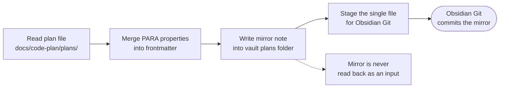
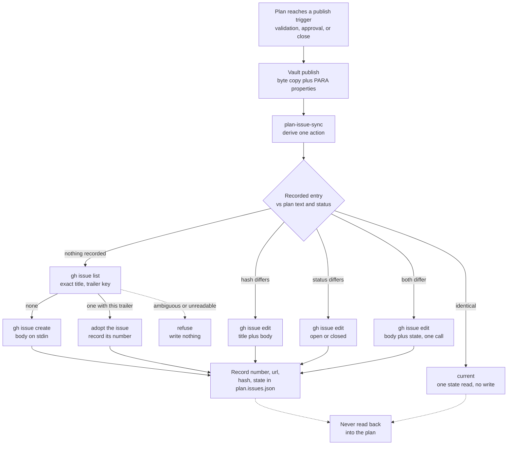

# Writing Plans

> Part of `super-ultra-code-plan`. Read `sucp-rules` too. Next phase: `sucp-tdd-debug`.

## 3️⃣ 🗺️ Writing Plans (architectural path only)
> 🗺️ **Component 2 — Plan output:** every task must be independently understandable, executable, and testable.

### 🗺️ Visual Implementation Map — MANDATORY for every plan
- Every plan (Bounded short design in chat AND Architectural plan file) MUST include at least one valid ` ```mermaid` diagram. No exceptions, no `N/A`. A plan without Mermaid is incomplete and blocks the approval gate.
- Minimum: one `flowchart` (TD or LR) placed near the plan overview showing task nodes (`T1`, `T2`, ...), `depends_on` edges, human approval gate(s) (`{{...}}`), and the Verify → Completion tail.
- Choose additional diagram types that match the reasoning when they add clarity: `flowchart` for process and decisions, `sequenceDiagram` for component/user interactions, `stateDiagram-v2` for lifecycle/status, `graph` for architecture/dependencies, `erDiagram` for data relationships.
- Every diagram MUST declare `accTitle:` and `accDescr:` on the lines immediately after the diagram-type declaration. Mermaid emits these as `<title>`/`<desc>` wired to `aria-labelledby`, which is what makes the diagram readable to a screen reader and to an agent that parses the SVG. The title names the diagram; the description states what it shows, in one or two sentences, without restating the node list. A diagram without them is incomplete and fails `scripts/validate-skill.mjs`.
- Keep diagrams free of decoration that carries no information: no gradient fills, no drop shadows, no emoji used as the only label. `accDescr` is the accessible equivalent of visual flourish.
- Label gates and decision points (`{{Gate}}`, `{Decision}`), keep node ids identical to `tasks[].id` frontmatter ids and `Task <id>` headings, and keep node labels consistent with the interfaces, components, files, and acceptance criteria in the plan.
- Before execution, read the plan and walk through the Mermaid diagram: identify the start, sequence, dependencies, branches, approval gates, failure paths, and expected outcome. Compare it with the current repository and approved spec.
- A missing diagram, an unrunnable diagram (mermaid syntax error), or a mismatch between the diagram, plan tasks, spec, or repository is a pre-execution blocker. Update the affected artifact or obtain approval for the changed interpretation before implementing.
- When the plan changes, update the Mermaid diagram and its related task, interface, acceptance, and verification details in the same change.
- Mermaid is a visual companion and a machine-checked contract (frontmatter `depends_on` == Mermaid edges == task headings), not a replacement for exact files, interfaces, acceptance criteria, test steps, commands, or evidence.
- Edge Direction Convention: `A --> B` means B depends on A. Every `depends_on` entry requires exactly one matching arrow, and every arrow between two task nodes must be declared in `depends_on`. `scripts/ultra-plan-runner.mjs` parses the map structurally and enforces both directions, so removing an arrow or adding one without updating the frontmatter fails the gate. Reachability is not a substitute: a transitive path does not satisfy a `depends_on` entry.
- A task id mentioned inside an unrelated label, comment, or second diagram does not count as a node. Node presence is determined by graph structure, not by text search.

Trigger: spec/requirements exist, before touching code.
Assume: engineer has zero codebase context, questionable taste, skilled developer, weak test design.
Save to: docs/code-plan/plans/YYYY-MM-DD-<feature-name>.md
Plan body lives in the file, not the session: write the full plan content into the .md deliverable and keep in-session explanation to a concise summary plus the file path and the key decisions needing approval. Do not paste or narrate the whole plan in chat; when the user wants the details, point to the saved file. In plan/spec review mode, present the file content as the reviewable artifact and stop there.
- Gate 2: after the plan validates (and is published at Draft), show the plan path and a concise summary in chat, then ask approval through the Confirmation Protocol (header `Plan`); do not paste the plan.
Scope check: spec covers multiple independent subsystems → split into separate plans, each producing working testable software alone.
File structure: map files before defining tasks. One responsibility per file. Files that change together, live together. Split by responsibility not layer. Existing codebase → follow established patterns; split only files grown unwieldy under current task.
File-size trigger: a source file of imperative logic that exceeds ~500 lines must be split by responsibility during the same task; a single file must not exceed 1000 lines without an explicit `defer: <ceiling>, <upgrade-trigger>` exception. Generated code, fixture/data files, and stylesheets are exempt from the 500-line trigger. Cite the line count when flagging an over-threshold file.
Task sizing: smallest unit carrying its own test cycle, worth independent review gate. Fold setup/config/docs into the task needing them. Split only where reviewer could reject one task while approving neighbor.
Step granularity: 2-5 min per step.
- Write failing test
- Run — confirm fail
- Implement minimal code
- Run — confirm pass
- Commit
Runner Contract (determinism fondasi): the YAML frontmatter below is the single source of truth for routing, dependency order, retry, and idempotency. Prose and checklists under it explain but must never contradict it. Every `Task N` heading MUST use an `id` identical to its `tasks[].id` in frontmatter and to its node name in the Mermaid map; any mismatch is a pre-execution blocker. Commands inside the plan MUST be directly runnable and wrapper-agnostic — never MCP/rtk/tgrep-specific — while still obeying the Mandatory Runtime rule: JS/TS commands are written with Bun (`bun test path`, `bun run lint`, `bun install`), never `npm`/`npx`/`node`. Context-mode and rtk are execution-environment wrappers applied by the runner or harness, not baked into the portable artifact.

Frontmatter Must Be Real YAML: the runner's own parser is lenient, so a plan can pass it and still not be YAML. The runner (`bun scripts/ultra-plan-runner.mjs <plan.md>`) and `bun scripts/check-runner-contract.mjs` now parse the frontmatter with the `yaml` package and refuse a plan that fails, naming the line. Quote every path or command that contains `[`, `]`, `{`, `}`, `,`, `:` or `#`, a double quote, or a backslash: write `"apps/web/src/pages/csat/[token].astro"`, never the bare path. The published vault mirror drops the runner contract (`schema`, `version`, `runner_contract`, `defaults`, `tasks`), because Obsidian renders frontmatter as Properties and shows invalid YAML as raw red text; the plan itself stays the only source of the contract.

Execution Hook Contract: `tasks[].run[]` is the only key that makes the runner execute anything, and it is what separates a machine-run plan from a prose one. Each entry is one runnable command with `cmd`, `expect_exit`, and `retry`, plus an optional `loop_until` on a step that iterates; the runner runs them in order, compares the exit code, retries a transient mismatch, and reports `PASSED`, `FAILED-BLOCKING`, `FAILED-ISOLATED`, `HALTED-UPSTREAM`, or `SKIPPED-IDEMPOTENT`. Four rules, all enforced by `scripts/ultra-plan-runner.mjs`:
- **Every task declares a hook.** A task with `run[]` is executed by the runner. A task with only `skip_if` is legitimate for work with no shell command (writing prose, choosing a layout, settling a design question) and reports `NEEDS-AGENT` with a warning. A task with **neither is a validation error**: it is invisible to the runner and silently exempt from every gate, which is how a plan ends up looking fully covered while nothing checks it.
- **`expect_exit: 1` is a first-class value, not a hack.** A RED step is expected to fail, so the failing test passes the gate with `expect_exit: 1`. Never wrap a RED step in a command that swallows its exit code to make it "pass".
- **A `run[]` step with no `cmd` is a validation error.** One step is one command. Never fold multiple non-chained commands into one step.
- **`loop_until` is the stopping condition, and it is a command.** A step that iterates declares the command that proves the iteration has finished. The runner executes it after the step's own `cmd` succeeds: exit 0 means converged, and the step passes; non-zero means not converged, so the step re-runs within its existing `retry` budget, and exhausting that budget is a failure naming `loop_until`. It must be something the runner can execute, never a string match against a file, for the same reason a loose `skip_if` is rejected below: `grep -q 'Done' src/x.ts` survives the behaviour being reverted, so a text probe reports convergence for work that is not converged. A present-but-blank or non-string `loop_until` is a validation error. Absence stays legal and means the step does not iterate, so every existing plan remains valid unchanged.

Idempotency Honesty: `skip_if` is a claim that the work is already done, and `plan-mark-done.mjs` will tick the task on that claim alone. The runner resolves every claim to exactly one of five classes, and the order matters: `empty` (blank or not a string — nothing was claimed), `sentinel` (the exact string `"false"` — the documented "this task has no command" marker), `behavioural` (it runs a tool that has to succeed first), `loose` (it reads a file and asserts a string is in it), `unknown` (neither rule matches — the classifier says so rather than guessing). A `skip_if` that only proves a string is present in a file is therefore a false-pass channel: `grep -q 'Marker' src/x.md` stays true after the string moves into a comment, after the behaviour is reverted, and after the file is truncated. **This is a validation error, not a warning.** The whole grep family is a file probe, not just bare `grep` — `rg -q`, `tgrep -q`, and a path-qualified `/usr/bin/grep -q` all read a file and assert a string is in it, and each is rejected on exactly the same evidence. Prefer a command that fails on behaviour — a test invocation, a build, a `git diff` query, a state check. A `grep` that filters a tool's output (`bun test x 2>&1 | grep -q '...'`) is behavioural and fine, because the tool has to succeed first. An existing plan is grandfathered by naming the task in `defaults.allow_loose_skip_if`, and a name that no longer corresponds to a loose `skip_if` is itself an error, so the allowlist cannot decay into a permanent blanket. A command that matches neither rule is `unknown`, and **`unknown` earns a warning, not an error** — measured across the registry it is 14 tasks in 7 plans, and four of those plans sit in `ram-audit`, `PS2` and `fasttrack`, repositories this one does not own, so an error here would be a commit in this repository deciding that someone else's plan cannot run. The warning names the task, the command, and the remedy. When a task genuinely has no command, say so with `skip_if: "false"` rather than inventing a probe that passes: `"false"` is the `sentinel` class, recognised by its own rule instead of by failing to match a regex, and it is a deliberate no-op, not an exemption — a task that declares `skip_if` with no `run[]` still reports `NEEDS-AGENT`, sentinel or not.

Declared Fields Are Enforced, Not Described: every other frontmatter field the runner reads is a check, not a comment.
- `files: { create: [], modify: [], test: [] }` — before the steps run, every path in `modify` and `test` must exist; after they run, every path in `create` must exist. A path that is missing on either side fails the task with the missing paths named. This is the working-tree verification the Finishing Protocol asks for, done mechanically: a task that touched a file it never declared is not caught by this, but a task that declared a file and did not produce it is.
- `verify_exit: 0` — the expected exit code for any `run[]` step that does not declare its own `expect_exit`. A step that is expected to fail must say so explicitly, so a RED step reads as the deliberate exception it is.
- **`loop_until: "<convergence check>"` is the stopping condition, and it is a command.** A step that iterates declares the command that proves the iteration finished; the runner executes it after that step's own `cmd` succeeds, so exit 0 is converged and the step passes, non-zero is not converged and the step re-runs inside the `retry` budget it already declares, and exhausting that budget is a failure naming `loop_until`. Optional: absence is legal and means the step does not iterate, so every plan written before the key existed stays valid unchanged. A present-but-blank or non-string value is a validation error naming the task and the step, because a step that declares a condition it does not have is worse than one that declares none. The command must fail on behaviour and never assert that a string is present in a file, and it is judged by the same five classes as `skip_if` in `Idempotency Honesty` above: the `loose` file-probe class is refused on exactly the evidence that refuses a loose `skip_if`, so `grep -q 'Done' src/x.ts` stays true after the behaviour is reverted and reports convergence for work that has not converged, and the `"false"` sentinel is refused here too, because omitting the key is how a non-iterating step says so, whereas `"false"` is a shell command that exits 1 and could never converge.
- `idempotency_key: "T1:unit-of-work"` — must begin with this task's own id. The right-hand side names the task's unit of work and is free-form: in practice it is a behaviour (`T3:two-stage-trigger`, `T5:lifecycle-audit`) rather than a path, because a behaviour has no filename. A key whose prefix names a different task is an error — that is a copy-paste or a plan edited in the wrong place, and it is the part that actually goes stale.
- `on_precondition_fail: stop-task-continue-independent` — the permissive default, which keeps independent tasks running. `halt-plan` stops the whole plan, reported as `HALTED-PLAN`. An unrecognised value throws rather than silently falling back to the permissive one, because a typo should not quietly grant the weaker semantics.
- `retry_if: any | transient` — whether a step's `retry` budget is spent on a failure the classifier calls DETERMINISTIC. `any` (the default, and therefore every plan in this registry) is the older behaviour: a retry is skipped only where the exit code PROVES one cannot help, which is `transient: false` for exit 127, 126, 130 and 143. `transient` is the strict policy: the budget is spent only on a failure classified `transient: true`, which in practice means a timeout, so the ordinary exit 1 stops being retried. **The strict policy is opt-in because `transient: 'unknown'` covers the ordinary exit 1, where a deterministic assertion failure and a flaky test are indistinguishable from an exit code**; defaulting to it would silently stop retrying flaky tests in every existing plan, including plans belonging to repositories this one does not own. An unrecognised value throws rather than defaulting, for the same reason `on_precondition_fail` does.
- `impacts: ["<surface> - <evidence command>", ...]` — **what the task can break, which `files` never asked.** `files` names the paths a task touches; `impacts` names the surfaces that consume them: sibling callers, the later task that reads this export, the README that documents the flag, the template that mirrors the schema. This is the key that closes the gap `depends_on` structurally cannot: the DAG orders tasks *inside one plan*, so a consumer in another module, another plan, or another repository is not a node and cannot be an edge. With `defaults.require_impacts: true` a task declaring no `impacts` is a validation error, and an empty list is an error as well, because an empty list claims nothing and proves nothing. "Checked, nothing downstream" is a real answer, written as the sentinel `"none: <the command that checked>"` — the same discipline as `skip_if: "false"`, for the same reason: a claim that cannot fail is a false pass. A task is exempted with `defaults.allow_no_impacts: [T3]`, and naming a task that does declare its own impacts is itself an error, so the list cannot decay into a permanent blanket. **Flow-style only** (`impacts: ["a", "b"]`): the block form `- "text"` parses as an object rather than a scalar, so a block-style list reaches the validator as objects where strings were written, and is refused rather than counted. Plans that do not opt into `require_impacts` earn one aggregated warning naming every undeclared task, never an error — the same reasoning that made an unclassifiable `skip_if` a warning: several plans in the registry belong to repositories this one does not own, and erroring there would be one commit in this repository deciding that someone else's plan cannot run.
Plan header template:
```
---
schema: ultra-plan/v1
plan_id: YYYY-MM-DD-<feature-name>
status: Draft            # Draft|Approved|InProgress|Verification|Complete|Blocked
version: 1              # schema stamp for the plan FORMAT. No runner reads it; `schema:` above is what the runner enforces. `bun run contract:check` reports it on purpose.
runner_contract: true
defaults:
  retry_transient_max: 1            # explicit integer, never the word "bounded"
  step_timeout_s: 120               # per-step hang guardrail
  on_precondition_fail: stop-task-continue-independent   # or: halt-plan
  allow_loose_skip_if: []            # task ids grandfathered from the skip_if probe ban
  require_impacts: true              # every task must declare the surfaces it can break
  allow_no_impacts: []               # task ids exempted from impacts; a stale name is an error
  retry_if: any                      # any | transient; an unrecognised value throws
tasks:
  - id: T1
    depends_on: []                  # DAG edges — `A --> B` means B depends_on A; must match Mermaid
    impacts: ["<surface> - <the command or graph query that shows the impact>"]   # flow-style only
    files: { create: [exact/path.ext], modify: [], test: [exact/path.test.ext] }
    idempotency_key: "T1:exact/path.ext"
    skip_if: "<verification command>"  # exit 0 = already done → SKIPPED-IDEMPOTENT
    verify_exit: 0
    run:                            # the steps the runner executes
      - cmd: "<failing-test command>"
        expect_exit: 1              # RED, before any implementation
        retry: 0
      - cmd: "<verification command>"
        expect_exit: 0
        retry: 1
        loop_until: "<convergence check>"  # exit 0 = converged; optional, and only on a step that iterates
  - id: T2
    depends_on: [T1]
    files: { create: [exact/path2.ext], modify: [], test: [exact/path2.test.ext] }
    idempotency_key: "T2:exact/path2.ext"
    skip_if: "<verification command>"
    verify_exit: 0
    run:
      - cmd: "<failing-test command>"
        expect_exit: 1
        retry: 0
      - cmd: "<verification command>"
        expect_exit: 0
        retry: 1
---
# [Feature Name] Implementation Plan
> For agentic workers: REQUIRED EXECUTION METHOD — delegated task execution (recommended) or inline plan execution. Steps use checkbox syntax.
**Goal:** [one sentence]
**Architecture:** [2-3 sentences]
**Tech Stack:** [key technologies]
**Active Project Profile:** [repository root, target scope, toolchain, configuration sources, and revision]
**Project Commands:** [verified test, lint, type-check, build, package, migration, and deploy commands]
**Protected Boundaries:** [locked contracts, generated files, protected paths, and project-specific constraints]
**Spec:** [path to spec]
**Scope:** [included behavior and surfaces]
**Non-Goals:** [explicitly excluded behavior]
**Visual Map:** [MANDATORY Mermaid diagram(s) — at least one flowchart mapping every task id, dependency edge, gate, and Verify step. Every diagram MUST also declare `accTitle:` and `accDescr:` right after its diagram-type line.]
**Reasoning Lenses:** [selected core and conditional lenses with their required outputs]
**Acceptance Criteria:** [observable conditions that define success]
**Traceability:** [acceptance criterion → task → test/check → evidence]
**Assumptions & Open Questions:** [resolved assumptions and questions that remain]
**Dependencies & Impact:** [dependencies, interfaces, migrations, and affected consumers]
**Risks & Rollback:** [known risks and recovery/rollback approach]
**Security & Compatibility:** [security surfaces and compatibility decision]
**Operations & Rollout:** [observability, rollout, post-deploy check, and rollback]
**CI/Review Gate:** [required checks and review status]
**Documentation:** [docs, examples, changelog, or runbook updates]
**Definition of Done:** [applicable gates and final completion conditions]
**Plan Status & Version:** [Draft/Approved/In Progress/Verification/Complete/Blocked and version]
**Reproducibility:** [runtime/tool versions, setup, fixtures, commands, and expected outputs]
**Test Reliability:** [determinism, isolation, external-state dependencies, and known flakiness]
**Privacy & Data Governance:** [data classification, minimization, retention, access, and audit requirements]
**Dependencies & Supply Chain:** [lockfile, license, vulnerability, integrity, and provenance review]
**UX States:** [applicable loading, empty, error, recovery, accessibility, responsive, and localization states]
**Persistent State & Artifact Storage:** [window.storage key schema, in-memory state, or N/A]
**Entity & Sourcing Verification:** [verified external packages/APIs and documentation freshness]
**Verification:** [commands and evidence required for completion]
## Global Constraints
[project-wide requirements, exact values from spec, one line each]
```
Task template:
```
### Task N: [Component Name]
**Files:**
- Create: exact/path/to/file
- Modify: exact/path/to/existing:line-range
- Test: exact/path/to/test
**Interfaces:**
- Consumes: [exact signatures from earlier tasks]
- Produces: [exact names/types for later tasks]
**Preconditions (assert FIRST; fail-fast, never improvise a substitute):**
- [ ] Upstream: artifact from Task <id> exists at <path> (else abort: `E_PRECOND_UPSTREAM`)
- [ ] Dependency: `<cmd> --version` exits 0 (else abort: `E_PRECOND_DEP`)
- [ ] Input contract: <VAR> defined and satisfies <constraint> (else abort: `E_PRECOND_INPUT`)
- On any failed precondition: STOP this task, do NOT guess a substitute, record it to the Error Ledger, and continue only tasks whose `depends_on` does not include this task.
**Idempotency Check (evaluate BEFORE Step 1):**
- [ ] Skip when the `skip_if` command from frontmatter exits 0 (fresh runtime proof). Mark the task `SKIPPED-IDEMPOTENT` and advance. A `[x]` checkbox alone is never sufficient to skip.
**Behavior & Acceptance:**
- [AC identifier and observable behavior delivered by this task]
**Edge Cases & Failure Behavior:**
- [relevant boundary, error, or fallback behavior]
**Deliberate Shortcuts & Deferrals:**
- [if taking a deliberate simplification, specify: `defer: <ceiling>, <upgrade-trigger>`, or `None`]
**Dependencies & Risks:**
- [dependency or risk that affects this task]
**Review & Evidence:**
- [review point, test/check, and evidence produced by this task]
**Reasoning Output:**
- [algorithm, dependency, risk, UX, compatibility, or operational result relevant to this task]
**Test Data & Determinism:**
- [fixture, isolation, cleanup, clock, external-state, and retry behavior]
- [ ] Step 1: Write failing test [code]
- [ ] Step 2: Run — verify fail | cmd: `<single runnable command>` | expect: exit <non-zero> | retry: 0 | on_fail: n/a (failure is expected here)
- [ ] Step 3: Write minimal implementation [code]
- [ ] Step 4: Run — verify pass | cmd: `<single runnable command>` | expect: exit 0, 0 failures | retry: 1 (transient only) | on_fail: mark task FAILED, write Error Ledger, halt only downstream tasks (those with this id in `depends_on`); independent tasks keep running
- [ ] Step 5: Commit — the PARENT commits, never a subagent. Stage by explicit path, never `git add .`, and never on the base branch: `git add <exact/path> && git commit -m "<conventional message>"`. The branch and worktree come from `bun scripts/pr-registry.mjs claim`, so this task's work lands on the session's single PR rather than a per-task branch.
```
Deterministic step mapping: one execution step maps to exactly one runnable shell command (1-to-1). Never fold multiple non-chained commands into a single step. Each executable step carries `cmd`, `expect` (exit code / count), `retry` (explicit integer, transient-only), and `on_fail` (route, never silent). `retry: 0` means no retry; the word "bounded" is banned in favor of an integer. These four fields live in `tasks[].run[]` in the frontmatter, which is the copy the runner executes; the `- [ ] Step N` checklist in the task body is the human-readable copy of the same steps. When the two disagree, the frontmatter wins and the checklist is the defect.
No placeholders — banned: TBD, TODO, "implement later", "add appropriate error handling", "similar to Task N", steps without code, undefined references.
Plan self-review: spec and acceptance-criteria coverage (every requirement → a task), selected reasoning-lens coverage and outputs, visual-map presence + validity + consistency (at least one runnable Mermaid flowchart; every task id appears as a node; every `depends_on` edge appears in the diagram; missing diagram or mismatch = blocker), non-goals, assumptions, dependencies, risks, rollback, placeholder scan, anti-bloat pruning pass (scan with tags: `delete:` dead/speculative code, `stdlib:` stdlib replacement, `native:` platform feature, `yagni:` single-impl abstraction/unused config, `shrink:` fewer lines; target net line reduction), deliberate shortcut check (all simplifications must include `defer: <ceiling>, <upgrade-trigger>`), type consistency across tasks (signature names must match), and verification evidence. Fix inline, no re-review cycle.
Pre-execution walkthrough: refresh the active project profile and inspect the plan's Mermaid diagram and selected reasoning-lens outputs, then compare every path, dependency, gate, failure branch, contract, command, and acceptance criterion with the current repository and approved spec before starting implementation.
Execution handoff — subagent fan-out is the default:
1. Subagent fan-out (default, required) — chunk every task into small verifiable units, dispatch a high-fan-out batch of narrow subagents, then gather and synthesize their reports.
2. Inline execution — permitted only for a genuinely atomic task, and the reason (atomic scope, no subagent tool in this runtime, or inseparable shared state) is stated explicitly at the handoff.

### 📤 Plan Publishing
> 📤 **Component 2b — Reachability:** a plan that exists only inside a project repository cannot be searched, rendered, or re-read months later. Publishing is a required step of finishing a plan, not an optional convenience.

- **The trigger is "the plan is finished", not "the plan is approved".** Three publishes, in this order:
  1. **Immediately after `bun scripts/ultra-plan-runner.mjs <plan.md>` prints `Validation: OK`, and before requesting approval.** The plan lands in the vault at `status: Draft` while the human is still deciding, so review happens in Obsidian — where they are looking — instead of only in a repository directory they have to go find.
  2. **Again after approval, and before `bun scripts/ultra-plan-runner.mjs <plan.md> --execute`.** The mirror then carries the approved state.
  3. **After execution and after the Session-Close Debt Sweep.** Close the plan in three sub-steps: apply the task ticks, set `status: Complete`, publish again. The ticks are applied by `bun scripts/plan-mark-done.mjs <plan.md> --from <runner.log>`, which reads the runner's own recorded statuses and refuses to tick anything the runner recorded as `NEEDS-AGENT`, `READY (dry-run)`, `HALTED-UPSTREAM` or `FAILED-*`. Capture the runner output to a log first; that log is the evidence.

  **The same three steps also drive the GitHub issue mirror**, run immediately after the vault publish of the same step. See `🐙 Plan → GitHub Issue` below. The two mirrors share the trigger and the ordering, and they are separate scripts on purpose: one is a file write on this machine, the other is a network write to somebody else's API, and merging them would mean one exit code that cannot say which failed.
  Do not skip step 1 because approval feels close. The whole reason the trigger moved earlier is that the authoring and approval window is exactly when a human wants to read the plan, and it is currently the window in which the vault has no copy at all.
- **Step 3 is not optional bookkeeping.** Without it the mirror keeps the step-2 snapshot forever, so a plan whose work is finished reads `status: Draft` in the vault. That is a known and measurable state — `bun scripts/plan-lifecycle-audit.mjs` counts exactly how many plans are in it and why — not something to be guessed at.
- **The runner never writes to a plan file.** `ultra-plan-runner.mjs` reads the plan, prints a ledger, and exits; it has no write path at all. So ticking is a separate, explicit step, and that separation is deliberate: a checkbox that the runner could set itself would be a claim rather than a record.
- Mandate: you MUST run the publisher from the vivera repository — that is where the publisher and `plans.publish.json` live, whichever project owns the plan. Those two runs are what make "every plan is also in the vault" true rather than aspirational.
- **The runner enforces it, so this is a contract and not advice.** `bun scripts/ultra-plan-runner.mjs <plan.md> --execute` refuses to start when the plan's mirror is missing or stale, runs zero task steps, and exits **3**. The block names the mirror path, the reason, and the literal publish command that fixes it. `--skip-mirror-gate` executes anyway and prints a warning every time, so the escape is loud rather than a silent default. A dry run is never gated, so validating a plan still works on a machine with no vault.
- **A review verdict belongs in the source plan, never in the mirror.** Publishing twice means the second publish overwrites the first, so a verdict written into the vault note is erased by the next publish without warning. Write it into the plan's approval section, which is the direction that survives.
- **The mirror is a byte copy, so the plan is authored once, in the repository's language, and never translated on the way into the vault.** The publisher copies the plan text unchanged and injects only the vault properties, and `source_hash` is computed over that whole text. A translated mirror therefore reads as stale on the next `--check`, blocks `--execute` with exit 3, and fails the daily drift timer. The user's prompt language belongs in the conversation and in the reasoning; the plan, the mirror, and every review verdict belong in the plan's own language. When someone wants to deliberate in a different language, that is a separate scratch note in the vault that links back to the plan, never a translation of the plan.
- **Concretely, a deliberation note lives at `01 - Projects/{project}/notes/<plan-id>.notes.md` and is never published.** The publisher writes only into the `plans/` folder named by `destDirTemplate`, so a note in the sibling `notes/` folder can never be clobbered by a publish and can never register as drift. Such a note is vault-native rather than a repository artifact, so the codebase-language rule above does not bind it: a Chinese deliberation note is legitimate content, not a rule violation. The one thing that must cross back into the repository is the resulting decision, written in the plan's own language.
- `SKIPPED-IDEMPOTENT` is a pass, not a failure: publishing an unchanged plan twice prints `SKIPPED-IDEMPOTENT`, writes nothing, and stages nothing. Nothing happened because nothing needed to happen. Do not go investigate a non-problem.
- One-way: the project repository is the source of truth; the vault copy is a read-only mirror. Never edit a mirrored note in the vault — edit the plan in the project and re-run the publisher. Two-way sync is permanently rejected, not deferred, because a vault edit is invisible to the repository and the mirror can no longer be regenerated from the truth.
- The check: `bun scripts/plan-publish.mjs --check --all` exits 1 when any mirror is missing or stale, and is the gate to run when verifying that a plan is published. `--status` is a human report: it prints a table and always exits 0, so it is never a gate.
- **Exit codes, so a caller can tell the three failures apart without parsing text:** the publisher exits `0` on success or idempotent skip, `1` on drift or a missing mirror, `2` on a usage error. The plan runner exits `1` on validation or task failure, `2` on a usage error, and **`3` on a mirror gate block** — meaning the plan's Obsidian mirror is missing or stale. Exit 3 says the plan is fine and the mirror is not, so the fix is to publish, never to edit the plan. A daily `systemd --user` timer runs the drift check unattended and surfaces a failure in `systemctl --user --failed`; it is the safety net for a plan published outside this pipeline, not a substitute for the publish step.
- Not hardwired: the CLI reads `PLAN_PUBLISH_CONFIG` to locate `plans.publish.json` instead of the repository copy, so a later session can point the publisher at another registry without editing the script.
- Failure handling: a non-zero exit does not invalidate the plan. The plan is still valid and still saved in the project; the mirror is derived state. Report the failure and its exit code. Do not hand-copy the file into the vault as a workaround — a hand copy carries no `source_hash`, so it reads as permanent drift to `--check` and can only be fixed by deleting it and republishing by hand.

```
bun scripts/plan-publish.mjs docs/code-plan/plans/YYYY-MM-DD-<feature>.md
bun scripts/plan-publish.mjs --check --all
bun scripts/plan-publish.mjs --status
bun scripts/plan-mark-done.mjs docs/code-plan/plans/YYYY-MM-DD-<feature>.md --from runner.log
bun scripts/plan-lifecycle-audit.mjs
```



## 🐙 Plan → GitHub Issue
> The second derived copy. The Obsidian mirror makes a plan searchable and readable; the issue makes its **history** searchable: who opened it, when it was approved, what was closed and when, and every comment in one timeline that GitHub already indexes, notifies, and links from the commit.

### Same rule as the vault mirror: one way, forever
The project repository is the source of truth. The issue body **is** the plan text, byte for byte, plus a machine-readable trailer. Nothing is ever read back from GitHub into the plan.

- **A summary body is banned.** A summary is a second source of truth that drifts the moment the plan changes, and then the issue is quietly wrong. The body is the plan, and its `source_hash` is what makes "is this issue current?" answerable from the issue alone.
- **An issue comment is a discussion about the plan, never an edit to it.** A decision reached in a comment crosses back into the repository as an edit to the plan file. The comment is where the deliberation happens; the plan is where the decision lives.
- **The issue number lives in `plan.issues.json`, never in the plan's frontmatter.** This is load-bearing. The vault mirror hashes the entire plan text, so writing an issue number into the plan would change `source_hash` and instantly make every vault mirror stale. A sidecar keeps the plan byte-stable.
- **A hand-closed issue is not authoritative.** The issue is derived state, so the plan wins: an in-progress plan whose issue was closed by hand reopens it on the next sync. Closing the issue to tidy a board must not permanently detach a plan from its mirror.

```bash
bun scripts/plan-issue-sync.mjs docs/code-plan/plans/YYYY-MM-DD-<feature>.md
bun scripts/plan-issue-sync.mjs --check <plan.md>...   # drift report, never writes
bun scripts/plan-issue-sync.mjs --status                # table, always exit 0
```

### The state mapping is derived from the plan, never chosen
| Plan `status` | Issue state |
|---|---|
| `Draft`, `Approved`, `InProgress`, `Verification` | open |
| `Blocked` | open. Blocked means unfinished, so closing it would report done. |
| `Complete` | closed |

- The sync is a pure decision over `(recorded entry, live issue state, plan text, plan status)`, resolving to exactly one of `create`, `update-body`, `update-state`, `update-and-state`, or `current`. That is what makes running it twice safe, and it is why the whole matrix is unit-tested without a network.
- **`current` is the real no-op**: it writes nothing and costs one read, `gh issue view --json state`, because the recorded state is the script's own past opinion and is checked against GitHub rather than believed. A duplicate issue in a real repository is the failure this prevents, and a body edit never silently closes or reopens the issue.
- **An unrecorded plan looks before it creates.** With no issue number recorded, the sync lists the repository's issues (`gh issue list --state all`, without `--search`, so the read has no search-index lag) and matches the title exactly. One match whose `plan-sync` trailer names this plan's key is adopted: its number is recorded and the normal update path runs. The run reports `adopt` when the issue needs no edit, and otherwise the edit it made (`update-body`, `update-state`, or both) with `adopted: true` in the result; `--check` reports the pending action and exits 1, because the sidecar is missing the row. A same-title issue without that trailer, two or more matches, a failed list, or a list cut at its limit is refused with the issue numbers named, and nothing is created or written. This covers a create that reached GitHub while its local record was lost.
- **The body goes on stdin** via `--body-file -`, never on argv. On argv a 10 KB plan hits `ARG_MAX` and goes through the shell's quoting rules, so the bytes stop being identical to the plan, which is the entire premise.
- **A project with no configured repository is refused, not guessed.** `plan.issues.json` maps project name to `owner/repo` explicitly. A plan filed under the wrong repository is worse than one that is not filed.
- **A plan with no `status:` in its frontmatter is refused**, because there is no state to derive.
- **A failure here does not invalidate the plan.** The plan is valid and saved in the project; the issue is derived state, exactly like the vault mirror. Report the failure and its exit code, and do not hand-create the issue as a workaround, because a hand-created issue carries no trailer and so reads as permanent drift.
- `gh` must be authenticated before the first sync, not discovered at issue-creation time. `gh auth status` once, at the start of the session.



