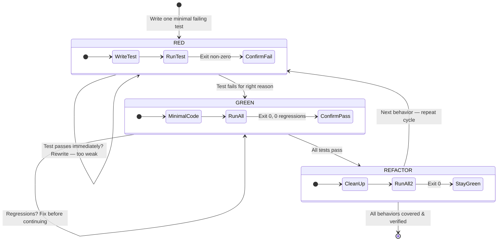

# TDD and Systematic Debugging

> Part of `super-ultra-code-plan`. Read `sucp-rules` too. Next phase: `sucp-verify-deliver`.

## 4️⃣ 🧪 Test-Driven Development (Iron Law)
> 🧪 **Component 3 — Test loop:** RED → GREEN → REFACTOR, repeated for each behavior, executed inside subagents (see Delegation & Execution for chunking, the high fan-out floor, and the gather & synthesize loop).

```
NO PRODUCTION CODE WITHOUT A FAILING TEST FIRST
```
Code before test → delete, restart. No "reference", no "adapt", no exceptions.
Cycle: RED (one minimal failing test) → verify fails for right reason → GREEN (minimal code to pass) → verify passes, no regressions → REFACTOR (clean up, stay green) → repeat.
| Quality | Good | Bad |
|---|---|---|
| Minimal | One behavior per test | "and" in test name |
| Clear | Name describes behavior | test('test1') |
| Shows intent | Demonstrates desired API | Obscures intended behavior |
Exceptions require explicit human approval, asked through the Confirmation Protocol (header `TDD waiver`): throwaway prototypes, generated code, documentation/configuration-only work, and visual-only changes. Every exception still needs an appropriate verification method.
Red flags — stop, restart: code before test, test passes immediately, can't explain failure, "just this once", "keep as reference", sunk-cost argument, "spirit not ritual" argument.



## 4.1 🐞 Systematic Debugging (Iron Law of Bug Isolation)
> 🐞 **Diagnostic loop:** REPRODUCE → DIAGNOSE (RCA) → SMALLEST SAFE FIX → REGRESSION PROOF.

```
NO BUG FIX WITHOUT A MINIMAL REPRODUCING FAILING TEST AND ROOT CAUSE ISOLATION
```
Shotgun debugging, speculative edits, and fixing symptoms without root cause isolation are strictly prohibited.
1. Phase 1 — Reproduce Deterministically:
   - Write a minimal failing test or deterministic reproducer command before touching production code.
   - Confirm failure matches the reported bug symptoms exactly.
2. Phase 2 — Diagnose & Isolate Root Cause:
   - Trace call stack, state transitions, and variable boundaries to identify the exact flaw.
   - Articulate the root cause clearly: what invariant was violated and why.
3. Phase 3 — Smallest Safe Localized Fix:
   - Apply the most focused, surgical patch that eliminates the root cause.
   - Strictly avoid unsolicited refactoring, cleanup of adjacent code, or changing unrelated interfaces.
4. Phase 4 — Regression Proof & Verification:
   - Run the reproduction test to prove GREEN status.
   - Execute the targeted test suite to confirm 0 regressions across existing functionality.

