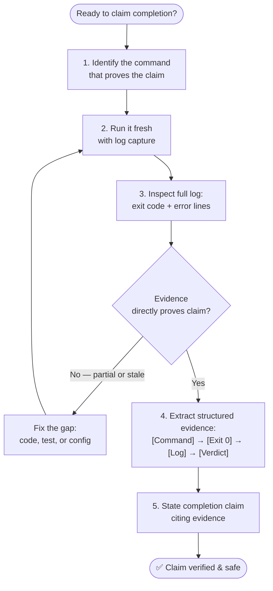
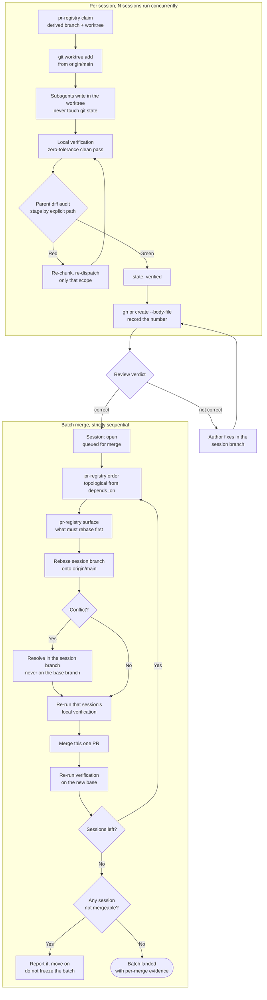

# Verification and Delivery

> Part of `super-ultra-code-plan`. Read `sucp-rules` too. Next phase after the evidence gate: `sucp-debt-sweep`.

## 🏗️ Professional Engineering Gates
Apply the gates relevant to the approved scope. Record `N/A` with a reason when a gate does not apply; never claim a gate passed without its evidence.

| Gate | Apply when | Required evidence |
|---|---|---|
| 🔗 Requirements traceability | Every requested change | Each acceptance criterion maps to a task, test/check, and final evidence |
| 🧬 Active project profile | Every plan or code change | Active root, target scope, verified configuration sources, commands, toolchain, and protected boundaries |
| 👀 Review and diff | Every non-trivial, shared, risky, or externally visible change | Diff review confirms intended files, behavior, tests, and no accidental changes or secrets |
| 🚦 CI and quality | Any code, test, configuration, or build change | Repository-required checks pass, with targeted checks run first where practical |
| 🔐 Security | Auth, permissions, secrets, input boundaries, dependencies, network, or sensitive data are involved | Allowed/denied paths, boundary checks, secret review, and relevant dependency/security audit |
| 🔄 Compatibility | API, IPC, schema, database, event, file format, or shared interface changes | Consumer impact, backward-compatibility decision, migration order, and rollback/data-preservation evidence |
| 📈 Production readiness | Deployment, runtime behavior, migration, or operational change is in scope | Observability signal, rollout plan, rollback path, and post-deployment verification |
| 📚 Documentation | Behavior, setup, configuration, API, migration, or operations change | Relevant documentation, examples, changelog, and runbook updates are accurate |
| ✅ Definition of Done | Every requested change | All applicable acceptance, quality, review, security, documentation, and operational gates are complete |
| 🧰 Reproducibility | Code, build, test, or environment behavior changes | Runtime/tool versions, setup, commands, fixtures, and environment assumptions are recorded |
| 🧪 Test reliability | Automated tests are added or changed | Tests are isolated and deterministic; flaky or environment-dependent behavior is identified and reported |
| 🔁 Plan lifecycle | A plan has multiple tasks or approval checkpoints | Status, version, decisions, superseded sections, and approval state are current |
| 📦 Supply chain | Dependencies, lockfiles, packages, or release artifacts change | Pinning/lockfile review, license check, vulnerability audit, and artifact provenance are addressed |
| 🛡️ Privacy and data governance | Personal, confidential, regulated, or user-generated data is involved | Data classification, minimization, redaction, retention, access, and audit behavior are reviewed |
| 🌐 User-visible completeness | A user-facing behavior or interface changes | Happy, loading, empty, error, retry/recovery, keyboard, accessibility, responsive, and localization states are covered as applicable |

### 🔗 Requirements Traceability
- Give each acceptance criterion a stable identifier such as `AC-1`, `AC-2`, and `AC-3`.
- Map every criterion to the task that implements it, the test or check that exercises it, and the evidence that proves it.
- A requirement without a task, a test/check, or final evidence is incomplete even when the build passes.

### 👀 Review, Diff & Publication
- Review the final diff, changed-file list, status, and generated artifacts before completion. Confirm that only approved files and behavior changed.
- A session ends in a pull request on its own branch, never in a commit on the working branch. See `5.5️⃣ 📤 Pull Request Delivery, Review & Batch Merge` for the isolation contract, the state machine, the body rules, and the ordered batch merge. Two related contracts live there and are not restated here: Git writes are parent-only (a subagent never commits, stages, or pushes), and a session's branch and worktree names are derived by `bun scripts/pr-registry.mjs claim` rather than chosen.
- Reviewing somebody else's pull request follows `templates/pr-review-template.md`. Reviewing your own local diff follows this section and `templates/code-review-template.md`; the difference is only what has to be fetched first and what gets posted.
- Post-Execution Final Code Review & Temp-File Purge: After plan execution completes and before any completion claim, run a dedicated final code review that (1) verifies each executed task against its acceptance criteria and cited evidence, (2) deletes every script, log, fixture, scratch file, or temporary/helper artifact created during execution unless it is an explicit deliverable or part of the approved change, and (3) re-scans the worktree and final diff to confirm the deleted files are absent and only approved files remain.
- Autonomous Code Review Rubric & 8-Point Bug Qualification Filter: reviewer agents emit this contract via `templates/code-review-template.md`.
  - An issue is a genuine review bug ONLY if it meets all 8 qualification criteria:
    1. It meaningfully impacts accuracy, performance, security, or maintainability.
    2. It is discrete and actionable (not an amorphous codebase critique).
    3. It does not demand a level of rigor absent from the rest of the repository.
    4. It was introduced in the active commit/diff (pre-existing debt is ignored).
    5. The original author would appreciate fixing it upon notice.
    6. It does not rely on unstated assumptions about intent.
    7. Sibling callers or consumers are provably affected (speculative disruption is banned).
    8. It is clearly not an intentional author design choice.
  - Priority Classification: Tag every finding title with its priority level: `[P0]` (drop everything, blocking release/operations), `[P1]` (urgent, fix next cycle), `[P2]` (normal, fix eventually), `[P3]` (low, nice to have).
  - Repository Rule Attribution Invariant: Every rule-supported finding MUST cite the exact supporting line range of `AGENTS.md`, `AGENTS.override.md`, or repository conventions. Subjective reviewer nitpicks or uncodified model preferences are strictly banned.
  - Review Comment Geometry: Body must be at most 1 concise paragraph; code chunks capped at 3 lines maximum; line ranges pinpointed to 5–10 lines maximum.
  - Deterministic Correctness Verdict: Conclude every code review with an explicit binary verdict: `correct` (patch will not break existing code/tests and is free of blocking defects) vs `not correct`.
  - Exhaustiveness: return EVERY qualifying finding, not the first one that qualifies. Deduplicate by changed location and by defect/remedy pair before reporting. If nothing qualifies, return none rather than padding the list with a nitpick.
  - Confidence & Remedy Discipline: state a confidence level per finding. A review reports findings; it does not ship the fix unless the user asks for one.
  - Instruction Precedence for Rule Attribution: resolve guidance in order of `AGENTS.override.md`, then `AGENTS.md`, then any configured fallback filename, walking from the repository root down to the changed file. The most specific applicable file wins, and explicit user instructions about review scope or style override repository files.
  - Suggestion Blocks: emit a suggestion block only for a concrete, minimal replacement that preserves leading whitespace and surrounding indentation. Never place commentary inside one.
- Non-trivial or shared-interface changes should receive independent review when a reviewer is available. If no independent reviewer exists, perform and report a documented self-review; do not imply peer approval.
- Local commits follow repository conventions and the approved workflow. Pushes, releases, deployments, PR comments, and other externally visible publication require explicit authorization, asked through the Confirmation Protocol (header `Publish`, safe option first) unless the approved scope already names it.
- Never include secrets, credentials, private data, temporary artifacts, or unrelated cleanup in a commit or publication.

### 🚦 CI, Test Layers & Quality Gates
- Run the repository's required checks for the affected surface. Start with focused tests and expand to required integration, contract, end-to-end, lint, type, build, or package checks as the scope demands.
- Checks run **locally in the agent's own session**, on the machine that holds the real working tree, the real vault, and the real service databases. A check that only runs on a remote runner cannot see that state, so a green remote result is not evidence about the thing being changed. Declare the checks complete only from local output, and quote the command and its exit code.
- Do not treat a hosted CI service as the executor, and do not push in order to make a remote pipeline run. Pushing to trigger someone else's runner converts a local verification problem into a remote one that costs the user's compute budget and still cannot see local state. If a check genuinely cannot run locally, report the boundary instead of relocating it.
- Select the test layer that matches the risk: unit tests for local logic, integration or contract tests for boundaries, and end-to-end tests for critical user flows. Do not substitute a passing lower-level test for a required boundary check.
- A failed required check blocks a completion claim. If an environment failure prevents verification, report the exact boundary instead of treating the check as passed.
- Zero-Tolerance Clean Pass: A passing run must be clean. Test output must report 0 failures and lint/type/build output 0 errors and 0 warnings. A single failure or warning in the affected surface is not a pass, and it may not be explained away as cosmetic or silenced with a suppression; resolve it and re-run until the run is clean before claiming completion. Distinguish pre-existing warnings outside the changed surface from new ones, and report any pre-existing warning explicitly as a follow-up rather than carrying it as part of the deliverable.

### 🔐 Security, Compatibility & Operations
- Treat authentication, authorization, input validation, secret handling, dependency changes, and sensitive data flows as explicit review surfaces.
- For API, IPC, schema, database, event, or file-format changes, enumerate consumers and decide whether compatibility, versioning, migration, backfill, rollback, and data preservation are required.
- For production-impacting changes, define what should be observed, how rollout is controlled, how failure is detected, how rollback works, and what post-deployment check proves the change is healthy.
- Update documentation only where the approved behavior, setup, configuration, API, migration, or operational procedure changes.

### ✅ Definition of Done & Plan Lifecycle
- Define `Definition of Done` for the approved scope before implementation. It must identify the applicable acceptance, implementation, test, review, security, documentation, and operational gates.
- Track plan status as `Draft → Approved → In Progress → Verification → Complete`, or `Blocked` when progress cannot continue without user input or an external change.
- Plan Completion Saturation Rule: when execution finishes, every task in the approved plan reaches `Done 100%` with cited evidence. A task left at 90%, "mostly done", or "done except the tests" is not a task state; it is either finished and evidenced, or `Blocked`/`DEFERRED` with a named reason. Never hand back a plan whose own scope is partially complete while claiming the plan is finished.
- Definition-of-Done scope boundary: `Done 100%` covers exactly what the approved plan defined. Anything discovered outside that scope belongs to the Step 6 debt sweep as a follow-up candidate, so plan completion is never inflated into unrelated cleanup.
- Plan status flips to `Complete` only after the Step 6 debt sweep has run and every remaining item is either resolved in-session or explicitly deferred with a `defer: <ceiling>, <upgrade-trigger>` marker. A plan is never closed while unexamined technical debt is still sitting in the task state.
- Record plan version, approval state, changed decisions, superseded sections, and the reason for each scope or contract change.
- A completion claim requires every applicable gate to pass or an explicit, documented risk acceptance from the authorized human partner.

### 🧰 Reproducibility & Environment
- Record the runtime, language, package manager, dependency, operating-system, database, service, and tool versions that materially affect the implementation or verification.
- Record setup prerequisites, environment variables by name without exposing secret values, exact commands, fixtures, seed data, and expected outputs needed to reproduce the result.
- Keep dependency manifests and lockfiles synchronized. Explain new dependencies, rejected alternatives, license impact, size/performance impact, and removal or upgrade considerations.
- Distinguish a repository failure from a local environment limitation. Do not claim reproducibility when the required environment or dependency is unavailable.

### 🧪 Test Reliability & Failure Classification
- Prefer deterministic, isolated tests with controlled fixtures, stable clocks, explicit cleanup, and no dependence on execution order or external state unless the test is specifically an integration test.
- When a test is flaky, classify the cause, capture evidence, and report the affected scope. Do not hide flakiness with unbounded retries or weaken assertions.
- Classify failed checks as code failure, test failure, contract failure, environment failure, infrastructure failure, or unrelated pre-existing failure. The classification must be supported by evidence.
- Retry only transient failures with a bounded policy. A retry is additional evidence, not proof that the original failure was irrelevant.
- **The runner classifies what the exit code proves, and reports the rest as unknown.** `scripts/ultra-plan-runner.mjs` resolves a failed step into `timeout` (124 or ETIMEDOUT), `environment` (127 absent, 126 not executable), `interrupted` (130), `terminated` (143), or `code`, with `contract` reserved for the runner's own pre/postcondition failures. `transient` is a separate axis: `true` only for a timeout, `false` only where a re-run provably cannot help (so a 127 fails once instead of twice, visibly), and `unknown` for the ordinary exit 1, because a flaky test and a deterministic failure are indistinguishable from an exit code. **Classify from evidence; never guess, and never report a guess as a class.** A missing binary filed as a code failure sends triage to the wrong place, which is the whole cost of the guess.
- **A failure row carries its own evidence.** The Error Ledger records the command's stderr tail (stdout when stderr is empty), bounded to the last few lines, plus the expectation the step actually carried. A row that states only "exit 1" cannot be acted on without re-running the command — and re-running a stateful step is not the same command twice. When the ledger says `_no output captured_`, that is itself the finding: the failing command produced nothing to diagnose with.
- **A timed-out step is terminated with its children.** `spawnSync` signals only the shell it spawned; measured on `sh -c "sleep N & wait"`, the backgrounded process outlived the reported ETIMEDOUT. The runner therefore runs steps in their own process group and signals the group, so a step that overruns `step_timeout_s` leaves no build or test worker holding a lock. This is the machine form of the Stalled Subagent & Stale-Writer Guardrail below, which the agent follows by hand.

### 🚀 Rollout, Observability & Recovery
- Deployment method default: deploy through the active repository's direct deployment script (e.g. `scripts/deploy-website.sh`) unless the user explicitly asks for CI, a workflow, or a pipeline to perform the deployment. Do not route a deployment through CI/CI-triggered jobs by default; treat CI-driven deployment as an explicit user choice.
- For production-impacting work, define the rollout mode, owner, health signal, success threshold, observation window, rollback trigger, and rollback owner before deployment.
- Prefer staged rollout, feature flags, canarying, or a reversible migration when the change has meaningful blast radius and the platform supports it.
- Define logs, metrics, traces, health checks, alerts, and user-visible signals needed to detect both failure and silent degradation. Avoid logging secrets or unnecessary personal data.
- For data or infrastructure changes, verify backup availability, restore procedure, migration rehearsal, rollback limits, and data integrity before applying the production change.
- After deployment, run the documented post-deployment check and record the result, timestamp, version, and any follow-up action.

### 🛡️ Privacy, Data Governance & Supply Chain
- Classify data before changing its collection, storage, transmission, display, export, or retention. Minimize collection and restrict access to the smallest required scope.
- Review redaction, deletion, retention, audit trail, encryption, and user-consent behavior when personal, confidential, or regulated data is involved.
- For dependencies and release artifacts, review lockfile changes, known vulnerabilities, license compatibility, integrity checks, provenance, and whether generated artifacts contain unintended content.

### 🌐 User-Visible Completeness
- For user-facing changes, define and verify the normal path plus loading, empty, error, retry, recovery, offline, permission-denied, and destructive-confirmation states that apply.
- Verify keyboard operation, focus behavior, semantics, contrast, screen-reader exposure, responsive layouts, localization, text expansion, and reduced-motion behavior when applicable.
- Treat WCAG 2.2 Level AA as the default accessibility target for web interfaces and user-facing flows, mapping applicable success criteria to acceptance criteria and verification evidence; document an explicit exception when the platform or approved design makes a criterion inapplicable.
- Preserve existing design-system, platform, accessibility, and localization conventions unless the approved design explicitly changes them.

## 5️⃣ ✅ Verification Before Completion (Iron Law)
> ✅ **Component 4 — Evidence gate:** identify, run, read, and confirm the proof before making the claim.

```
NO COMPLETION CLAIMS WITHOUT FRESH VERIFICATION EVIDENCE
```
Gate before any completion/success claim:
1. Identify command that proves claim
2. Run full command, fresh (with log capture or verification trail)
3. Trace and inspect full log output, exit code, failure count, and error lines
4. Extract structured log evidence: `[Command] → [Exit Code] → [Extracted Log Trace / Metrics] → [Deterministic Verdict]`
5. Confirm output directly proves the claim
6. Only then state claim, citing the verified log evidence
- Execution Over Synthesis: numeric/rendered results come from executed code, not mental math on copied text. Re-run the proving command for the claim at hand; do not reuse a stale log from an earlier step as proof for a new claim.
- Independent Check for High-Stakes Work: for production, security, migration, or irreversible changes, the final check is done by a reviewer that did not produce the work (separate subagent or documented self-review with fresh reads). The work never grades itself silently.
| Claim | Requires | Not sufficient |
|---|---|---|
| Tests pass | Fresh test output, 0 failures | Previous run, "should pass" |
| Linter clean | Fresh linter output, 0 errors | Partial check |
| Build succeeds | Build command exit 0 | Linter passing |
| Bug fixed | Original symptom retested, passes | Code changed, assumed fixed |
| Requirements met | Line-by-line checklist vs spec | Tests passing alone |
| Agent completed | VCS diff shows actual changes | Agent self-report |

Requirement-by-Requirement Completion Audit: treat every completion claim as unproven until audited.
1. Derive the concrete requirements from the objective, the approved plan, the spec, the issue, and the user's stated constraints.
2. For each requirement, name the artifact, command output, log, diff, or current file state that would prove it.
3. Classify each piece of evidence as proof, contradiction, partial, too weak, or missing.
4. Partial or too-weak evidence means NOT achieved: keep working, or report the gap precisely. Never present the result as complete with a caveat attached.
5. Intent, a plan, a prior conversation, memory of an earlier run, a green test manifest, or a reviewer summary count as proof only after confirming they actually cover the requirement in question. Match the evidence scope to the claim scope: a narrow check never proves a broad claim.

Verification matrix — run only the rows relevant to the approved scope and record `N/A` with a reason for the rest:

| Change surface | Minimum evidence |
|---|---|
| Behavior | Focused test or reproducible check for each acceptance criterion |
| Regression | Relevant neighboring tests and unchanged contracts, plus every surface the tasks' `impacts` declared — each one either re-verified or recorded as a follow-up |
| UI/accessibility | Rendered behavior, interaction states, keyboard/accessibility checks where applicable |
| API/data/migration | Contract/schema validation, migration or rollback check, affected consumer check |
| Security/permissions | Allowed and denied paths, boundary validation, secret-handling review |
| Code review/diff | Intended-file review, no accidental changes, no secrets, reviewer or documented self-review |
| CI/repository gates | Required checks for the affected surface, including integration/contract/e2e checks when applicable |
| Compatibility | Consumer impact, versioning or migration decision, rollback and data-preservation check |
| Reproducibility | Documented environment, versions, setup, fixtures, commands, and expected outputs reproduce the result |
| Test reliability | Deterministic/isolation check, flaky-test classification, cleanup, and bounded retry evidence |
| Performance | Targeted measurement when performance is part of the request or risk |
| Operations/rollout | Observability signal, rollout/rollback check, and post-deployment verification when applicable |
| Privacy/data governance | Classification, minimization, access, redaction, retention, deletion, and audit behavior when applicable |
| Supply chain | Lockfile, license, vulnerability, integrity, provenance, and generated-artifact review when applicable |
| UX completeness | Applicable loading, empty, error, recovery, keyboard, accessibility, responsive, and localization states |
| Definition of Done | Every applicable gate and acceptance criterion is complete, evidenced, and traceable |
| Build/deployment | Relevant build/package/deploy check when the deliverable includes it |
| Documentation/configuration | References, examples, and configuration behavior match the implementation |
| Session close / debt sweep | Every noticed-but-unclosed item classified `NOW`/`LATER`, 3-5 ranked follow-ups injected as one question-tool call of multi-select groups, each selection executed with fresh evidence or explicitly deferred with a `defer:` marker |



Red flags: "should", "probably", "seems to", satisfaction expressed pre-verification, trusting agent reports without diff check, "I'm tired", "just this once".

## 5.5️⃣ 📤 Pull Request Delivery, Review & Batch Merge
> 📤 **Component 5 — Delivery:** a session ends in a pull request on its own branch, never in a commit on the working branch. This is the stage that makes twenty concurrent sessions survivable: isolation, review, and an ordered merge are the only things standing between twenty agents and twenty silently clobbering each other.

### Why a PR and not a commit
Three failure modes appear the moment more than one session touches one repository, and none of them raises an error at the git level, because each individual command is valid:

| Failure | What actually happens | Where it is prevented |
|---|---|---|
| Two sessions on one branch | The second push fast-forwards or is rejected; the agent reaches for `--force` and the first session's PR now carries the second session's commits | Derived branch names, refused at claim time |
| Two sessions in one worktree | `git worktree add` fails, or the second session works inside the first session's checkout and both diffs become garbage | Derived worktree paths, refused at claim time and at load time |
| Merging in finish order | A session that depends on another lands first, then conflicts with the rest of the batch | Topological merge order from a recorded `depends_on` graph |

So the naming is computed rather than chosen, and the order is computed rather than remembered.

### 5.1 Isolation, before any subagent is dispatched
```bash
# One claim per session. It prints the branch and the worktree path.
bun scripts/pr-registry.mjs claim --plan <plan-id> --session <session-slug> \
  [--repo <repo-root>] [--depends-on <slug>,<slug>]

# Then, in the repository, before dispatch:
git worktree prune
git fetch origin main
git worktree add <printed-worktree> -b <printed-branch> origin/main
```

- The branch is exactly `<plan-id>/<session-slug>`, and carries **no tool, vendor, or workflow prefix**. `ai/<plan-id>/<session-slug>` was the earlier shape and is gone: a branch name is permanent, publicly readable repository history, so a prefix is an authorship claim in an artifact nobody can redact later, which is the same defect as the `Generated with <tool>` footer (see the copy rule). The plan id already dates and describes the work. Slots claimed before the change keep the branch they claimed, so nothing has to be renamed and no migration exists.
- The claim is **idempotent**. A retried claim after a crashed session returns the same slot instead of allocating a second one, because the names are a pure function of the two inputs.
- `--depends-on` is only accepted for sessions that already hold a slot. An unclaimable dependency would make the merge order unprovable, so it is refused at claim time rather than discovered at merge time.
- Every subagent's working directory is that worktree. Nothing is dispatched before it exists.
- The parent dispatches with the worktree path in the contract, so a subagent cannot resolve a relative path against the main checkout.

### 5.2 The session state machine
`pr-registry.mjs` holds the session state, and the states exist to make two specific mistakes impossible:

```
isolated → active → verified → open → merged
                                    ↘ closed
```

| State | Meaning | How it is reached |
|---|---|---|
| `isolated` | Branch and worktree exist, nothing written | `claim` |
| `active` | Subagents are writing inside the worktree | `state <s> active` |
| `verified` | Local evidence is green, parent diff audit passed | `state <s> verified` |
| `open` | The PR exists on the remote | `pr <s> --number <N>` |
| `merged` | The PR reached the base branch | `state <s> merged` (refused while the plan is not `Complete` or its issue is not closed) |
| `closed` | The PR was closed without merging (superseded, abandoned, or its change landed by another path) | `state <s> closed` |

- **A PR number cannot be recorded before `verified`.** `setPr` throws otherwise. Recording a PR implies the work is finished and checked, so `isolated → open` would skip the gate that makes a merge safe.
- **Only an `open` session can merge**, and only if it has a PR number. A green local run is not a mergeable session; a mergeable session is a green local run *and* a PR.
- **`state <s> merged` is also the close-out gate.** It reads the session's plan file (`docs/code-plan/plans/<plan>.md` in `--repo`, default this repository) and the `plan.issues.json` record, and exits 1 without touching the registry when the plan is not `Complete`, the issue is not closed, or the issue record was not re-synced after the status changed. Each gap is printed with the command that fixes it. The plan flips to `Complete` after the Step 6 debt sweep, before the merge, so reaching this gate with an open plan means a closing step was skipped. `--allow-open-plan` records the merge anyway and prints a warning. A missing plan file, a missing `plan.issues.json`, or a plan with no issue record is reported as skipped, not as a pass. The check reads the last sync's record, not live GitHub.
- **`merged` and `closed` are terminal.** Reverting or redoing a session is a new session with a new branch, never a state edit. Letting the registry file "un-merge" would hide a revert from the merge order.
- **A `closed` session is finished but did not move the base.** Unlike `merged` it is not a rebase reason, so `surface` never lists it as landed; unlike an unmerged `open` session it satisfies a dependency, so `order` does not make a dependent wait on a PR that will never land.
- **Recording a PR moves `verified → open` automatically.** A PR that exists while the session is still `isolated` is a state contradiction, so the tool refuses to represent it.

### 5.3 Opening the PR
Follow `templates/pull-request-template.md` for the body.

- **Write the body to a file, post with `--body-file`.** Passing multi-line markdown through `--body` on a command line is error-prone with newlines, backticks, shell quoting, and checkbox markers. `--body-file` handles all of it.
- **The body is in the codebase's language, not the language the request arrived in** (see Artifact Language Follows the Codebase). A translated PR body breaks `grep` for the next reviewer.
- **No em dash anywhere in the body, the commit messages, or user-visible strings in the diff** (see the copy rule). This scan blocks the PR, not just the session.
- **No attribution footer, watermark, badge, or co-author line** (see the copy rule for the full statement and the measured case). An unrequested credit line is a defect even when it names the right tool, because it sets a house style nobody agreed to, and the tool it names is frequently wrong. Append one only when the user names the exact text.
- Title is imperative and names the outcome, not the mechanism. `fix: null deref in retry loop`, not `update retry code`.
- Draft (`--draft`) when the session is genuinely incomplete. A draft is not a smaller completion claim; it is an honest one. Never leave a session draft when its evidence is green, because a draft that nobody un-drafts is a session that silently never lands.
- Record it immediately: `bun scripts/pr-registry.mjs pr <session> --number <N>`. A PR that exists but is not in the registry is invisible to the merge order, which means it never gets merged.
- **`gh` must be authenticated before the first push, not discovered at PR time.** `gh auth status` once per session, at the start. A missing token discovered after twenty commits is a much worse place to find out than before the first one.

```bash
gh pr create --base main --head <branch> \
  --title "<imperative title>" \
  --body-file <path-to-pr-body.md>
```

### 5.4 Reviewing a PR
Use `templates/pr-review-template.md` for the report. Two things make it deterministic rather than a matter of reviewer taste:

**Every input is fetched and recorded before any judgement.** Metadata, diff, commits, existing review comments, prior verdicts, and CI status. A row marked "not consulted" with a reason is honest; a row left blank is indistinguishable from a row that was checked and found clean, and it reads as the latter.

**Remote CI status is reported, never adopted.** This repository's checks run locally by policy, so a green remote run is the author's evidence about a commit, not this reviewer's evidence about the working tree. Reading it as a verification result is the same error as pushing to trigger someone else's runner.

**Line anchoring is part of the finding, not formatting.** A comment anchored to a line the PR did not touch either fails to post or degrades into a general remark that looks specific. Every finding names a changed line and the correct side.

**The verdict is binary and derived.** `not correct` if and only if there is at least one blocking (`P0`/`P1`) finding. No third state, no "looks good overall". A verdict names the specific checkable condition that would change it, because "after the author addresses comments" is not a condition.

**Generating a review and posting it are two acts.** The posted comment is a shorter artifact than the internal report: verdict, blocking findings, and nothing else. Internal reasoning and praise stay in the report. Posting is externally visible publication: the exact text is shown in chat first, then asked through the Confirmation Protocol (header `Publish`, safe option first). A reviewer that posts its own draft has skipped the only gate that exists on this stage.

### 5.5 Merging a batch of twenty PRs
```bash
bun scripts/pr-registry.mjs order        # the merge order, computed from depends_on
bun scripts/pr-registry.mjs surface <s>  # what must rebase first, and what blocks it
```

- **Order is topological, from the recorded `depends_on` graph, never chronological.** Ties break on session name so the same registry always yields the same order. A timestamp tiebreak would make the printed plan unreproducible and two runs of one registry would disagree.
- **Already-merged sessions drop out and stop blocking their dependents.** That is the plan's own blast-radius rule applied to merges: a session waiting on nothing should still be able to land.
- **A dependency cycle is refused with the cycle named.** There is no valid order for a cycle; the remedy is to split a session, not to pick an arbitrary one.
- **Rebase before each merge, not once at the start.** The base branch moves with every merge, so a branch rebased at position 3 is already behind by position 7. `surface <s>` reports which sessions landed since the branch was cut.
- **Verify locally after every single merge.** Twenty merges followed by one test run at the end means nineteen merges ship unverified. The check after merge N is the evidence for merge N, and it is cheap because the session was already verified once.
- **One merge at a time.** A batch merge is an unverified batch.
- **The merge itself is a question, once per merge.** Ask it through the Confirmation Protocol (header `Merge`): the first option is `Do not merge`, the second is `Merge the PR` with a description naming the PR number and the head commit. The standing gate on merging into the base branch is unchanged; the question only removes the typing.
- **A conflict is resolved in the session's branch, never on the base branch.** Rebase the session branch onto `origin/<base>`, resolve there, re-run that session's verification, push, then merge. Editing the base branch directly to "fix" a conflict is how a conflict becomes an unreviewable change nobody can attribute to a session.
- **If a session cannot be made mergeable, it does not merge.** Mark it and move to the next one in the order. A blocked session is a status, not a reason to freeze nineteen others.

### What is never allowed on this stage
- Committing or pushing directly to the base branch. There is no exception for a one-line fix; the exception is a separate session with its own branch.
- A hand-written branch or worktree name. Derived or nothing.
- `--force` or `--force-with-lease` on a session branch. A force push on a branch that already has a PR rewrites review history; rebase-and-push only onto a branch with no PR yet.
- Force-merging a conflicted PR to clear a queue. A conflict is information.
- A review verdict written into a plan mirror or a vault note. It belongs in the PR and in the source plan, both of which survive the next publish.
- Merging on the strength of a green remote CI run, or on a subagent's self-report of success.



