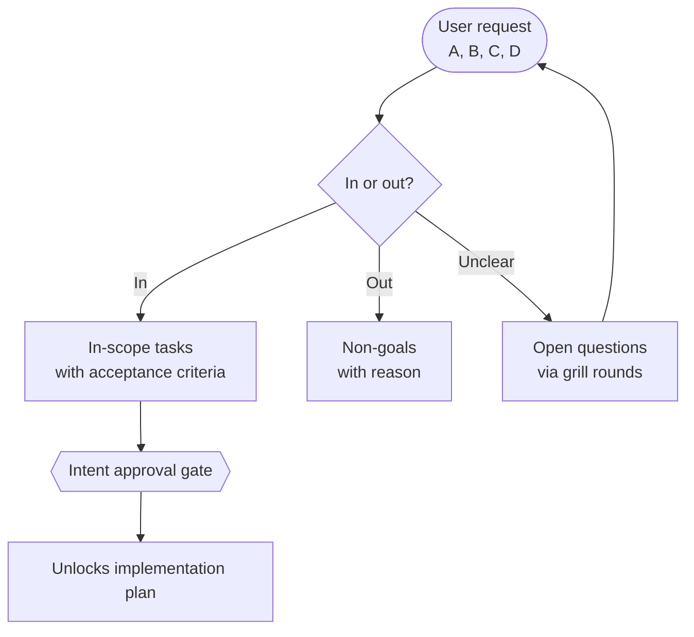

# Intent Lock Report: [Topic]

> Fill this during the brainstorm session, before any implementation plan exists.
> No code, no plan file, no worktree until Section 8 is approved.

## 1. Goal & Context
- **Problem:** [one-two sentences: what hurts, for whom]
- **Desired outcome:** [observable end state]
- **Requester intent (verbatim):** [quote the user's own words for tasks A, B, C, D before interpreting them]

## 2. Task List (A, B, C, D...)
| ID | Task (user wording) | Interpreted scope | In / Out | Notes |
|---|---|---|---|---|
| A | | | | |
| B | | | | |
| C | | | | |
| D | | | | |

- Every row keeps the user's original phrasing next to the agent's interpretation. A row with no interpretation is unprocessed, not agreed.

## 3. Scope Map

## 4. Non-Goals
- [Explicitly out of scope + one-line reason each]

## 5. Decisions & Trade-offs
| # | Decision | Options considered (2-4) | Chosen + why | Who decided |
|---|---|---|---|---|
| D1 | | | | Human / Agent-default |

- Assistant-proposed options are NOT decisions until a Human turn adopts them. Mark agent defaults as `Agent-default (needs confirmation)` vs `Human-locked`.

## 6. Assumptions
- [Assumption + what would falsify it + impact if wrong]

## 7. Acceptance Criteria (observable, testable)
- [ ] AC-1: [criterion]
- [ ] AC-2: [criterion]

## 8. Approval Gate
- [ ] Human approves this intent lock before any plan is written, answered through the Confirmation Protocol (header `Intent`).
- [ ] Approved scope (tasks A/B/C/D as locked): [...]
- [ ] Next step: invoke the plan snippet to generate the implementation plan from this lock.
