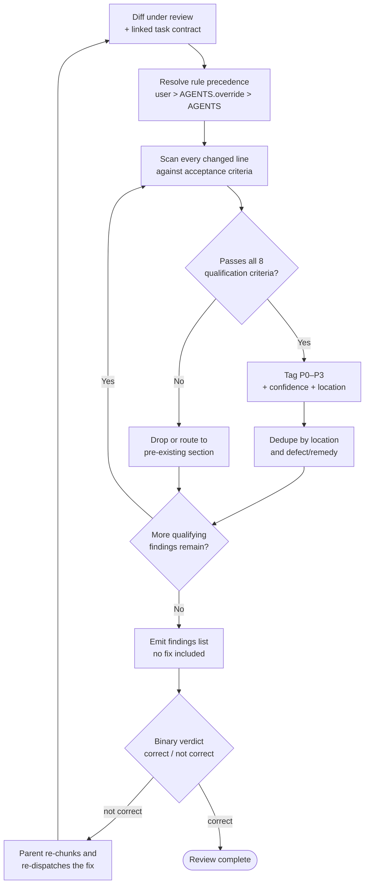

# Code Review Report: [Change / Diff Under Review]

> Structured output contract for a reviewer agent. The reviewer reports findings; it does not ship the fix.
> Populate every section. Write `none` where a section has no qualifying finding.
>
> **Scope: a local diff, a branch, or a worktree.** Reviewing a pull request
> somebody else opened is a different unit of review: remote state has to be
> fetched first, coverage has to be answered per category, and the output is a
> comment a human approves, through the Confirmation Protocol, before it is posted. Use
> `templates/pr-review-template.md` for that, and keep the 8-point qualification
> filter below as the shared core. Do not duplicate one template into the other;
> the split is what keeps the internal report and the posted comment from
> collapsing into the same artifact.

## 1. Review Scope & Inputs

- **Change under review:** [branch, commit range, or worktree path]
- **Base reference:** [commit or ref the diff is computed against]
- **Linked task contract:** [`templates/subagent-contract-template.md` chunk id, plan task id, or issue]
- **Stated intent:** [what the change is supposed to accomplish, in one or two sentences]
- **Out of scope:** [surfaces the reviewer must not comment on]
- **Reviewer type:** independent subagent | parent self-review (no independent reviewer available)

## 2. Rule Attribution Precedence

Resolve repository guidance in this order, walking from the repository root down to each changed file:

1. explicit user instruction about review scope or style
2. `AGENTS.override.md` (deepest applicable directory first)
3. `AGENTS.md` (deepest applicable directory first)
4. configured fallback instruction filename
5. repository conventions visible in the surrounding code

The most specific applicable source wins. A finding is rule-supported only when the located guidance materially contributes a repository-specific scope, invariant, remedy, or confirmation behavior beyond generic correctness advice. Ordinary findings stand on their own without rule support.

- **Guidance sources consulted:** [`path:line-range`, ...]

## 3. Bug Qualification Filter (all 8 must hold)

An issue is a genuine review finding ONLY when every criterion is satisfied:

1. It meaningfully affects correctness, performance, security, or maintainability.
2. It is discrete and actionable, not an amorphous critique of the codebase.
3. It does not demand a level of rigor or ceremony absent from the surrounding code.
4. It was introduced by this change; pre-existing debt is reported separately, not as a finding.
5. The author would likely fix it once aware of it.
6. It does not rest on unstated assumptions about intent or unstated infrastructure.
7. Affected code is provably impacted, not speculatively affected.
8. It is clearly not a deliberate design choice by the author.

Trivial style, formatting, typos, and documentation nits are not findings. If nothing qualifies, report none.

**One exception, because it is measurable rather than a matter of taste.** A comment this change *introduced* that adds nothing the code does not already show does qualify, under criteria 1 and 5: an unreadable comment is a maintainability cost every later reader pays. That covers a restated line, `// Step 1: validate`, `// Core logic`, a decorative emoji, and `} // end if`. Two limits keep it honest. It must be anchored to a line this diff actually touched, and a plain rule marking a top-level block in a long file is an index rather than slop, so it is never a finding. See **Code Comment Hygiene** in the master skill for the full rule.

## 4. Findings

Report **every** qualifying finding, not the first one. Deduplicate by changed location and by defect/remedy pair before writing. Keep the reported line range as tight as possible, ideally 5–10 lines.

| Field | Requirement |
|---|---|
| Title | `[P<level>] <imperative summary>`, 80 characters or fewer |
| Priority | `P0` block everything · `P1` fix next cycle · `P2` fix eventually · `P3` nice to have |
| Location | Absolute file path plus tight start and end line |
| Body | One paragraph: the defect, the concrete scenario that triggers it, and the impact. State explicitly which inputs, environment, or state the finding depends on |
| Confidence | `0.0`–`1.0` numeric |
| Rule support | Exact `path:line-range` of the governing rule, or omit when the finding is self-evident |

### Priority Calibration

| Level | Use when |
|---|---|
| `P0` | Universal failure independent of inputs, or the patch must be dropped entirely |
| `P1` | Urgent: breaks a documented contract, loses data, or opens a security hole on a realistic path |
| `P2` | Normal defect, correct on the intended path, breaks on an edge case worth fixing |
| `P3` | Low value polish; the author may decline it |

### Finding Example

```
[P2] Clear the staged lockfile before resolving the new transitive dep

`bun install` runs before `git add bun.lock`, so the commit can capture
a lockfile rewritten by a later unrelated install in the same run. Anyone checking
out that commit and running `bun install --frozen-lockfile` gets a resolution error
instead of the pinned tree. Move the staging line after the install and add
`git diff --exit-code bun.lock` to the verification step.
```

### Suggestion Blocks

Use a suggestion block only for a concrete, minimal replacement. Preserve the exact leading whitespace of the replaced lines and never change surrounding indentation. No commentary inside the block.

````
```suggestion
-  const timeout = 5000
+  const timeout = process.env.REQUEST_TIMEOUT_MS ?? 5000
```
````

## 5. Pre-Existing Issues (reported, not filed as findings)

- [Issue observed in surrounding code, with `path:line` and why it is out of this change's scope]

## 6. Correctness Verdict

End every review with one explicit binary verdict, justified in one to three sentences.

- **Verdict:** `correct` | `not correct`
- **Justification:** [does the patch break existing code, tests, or contracts; are there blocking defects]
- **Overall confidence:** `0.0`–`1.0`

## 7. Reviewer Self-Check

- [ ] Every reported finding passes all 8 criteria in section 3.
- [ ] All qualifying findings were reported, not just the first.
- [ ] Findings were deduplicated by location and by defect/remedy pair.
- [ ] No pre-existing issue was filed as a finding.
- [ ] No speculative breakage was reported without provable impact.
- [ ] No praise, no filler apology, and no restatement of the diff back to the author.
- [ ] No fix was applied and no patch was emitted; the review reports only.
- [ ] Verdict stated, with the conditions that would change it.


