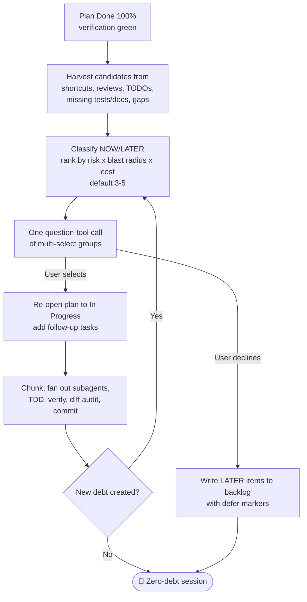

# Session-Close Debt Sweep & Follow-Up Injection — Template

> Use after the approved plan is `Done 100%` and the verification gate is green. The output is a batched question-tool call of multi-select groups, not a report. Default 3-5 items.

---

## 1. Preconditions

| Check | Evidence | Status |
|---|---|---|
| Plan tasks all `Done 100%` (or `Blocked`/`DEFERRED` with a reason) | Task checklist in `docs/code-plan/plans/<plan>.md` | Pending |
| Verification gate green (fresh command, exit 0, 0 failures/errors/warnings) | `[Command] → [Exit 0] → [Log] → [Verdict]` | Pending |
| Final diff audited, temp files purged, git hygiene done | `git status`, `git diff` | Pending |
| Blocked items excluded from candidates, each with its unblock condition | Error Ledger | Pending |

## 2. Harvested Debt Candidates

| # | Source | Candidate (outcome + path + finish line) | Class | Est. |
|---|---|---|---|---|
| 1 | `defer:` shortcut ceiling hit | | `NOW` / `LATER` | S / M / L |
| 2 | Review finding (`[P1]`) | | | |
| 3 | Pre-existing lint/type warning | | | |
| 4 | Sibling caller left inconsistent | | | |
| 5 | Missing test layer on changed surface | | | |
| 6 | Missing docs / changelog / runbook entry | | | |
| 7 | TODO/FIXME/`.skip`/`ts-ignore`/dead code seen in diff | | | |
| 8 | Flaky test or unmeasured perf/security risk | | | |
| 9 | Verification gap (partial or unrunnable evidence) | | | |
| 10 | Other | | | |

`NOW` = closes fully inside this session, no new approval, no destructive action, no external dependency.
`LATER` = needs a new plan, an external dependency, or a genuine scope decision. Goes to the written backlog with a `defer: <ceiling>, <upgrade-trigger>` marker.

## 3. Ranked Follow-Up Set (default 3-5, cap 5)

Rank by `leftover risk x blast radius x cheapness to close`. Everything below the cap goes to section 6, not to another question batch.

1. `[short label]` — one line naming the file/surface touched and the check that proves it closed. (recommended)
2. `[short label]` — ...
3. `[short label]` — ...

Banned from the batch: destructive, externally visible, credential-touching, or scope-expanding items (ask each on its own through the Confirmation Protocol, safe option first); already-completed items; cosmetic preferences with no code outcome.

## 4. The Question (single batched multi-select call)

Present through the harness's structured question mechanism (the tool table is in the Confirmation Protocol) as one question-tool call placed after the final recap. Cap: multi-select questions of at most 4 options each, at most 4 questions per call, and the last option of the last group is `Nothing, close session`. If the runtime has no question tool, render the checkbox list below as the Confirmation Protocol fallback (the gate stays closed) and say plainly that the widget is missing.

The description of the recommended option begins with `Why:` and the ranking factor that put it first, then the usual one line naming the surface and the finish line.

- [ ] **`<option label>`** — `<one line: surface touched + finish line>` (recommended)
- [ ] **`<option label>`** — `<one line>`
- [ ] **`<option label>`** — `<one line>`
- [ ] `Nothing, close session`: keep these in the backlog with their `defer:` markers

Never ask one call per item. Never re-ask a declined item in the same session.

## 5. Execution Record (selected items)

| Item | Plan task id | Acceptance criterion | Verify command | Evidence | Status |
|---|---|---|---|---|---|
| | `F1` | | | | `IN PROGRESS` / `DONE` / `DEFERRED` |

Selected follow-ups run the full pipeline: chunk, subagent fan-out, TDD for behavior changes, fresh verification, parent diff audit, conventional commit. Plan status returns to `In Progress` for the duration and back to `Complete` when green.

## 6. Deferred Backlog (`LATER`)

| Item | Why deferred | `defer: <ceiling>, <upgrade-trigger>` |
|---|---|---|
| | | |

## 7. Second Sweep Pass

Did executing a selected item create new debt in the surface it touched? List new candidates and re-ask only for genuinely new items.

