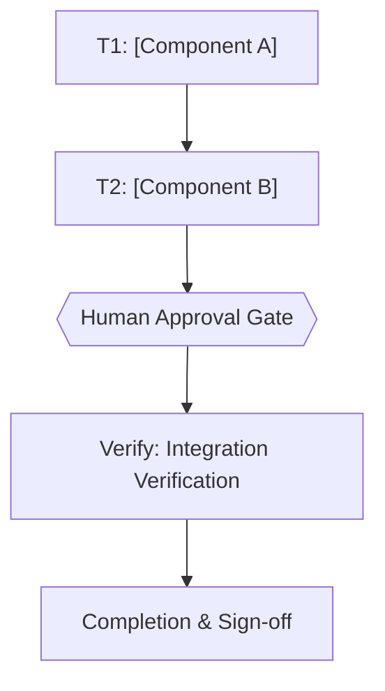

# [Feature Name] Implementation Plan

> The YAML frontmatter above is the single source of truth for routing, dependency order, retry, and idempotency. Prose and checklists below only explain and must never contradict it. Every `Task N` heading, its `tasks[].id`, and its Mermaid node id must be the same identifier; a mismatch is a pre-execution blocker. Commands stay tool-agnostic and directly runnable (no MCP/rtk required to execute this plan).
>
> **`run[]` is what the runner executes.** A task carrying `run[]` is machine-runnable: `bun scripts/ultra-plan-runner.mjs <plan.md> --execute` runs each `cmd` in order, compares the exit code to `expect_exit`, retries up to `retry` times, and reports `PASSED` / `FAILED-BLOCKING` / `FAILED-ISOLATED`. Without `run[]` the runner reports `NEEDS-AGENT` and the agent runs the prose steps itself, which is correct for work with no shell command (writing prose, choosing a layout, settling a design question) — but that task must still declare `skip_if`, or it is invisible to the runner and exempt from every gate.
>
> **A `skip_if` that only proves a string is present is not an idempotency proof.** `grep -q 'Marker' src/x.md` stays true after the string moves into a comment, and `plan-mark-done.mjs` will tick the task off it. **The runner rejects this as a validation error.** Prefer a command that fails on behaviour: a test invocation, a build, a `git diff` query, or a state check. A `grep` that filters the output of a tool (`bun test x 2>&1 | grep -q ...`) is fine — the tool has to succeed first. The whole grep family counts as a file probe, including `rg -q`, `tgrep -q`, and a path-qualified `/usr/bin/grep -q`. Grandfather an existing plan with `defaults.allow_loose_skip_if: [T3]`.
>
> **A `skip_if` the rules cannot classify gets a warning, not an error.** `classifySkipIf` returns `empty`, `sentinel` (the literal `false` — the documented "this task has no command"), `behavioural`, `loose`, or `unknown`. An `unknown` command — one that is neither a tool invocation nor a file probe, such as `bash scripts/x.sh --verify out.txt` or `pacman -Q rtkit` — draws a `WARN` naming the task and the command, and the plan still runs. That is deliberate: 14 such tasks live in plans belonging to repositories this one does not own. If the command genuinely has no exit status worth asserting, write `skip_if: "false"`; that is a deliberate no-op, not an exemption, and such a task still reports `NEEDS-AGENT` because it declares no `run[]`. There is no `allow_unknown_skip_if` — a second allowlist would decay into a permanent blanket. Run `bun scripts/skipif-registry-audit.mjs` for the current tally.
>
> **The other declared fields are enforced too, so keep them honest.** Every `files.modify` and `files.test` path must exist before the steps run, and every `files.create` path must exist after they finish. A `run[]` step with no `expect_exit` inherits `verify_exit`. `idempotency_key` must begin with this task's own id; its right-hand side names the unit of work and is free-form, because a behaviour like `T3:two-stage-trigger` has no filename. `on_precondition_fail` is either `stop-task-continue-independent` or `halt-plan`; anything else throws.
>
> **`loop_until` is the convergence condition, which `retry` is not.** `retry` bounds how many times a step may re-run; it says nothing about what proves one iteration finished. `loop_until` holds the command the runner executes after that step's own `cmd` succeeds, and its exit code is the answer: 0 means this iteration has converged and the step passes, non-zero means it has not and the step re-runs inside the `retry` budget already declared. It is optional and its absence stays legal, so a plan that never mentions it behaves exactly as before. **Write it as a command, never a grep-style string match**: `grep -q 'Marker' src/x.ts` stays true after the behaviour it names is reverted, so it reports convergence that did not happen, and a probe that cannot fail is the same false pass `skip_if` is banned for. A present-but-blank or non-string value is a validation error naming the task and the step, because a condition the runner cannot execute is worse than no condition at all.
>
> **`impacts` is what the task can BREAK, which `files` does not ask.** `files` names the paths a task touches; `impacts` names the surfaces that consume them — sibling callers, the other task that reads this export, the README that documents the flag, the template that mirrors the schema. `depends_on` cannot cover this: it orders tasks inside one plan, so a consumer in another module or another repository is not a node and cannot be an edge. With `defaults.require_impacts: true` a task that declares no `impacts` is a validation error, and an empty list is an error too, because an empty list claims nothing and proves nothing. "Checked, nothing downstream" is a real answer and is written as the sentinel `"none: <the command that checked>"`. Grandfather a task with `defaults.allow_no_impacts: [T3]`; naming a task that does declare impacts is itself an error, so the list cannot become a permanent blanket. **Flow-style only** (`impacts: ["a", "b"]`): the block form `- "text"` parses as an object rather than a scalar, so a block-style list reaches the validator as objects where strings were written and is refused.

## 1. Intent & Scope
- **Goal:** [Concise description of target capability or fix]
- **Non-Goals:** [Explicit boundaries of what is out of scope]
- **To-do list:** the checklist in this file is the only to-do list. Do not use the harness todo tool.
- **Acceptance Criteria:**
  - [ ] AC-1: [Criterion 1 — observable, testable]
  - [ ] AC-2: [Criterion 2]
  - [ ] AC-3: [Criterion 3]

## 2. Visual Implementation Map — MANDATORY (approval gate blocker if missing)
> Every plan MUST include at least one valid Mermaid diagram. Minimum: a `flowchart` showing every task node, every `depends_on` edge, the approval gate, and the Verify → Completion tail. Add a second diagram (`sequenceDiagram` for interactions, `stateDiagram-v2` for lifecycle, `erDiagram` for data) when it clarifies the design. Node ids must be identical to `tasks[].id` in frontmatter and to the `Task <id>` headings in §4. Edge direction is `A --> B` meaning B depends on A. Every diagram MUST carry `accTitle` and `accDescr`. Validate with `bun scripts/validate-skill.mjs` (syntax + accessibility) and `bun scripts/ultra-plan-runner.mjs <plan.md>` (id and edge consistency, both directions) before requesting approval.

> Node ids (`T1`, `T2`, ...) must match `tasks[].id` in frontmatter and the task headings below. Every `depends_on` edge in frontmatter must appear as an arrow here, and every arrow between two task nodes must be declared in `depends_on`. The runner enforces both directions and rejects transitive-only reachability.

## 2b. Affected Surfaces — approval gate blocker if empty
> The mirror of `tasks[].impacts` in prose. The frontmatter is what the runner reads; this section is what a human reads to judge whether the impact claim is honest. **A task that touches a shared interface, a public export shape, a CLI flag, a config key, or a documented rule lists every consumer of it here, including the ones in other modules, other plans, and the README.** `depends_on` cannot express those: it orders tasks inside one plan, so a consumer elsewhere is not a node and cannot be an edge. Focus that makes one task green while its consumers stay broken is the defect this section exists to prevent.
>
> The evidence column is not decoration. "Name the surfaces" is a claim; the command that shows them is the proof, and the same standard `skip_if` is held to.

| Task | Affected surface (module / doc / consumer) | Relationship | Evidence (command or graph query) | Action taken in this plan |
|---|---|---|---|---|
| T1 | [path or surface] | [caller / mirror / documented rule] | [`bun test …` / `rg …` / `graphify path "A" "B"`] | [updated / verified unchanged + why] |
| T2 | none | — | [`<command that checked>`] | no downstream exists |

- [ ] Every task in `tasks[]` appears above, or carries `"none: <command>"` in its `impacts`.
- [ ] Every surface listed in a subagent's out-of-scope report became a task here or a `defer:` line in §8 — never a silently dropped name.
- [ ] Docs that describe the changed behaviour (README, templates, runbook, ADR) are in this table.

## 3. Global Constraints
- Non-negotiable constraints, safety rules, and platform compatibility requirements.
- Dependency constraints (e.g. no new external runtime packages unless approved).
- Performance and memory limits.

## 4. Work Breakdown & Task Checklist

### Task T1: [Component Name]
- **Interfaces:**
  - Consumes: [exact signatures from earlier tasks, or `none`]
  - Produces: [exact names/types consumed by later tasks]
- **Preconditions (assert FIRST; fail-fast, never improvise a substitute):**
  - [ ] Dependency: `<cmd> --version` exits 0 (else abort: `E_PRECOND_DEP`)
  - [ ] Input contract: <VAR> defined and satisfies <constraint> (else abort: `E_PRECOND_INPUT`)
  - On failure: STOP this task, do NOT guess a substitute, record to §6 Error Ledger, continue only tasks independent of T1.
- **Idempotency Check (BEFORE Step 1):**
  - [ ] Skip when `skip_if` (frontmatter) exits 0 → mark `SKIPPED-IDEMPOTENT`. A checked box alone never justifies a skip.
- **Affected-Surface Audit (BEFORE Step 1, and again at Step 4):**
  - [ ] Every surface in `impacts` (frontmatter) and §2b was checked against the current tree, not assumed from the design.
  - [ ] Each affected surface outside this task's file scope is either updated by this task or recorded as a follow-up with a finish line. A file this task noticed but did not fix is a named outcome, never a silent omission.
- [ ] **Step 1 — Failing Test (RED):** cmd: `bun test path/to/file1.test.ts` | expect: exit non-zero for the right reason | retry: 0
- [ ] **Step 2 — Implementation (GREEN):** minimal code to pass the test
- [ ] **Step 3 (Verify):** cmd: `bun test path/to/file1.test.ts` | expect: exit 0, 0 failures | retry: 1 (transient only) | loop_until: `bun test path/to/file1.test.ts` (optional; exit 0 = converged) | on_fail: mark FAILED, write §6, halt only downstream (`depends_on` includes T1), keep independent tasks running
- [ ] **Step 4 — Commit:** `git add <files> && git commit -m "feat: ..."`

> Steps 1 and 3 are the same commands as T1's `run[]` in the frontmatter. The frontmatter is the copy the runner executes; this checklist is the copy a human reads. When they disagree, the frontmatter wins and the checklist is the defect.

### Task T2: [Component Name]
- **Interfaces:**
  - Consumes: [outputs of T1]
  - Produces: [exact names/types]
- **Preconditions (assert FIRST; fail-fast):**
  - [ ] Upstream: artifact from T1 exists at `path/to/file1.ts` (else abort: `E_PRECOND_UPSTREAM`)
  - On failure: STOP, record to §6, continue only tasks independent of T2.
- **Idempotency Check (BEFORE Step 1):**
  - [ ] Skip when `skip_if` exits 0 → `SKIPPED-IDEMPOTENT`.
- **Affected-Surface Audit (BEFORE Step 1, and again at Step 4):**
  - [ ] Every surface in `impacts` (frontmatter) and §2b was checked against the current tree.
  - [ ] Each affected surface outside this task's file scope is either updated here or recorded as a follow-up with a finish line.
- [ ] **Step 1 — Failing Test (RED):** cmd: `bun test path/to/file2.test.ts` | expect: exit non-zero | retry: 0
- [ ] **Step 2 — Implementation (GREEN):** minimal code to pass
- [ ] **Step 3 (Verify):** cmd: `bun test path/to/file2.test.ts` | expect: exit 0, 0 failures | retry: 1 (transient only) | loop_until: `bun test path/to/file2.test.ts` (optional; exit 0 = converged) | on_fail: mark FAILED, write §6, halt downstream, keep independent running
- [ ] **Step 4 — Commit:** `git add <files> && git commit -m "feat: ..."`

## 5. Verification Matrix Before Completion
| Check | Command | Exit Code | Fresh Evidence | Status |
|---|---|---|---|---|
| Unit Tests | `bun test` | 0 | 0 failures | Pending |
| Type Check | `bun run typecheck` | 0 | 0 errors | Pending |
| Lint Check | `bun run lint` | 0 | 0 warnings | Pending |
| Build Check | `bun run build` | 0 | Build succeeded | Pending |

## 6. Error Ledger (aggregated at end; independent tasks not halted)
> The runner writes these rows. Column order is a contract: `plan-mark-done.mjs` reads a row back by SHAPE (id-shaped first cell, backticked status last), so the status column stays last and a log trace can never contain an unescaped `|`.

| Task | Step | Classification | Exit | Expected | Transient | Root cause | Evidence (log tail) | Retry used | Status |
|---|---|---|---|---|---|---|---|---|---|
| [T?] | [n] | [environment] | [1] | [0] | [false] | [cause] | [tail of stderr/stdout] | [0/1] | `FAILED-ISOLATED` |

- Classification: `code` (the command ran and disagreed) | `timeout` | `environment` (127/126) | `interrupted` (130) | `terminated` (143) | `contract` (the runner's own pre/postcondition).
- **Transient** answers "is re-running worth anything", not "what broke": `true` only for a timeout, `false` only where the exit code proves a re-run cannot help, and `unknown` otherwise — a flaky test and a deterministic failure share exit 1, so the runner reports the doubt instead of guessing. A `false` row skips its retry and says so in the run log.
- **Evidence** is the command's own stderr tail (stdout when stderr is empty), bounded to the last few lines, with `_no output captured_` when there was none. A ledger row that cannot explain itself forces a re-run of a stateful step, which is not the same command twice.
- Status: `FAILED-ISOLATED` | `FAILED-BLOCKING` | `RESOLVED` | `DEFERRED`.

## 7. Human Approval Gate
- [ ] Partner / Human approval received for this plan before implementation begins.

## 8. Session-Close Debt Sweep & Follow-Up Backlog
> Runs when every task above is `Done 100%`. Filled with `templates/follow-up-injection-template.md`.

| # | Follow-up (outcome + path + finish line) | Class | `defer: <ceiling>, <upgrade-trigger>` | Status |
|---|---|---|---|---|
| F1 | | `NOW` / `LATER` | | `OPEN` / `DONE` / `DEFERRED` |

- [ ] 3-5 ranked follow-ups injected as one question-tool call of multi-select checkboxes after the final recap.
- [ ] Every selected follow-up executed through the full pipeline with fresh evidence.
- [ ] Declined and out-of-cap items written here so no debt leaves the session unrecorded.

