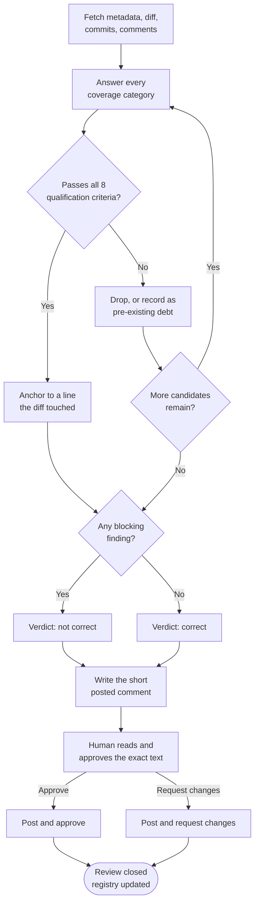

# PR Review Report: [#<number>: <title>]

> Reviewer output contract for a pull request somebody else opened. The
> internal-diff review lives in `templates/code-review-template.md` and is not
> duplicated here; this template covers what changes when the unit of review is
> a PR rather than a local diff: fetching remote state, reviewing against the
> base branch, and handing a verdict back to the author.
>
> **Nothing is posted to GitHub from this document.** It is a draft until a
> human approves the exact text, asked through the Confirmation Protocol (header
> `Publish`, safe option first). Generating a review and posting it are two
> separate acts, and the second one is externally visible publication.

## 1. Target

| Field | Value |
|---|---|
| PR | `[owner/repo#<number>]` |
| Base → head | `main` ← `<plan-id>/<session-slug>` |
| Author | `[login]` |
| Linked plan | `[docs/code-plan/plans/....md]` or `none` |
| Linked issue | `[#<n>]` or `none` |
| Commits | `[n]`, largest `[n]` changed lines |
| Stated intent | [from the PR body, in the author's words, not paraphrased into something easier to approve] |

## 2. Fetched State

Record what was actually read. A review that claims to have checked tests
without fetching them is a guess.

| Input | Command | Present |
|---|---|---|
| Metadata, labels, base/head | `gh pr view <n> --json ...` | yes / no |
| Diff | `gh pr diff <n>` | yes / no |
| Commits | `gh pr view <n> --json commits` | yes / no |
| Existing review comments | `gh api repos/<o>/<r>/pulls/<n>/comments` | yes / no |
| Review verdicts so far | `gh pr view <n> --json reviews` | yes / no |
| CI status | `gh pr checks <n>` | yes / no |

**Not consulted:** [anything skipped, and why. An unstated omission reads as a
clean bill of health for a surface nobody looked at.]

> Remote CI status is reported as the author's evidence, never adopted as this
> review's own. This repository's checks are local by policy, so a green remote
> run says nothing about the working tree this change came from.

## 3. Coverage

Every category is answered. `N/A` with a reason is a valid answer; a blank is
not, because a blank row and an unchecked row look identical in a diff.

| Category | Question | Answer | Finding ids |
|---|---|---|---|
| Functionality | Does it do what the body claims? Any logic error, unhandled edge case? | | |
| Correctness of tests | Would these tests fail if the change were reverted? | | |
| Scope | Is the diff one concern, or several changes wearing one title? | | |
| Security | New input boundary, secret, authz path, dependency, or eval? | | |
| Compatibility | Does anything outside this diff call what changed? | | |
| Data and migration | Schema, IPC, file format, or persisted state touched? Rollback defined? | | |
| Observability | If this breaks in production, what signal fires? | | |
| Documentation | Does the doc, runbook, or changelog match the new behavior? | | |
| Artifacts | Temp files, debug output, commented-out code, `.env`, or unrelated reformatting? | | |

**Test-reversal check, stated explicitly:** [which test, if reverted, would go
red. If no test would, that is a finding, not a neutral observation.]

## 4. Findings

Same 8-point qualification filter as `templates/code-review-template.md` §3.
Every criterion must hold, or it is not a finding.

| id | Priority | Location | Defect and trigger | Confidence | Suggested fix |
|---|---|---|---|---|---|
| F1 | `P0`–`P3` | `path:line` | [one paragraph: what breaks, under which input or state] | 0.0–1.0 | [the concrete change] |
| F2 | | | | | |

Report **every** qualifying finding, not the first one. Deduplicate by location
and by defect/remedy pair. If nothing qualifies, write `none`; a padded list
teaches the author to skim.

**Line anchoring:** a line number is only usable if it is in the diff. Anchor to
a line the PR actually touched, on the correct side. A comment on an unchanged
line either fails to post or lands as a general remark pretending to be
specific.

## 5. Merge Readiness

| Check | State | Note |
|---|---|---|
| Acceptance criteria mapped to checks and evidence | pass / fail / partial | |
| Local evidence quoted, not summarised | pass / fail | |
| Parent diff audit performed by a non-author | pass / fail / self-review | |
| Branch rebased onto current base | yes / no / not required | |
| Registry records this PR number | yes / no | |
| Pre-existing debt listed with `defer:` markers | yes / no / nothing found | |

**Blocking findings:** [ids, or `none`]

## 6. Verdict

One of exactly two, never a hedge.

- **Verdict:** `correct` | `not correct`
- **Blocking findings:** [ids, or `none`]
- **Justification:** [one to three sentences: does this break existing code,
  tests, or contracts; are there blocking defects]
- **Would change to `correct` when:** [the specific, checkable condition. "After
  the author addresses comments" is not a condition.]
- **Confidence:** 0.0–1.0

## 7. What Gets Posted

The posted comment is a **separate, shorter artifact** than this report. It
carries the verdict, the blocking findings, and nothing else. Internal
reasoning, search paths, discarded candidates, and praise stay here.

- [ ] Draft comment written, and it stands alone without this report
- [ ] Human read the exact text that will be posted
- [ ] Human approved posting (approve / request changes)
- [ ] Posted with the verdict the human chose, not the one the reviewer preferred

