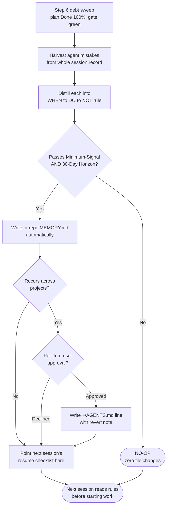

# Session Learning Ledger — Template

> Fill during the Step 6 Debt Sweep (sub-step 6.2.8 Learning Harvest), after the plan is `Done 100%`.
> This ledger records the **agent's own operational mistakes** this session — wrong tool calls, misread
> skill rules, blind retries, premature guesses, scope creep — and distills the ones worth keeping into
> `WHEN → DO → NOT` rules the next session reads before it starts work.
>
> This is NOT the Error Ledger. The Error Ledger (plan/progress templates) tracks per-task *technical*
> failures (test/build/exit code). This ledger tracks *behavioral* failures of the agent and carries the
> durable lessons across sessions so the same mistake is not repeated.

---

## 1. Identity

- **Session:** [session id or slug]
- **Plan file:** [path, e.g. `docs/code-plan/plans/<plan>.md`]
- **Written at:** [ISO timestamp]
- **Preconditions:** Plan `Done 100%`, verification gate green (same gate as the debt sweep).

---

## 2. Mistake Log (raw, this session)

> Mine the whole session record, not just the last turn. One row per distinct operational mistake.
> Secrets & Hygiene: never paste tokens/credentials; replace with `[REDACTED_SECRET]`. Store compact
> snippets, not raw tool dumps.

| # | Category | Trigger (what I did) | Signal (how it surfaced) | Cost | Correct move |
|---|---|---|---|---|---|
| 1 | `tool-misfire` | Called `shell` tool | Tool not found / no output | 1 turn wasted | Use `bash`; verify tool name against catalog first |
| 2 | `wrong-tool` | | | | |
| 3 | `premature-guess` | | | | |
| 4 | `rule-miss` | | | | |
| 5 | `retry-blind` | | | | |
| 6 | `scope-creep` | | | | |

**Categories:**
`tool-misfire` (wrong tool name / wrong args / malformed call) ·
`wrong-tool` (used a weaker tool when a better one existed) ·
`premature-guess` (guessed instead of searching/reading first) ·
`rule-miss` (missed or misread an active skill / AGENTS.md rule) ·
`retry-blind` (retried a failure without changing anything) ·
`scope-creep` (acted outside approved scope).

**Cost:** rough count of turns / tool calls wasted (keeps the ranking honest).

---

## 3. Distilled Rules (candidates)

> Each raw mistake becomes a candidate rule in `WHEN <situation> → DO <action>, NOT <anti-pattern>` form.
> A rule earns a line only if it passes BOTH existing gates — otherwise NO-OP (drop it, zero file changes).

| # | Candidate rule (`WHEN → DO → NOT`) | Minimum-Signal gate | 30-Day Horizon gate | Keep? |
|---|---|---|---|---|
| 1 | WHEN calling a tool → DO verify the exact name against the catalog, NOT assume a plausible alias | A future agent acts differently? Y/N | Still true in 30 days? Y/N | KEEP / NO-OP |
| 2 | | | | |

**Minimum-Signal NO-OP gate:** *"Will a future agent plausibly act differently and more effectively because of this rule?"* If NO → NO-OP, make zero file changes. Reject trivial facts, transient errors, and generic knowledge the model already has.

**30-Day Horizon gate:** *"Would this rule still be true and worth reading a month from now?"* Stable residue passes; moving task state (today's bug, this environment's transient hiccup) fails and expires with the session.

---

## 4. Promotion Decision

> `KEEP` rules are written in-repo automatically. Global promotion to `~/AGENTS.md` is per-item and requires
> explicit user approval (policy C). Nothing destructive, credential-touching, or scope-expanding is promoted.

| Rule # | Destination | Why | Approval |
|---|---|---|---|
| 1 | in-repo `MEMORY.md` (auto) | Repo-scoped, portable with the skill | not required |
| 2 | `~/AGENTS.md` (global) | Recurs across projects on this machine | **PENDING user approval** |

- **In-repo (auto):** append `KEEP` rules under a `Task Group:` header in `MEMORY.md`.
- **Global (gated):** ask each `~/AGENTS.md` line as its own question through the Confirmation Protocol (header `Promote`, safe option first). State a revert path inside the edited file. Never write a global rule without an item-level yes.

---

## 5. Carry-Forward Pointer

- [ ] `KEEP` rules written in-repo.
- [ ] Approved global rules written with a revert note; declined ones left in this ledger only.
- [ ] Handoff "Resume Checklist" points the next session at these rules **before** it starts work.

